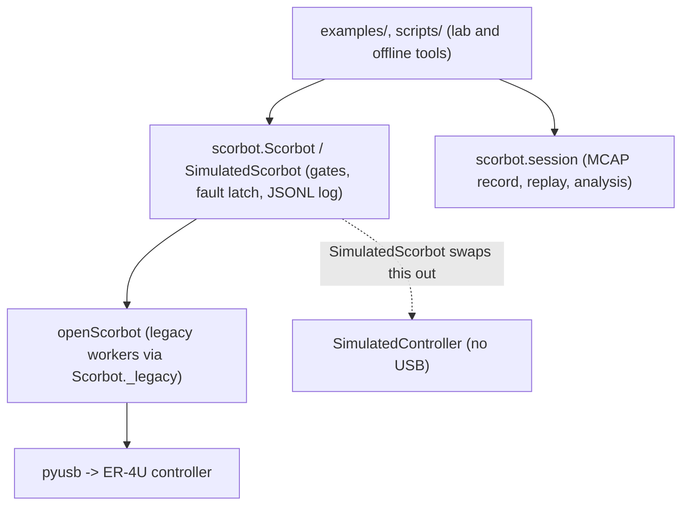

# CLAUDE.md

Python SDK, legacy USB protocol code, lab bench tools and offline research tools for the Intelitek ScorBot ER-4U arm (USB `09F1:0007`, original Controller-USB). Nothing here is hardware-validated. Milestone: supervised connect, raw state, legacy homing, small relative joint jogs. Deeper docs: [docs/design/ARCHITECTURE.md](docs/design/ARCHITECTURE.md), [docs/protocol/PROTOCOL.md](docs/protocol/PROTOCOL.md) and [docs/design/SAFETY_CASE.md](docs/design/SAFETY_CASE.md), [docs/manual/HARDWARE_REFERENCE.md](docs/manual/HARDWARE_REFERENCE.md).

Each subdirectory has its own CLAUDE.md with module-level rules. Read it before editing there.

## Safety invariants (never break)

| Rule | Why | Enforced by |
|---|---|---|
| Tests, simulators, scripts you run and CI never open USB or move the arm. Never call `Scorbot.connect()` (real class) or a lab script without `--simulate`. | The legacy handshake energises the motors. | `SimulatedScorbot` replaces only `connect`/`disconnect`; `tests/test_simulated.py:test_import_loads_no_usb_and_leaves_sys_path_alone`; CI comment in `.github/workflows/tests.yml`. No test-time guard blocks USB access; review does. |
| Do not change `openScorbot/` packet construction, sequence bytes, or the `WRITE`/`READ` sleeps without evidence: a captured trace, or the vendor disassembly in `docs/protocol/VENDOR_DLL_PROTOCOL.md` for sequences built only from command bytes the legacy code already sends. A disassembly-based change is tried first on a 1 degree jog. Bytes the legacy code never sends (`54`, `4D`, `48`, ...) still need a capture. | Byte layout and timing are unverified against the controller; the sleeps are load-bearing. The controller is known to accept the legacy bytes (2026-09-29 run), so re-ordering them is a smaller risk than new ones. | `docs/lab/USB_CAPTURE.md`, `scripts/usb_trace.py`, `scripts/vendor_check.py`; `scorbot/provenance.py:motion_source_sha256` fingerprints the motion path into every lab log. |
| Neither `disable()` nor `request_stop()` is an emergency stop. Never document or name either as one. | `disable()` is queued behind the running command and cannot interrupt it. `request_stop()` ends a jog early but needs a live USB link and a responsive worker, acts at the next packet, and the arm coasts; its sequence is from disassembly and unverified on the arm. | `scorbot/robot.py:Scorbot.disable`, `request_stop` docstrings; `tests/test_software_stop.py:test_request_stop_is_documented_as_not_an_emergency_stop`; `README.md`. The physical stop is authoritative. |
| Any fault latches the session and rejects further motion. New failure paths must call `Scorbot._latch_fault`. | Motor and home state are unverified after a fault. | `scorbot/robot.py:_command`, `_motion_state`; `tests/test_simulated.py:test_every_fault_kind_latches_the_session`. Known exceptions that set `_fault` directly: `jog_joint`/`get_joint_angles` on invalid calibrated state. |
| Wrist jogs stay disabled. | Pitch and roll drive two coupled motors; unmeasured. | `Scorbot.jog_joint`; `tests/test_arm_control.py:test_wrist_jog_rejected_without_queuing_motion`. |
| Jog ceiling is 5 degrees in the SDK (`max_jog_degrees`, constructor rejects more) and 1 degree in `examples/bench_joint.py --delta`. Speed is an int 1-20. A stream (`Scorbot.start_stream`) is bounded differently: travel from home at most `STREAM_TRAVEL_CAP_MAX_DEG` (10, raised only in stages with lab evidence), and the command may lead the arm by at most the jog ceiling before the session faults. | Directions and scales are inherited, not measured. | `Scorbot.__init__`, `jog_joint`; `test_jog_ceiling_cannot_be_raised_past_five_degrees`. |
| No Cartesian motion and no gripper. `move_joint` is one bounded jog step and needs a validated calibration. Base, shoulder and elbow may move together only as motor-count targets inside the travel cap (changed 2026-10-04 by the owner: the old "no coordinated motion" was a project rule, not from the manual, and the vendor moves all joints together as a matter of course). | Kinematics, frames and signs are unverified, so nothing may depend on them. Moving several motors at once in counts needs none of them; what it does need is the travel cap and a bench trial of each motor alone first, because a wrong direction is harder to spot when three move. Legacy order 19 (`moveXYZ`) and 14/15 (clamp) exist but `Scorbot` never sends them. | `scorbot/kinematics.py` is offline and wired into nothing. |
| `home()` needs `start_position_confirmed=True`, enabled motors, and refuses `home_switch_bits` with unknown bits (>= 32). | `libdef.get_switch` misreads byte 5 >= 32; homing assumes a fixed start pose. | `Scorbot.home`; `test_home_refuses_switch_byte_the_legacy_decoder_misreads`. |
| Real and simulated data never share a session, review or comparison. | A simulated run could pass as evidence. | `SessionWriter.log_state` raises `SessionError`; `analysis.compare` gives no pooled row for mixed sources; `scripts/review_lab_logs.py` flags mixed logs. |
| Calibration refuses vendor-display (SCORBASE) data and soft-limit spans beyond the manual's travel. | Only independent physical angle measurements validate a scale. | `scripts/fit_calibration.py:fit` (needs `reference_source == "physical"`), `scorbot/calibration.py:load_calibration`, `scorbot/nominal.py:check_soft_limit_span`. Only spans are compared; manual zero/sign are unknown. |
| Never commit Intelitek manuals (anything in `references/`: the ER-4u, Controller-USB and ER-4pc manuals). | Copyrighted; the repo is public. | `.gitignore` ignores `references/*.pdf`; `scripts/build_bench_kit.py` leaves PDFs out of the kit. The ER-4pc manual was tracked until 2026-10-05 and is still in git history. |

Nominal manual values are priors, never calibration: `scorbot/nominal.py` values carry `status = "nominal, from manual, not measured"`. Do not present a legacy scale (`openScorbot/motion_profile.py:COUNTS_PER_DEGREE`) as measured.

## Layers



## Repo map

| Path | Responsibility |
|---|---|
| `scorbot/` | Public SDK: facade, state decode, calibration, nominal manual values, the streaming follower (`streaming.py`), offline kinematics, the vendor's formulas read from the DLL (`vendor_model.py`, `vendor_profile.py`), the viewer's link chain `arm_chain.py` and 3D view `arm_view.py`, simulator, preflight |
| `scorbot/session/` | MCAP session recorder, replay, analysis, CLI (`python -m scorbot.session`). Never imports USB |
| `plugins/lerobot_robot_scorbot/` | LeRobot robot plugin, simulator only (refuses the real arm); each action is one bounded jog via `scorbot/follow.py`. Installed into `.venv-lerobot` with `-e`. Real-arm replay is `python -m scorbot.lab` key `p` (`scorbot/lab/replay.py`) |
| `scorbot/lerobot_export/` | Lab sessions to a local LeRobot dataset: load, refusal checks, resampling (pure), `write.py` (only module importing `lerobot`, run in `.venv-lerobot`). `python -m scorbot.lerobot_export ... --dry-run`. See `docs/design/LEROBOT_EXPORT.md` |
| `scorbot/camera/` | Webcam capture: per-camera stream files next to a session, recorder threads with a bounded stop, `python -m scorbot.camera check`. OpenCV optional (`[camera]`). Never imports USB |
| `scorbot/transport/` | Pure packet codec (`codec.py`), proven byte-identical to the legacy code by golden tests (`tests/test_transport_codec.py`). Not wired into `Scorbot`. Phase A of the USB upgrade |
| `openScorbot/` | Original GPL OpenScorbot protocol code plus `motion_profile.py`; frozen legacy backend, PyQt GUI kept as reference |
| `examples/` | Supervised bench procedures (`--simulate` capable), synthetic session, offline preview and kinematics check |
| `scripts/` | Offline analysis (fit, review, live view, USB trace), kit and Windows setup |
| `tests/` | `unittest` suite, no hardware |
| `docs/` | Design, hardware reference, bench and lab checklists, capture and recording guides. `docs/specs/` holds design specs (old implementation plans are in git history) |
| `models/er4u_meshes/` | Optional community link meshes for the 3D view. Only the README is tracked; never commit the STL files (licence unclear) |
| `tools/foxglove/` | Foxglove layouts for recorded sessions |
| `tools/usbc_analysis/` | Ghidra export script and query tool for static analysis of the vendor `USBC.dll`. Never commit the DLL or its decompiled output |
| `models/` | OpenSCAD, STL, DXF parts from the original project (encoder, home jig) |
| `references/` | Local only: vendor manuals, never committed (`references/*.pdf` is git-ignored) |

## Commands

```powershell
python -m pip install -e ".[dev]"              # add ,kinematics for the Robotics Toolbox cross-check; windows extra adds libusb-package; gui adds PyQt5
uv sync --locked --extra windows --extra test --extra planning  # lab PC: Python 3.13 + exact versions from uv.lock (planning = Ruckig, needed by start_stream); after editing deps run `uv lock` (CI checks it)
python -m compileall -q scorbot openScorbot scripts examples tests
python -m unittest discover -s tests -v        # ~2 min, about 700 tests, 2 expected failures (documented legacy bugs); pytest -n auto is faster
python examples/make_synthetic_session.py --root <tmpdir>   # CI smoke test
.venv-lerobot/Scripts/python.exe -m unittest discover -s tests -p "test_lerobot_export_write.py"  # LeRobot round trip (docs/design/LEROBOT_EXPORT.md)
ruff check .                                   # CI rules incl. bugbear (openScorbot/ excluded); `pre-commit install` runs it on every commit
```

Simulated rehearsal (no USB; every output says SIMULATED). Use a `rehearsal\` folder, never `logs\`:

```powershell
python -m scorbot.lab --simulate --profile rehearsal\lab.json --logs rehearsal   # guided session rehearsal
python examples\record_raw_state.py --output rehearsal\idle-01.jsonl --robot-id lab-er4u-1 --arm-label x --controller-label x --driver none --operator XX --pose-note rehearsal --seconds 2 --simulate --acknowledge-connect-handshake
python examples\bench_joint.py --output rehearsal\base-01.jsonl --robot-id lab-er4u-1 --arm-label x --controller-label x --driver none --operator XX --start-pose-note rehearsal --joint base --delta 1 --simulate --acknowledge-supervised-motion
python scripts\review_lab_logs.py --idle rehearsal\idle-01.jsonl --bench rehearsal\base-01.jsonl
python -m scorbot.session list|export|compare <paths>
python -m scorbot.arm_view --simulate            # live 3D picture of a simulated stream (viz + planning extras); UNVALIDATED geometry
```

CI (`.github/workflows/tests.yml`): Windows and Ubuntu, Python 3.10 and 3.13, compileall, unittest, synthetic session.

## Conventions

- Target is a Windows lab PC with only Python and VS Code. Keep lab-PC tools standard-library-first (`scripts/usb_trace.py`, `watch_lab_log.py` and `scorbot/nominal.py` are stdlib only). Runtime deps: `mcap`, `numpy`, `pyusb`. Python >= 3.10.
- Docs show PowerShell with `.\.venv\Scripts\python.exe`. Open files with `encoding="utf-8"`; console output on Windows may be cp1252.
- Primary evidence is append-only JSONL (`open("x")`, never overwrite) plus an MCAP session (`scorbot/session`). MCAP is best-effort secondary; JSONL is written first. Payloads are strict JSON (`allow_nan=False`).
- Encoder counts are unsigned 16-bit with a 65535 (one's complement) wrap. Take differences with `scorbot.calibration.signed_count_delta`, never subtract raw or signed counts.
- Claims about hardware must say "unverified" unless a bench trace exists. Say so in code comments and docs too.
- Tests use `unittest`. Optional deps skip (`hypothesis`, `roboticstoolbox`, `usb`).
- Commits: imperative sentence-case subject, no prefix, body explains why. No AI attribution lines, in commits or pull requests (owner's rule; see `AGENTS.md`).
- Do not push or open PRs unless asked.

## Where to look

| Question | File |
|---|---|
| Why is the design what it is, open risks | `docs/design/ARCHITECTURE.md` |
| Packet layout, command codes | `docs/protocol/PROTOCOL.md`, `openScorbot/libhex.py`, `scorbot/state.py` |
| What the vendor DLL sends (from disassembly, unverified) | `docs/protocol/VENDOR_DLL_PROTOCOL.md`; method in `tools/usbc_analysis/README.md` |
| How to confirm it at the lab, claim by claim | `docs/lab/VENDOR_PROTOCOL_LAB_PLAN.md` |
| Safety argument | `docs/design/SAFETY_CASE.md` |
| Known bugs and next work | `docs/project/BACKLOG.md` |
| Manual facts, LEDs, controller safety | `docs/manual/HARDWARE_REFERENCE.md` |
| Next lab visit, step by step | `docs/lab/LAB_DAY_CARD.md` |
| Guided session, first-visit procedure, PC setup | `docs/lab/LAB_SESSION.md`, `docs/lab/G1_LAB_CHECKLIST.md`, `docs/lab/ARM_CONTROL_BENCH.md`, `docs/lab/WINDOWS_BENCH_RUN.md` |
| Prompt and warning design | `docs/design/OPERATOR_UX.md` |
| Recording, session format, viewers | `docs/design/EXPERIMENT_RECORDING.md` |
| Wireshark/USBPcap comparison | `docs/lab/USB_CAPTURE.md` |
| Measuring joint angles, CSV format | `docs/lab/PHYSICAL_CALIBRATION.md` |

## Before you change X, read Y

| Change | Read first |
|---|---|
| `scorbot/robot.py` gates, faults, threading | `tests/test_python_api.py`, `tests/test_simulated.py`, `docs/design/ARCHITECTURE.md` sections 8, 11 |
| `openScorbot/*` | `openScorbot/CLAUDE.md`, `docs/lab/USB_CAPTURE.md` |
| Session schema or topics | `scorbot/session/schemas.py`, `docs/design/EXPERIMENT_RECORDING.md`; bump `SCHEMA_VERSION` only with a reader migration |
| Prompts in `examples/bench_joint.py` | `docs/design/OPERATOR_UX.md`, `docs/lab/G1_LAB_CHECKLIST.md`; rehearse with `--simulate` |
| Calibration fields | `scorbot/calibration.py`, `scripts/fit_calibration.py`, `docs/lab/PHYSICAL_CALIBRATION.md` (loader and fitter must agree) |
| Log event names | `scripts/watch_lab_log.py:ALARM_EVENTS`, `scripts/review_lab_logs.py` (both parse them) |
