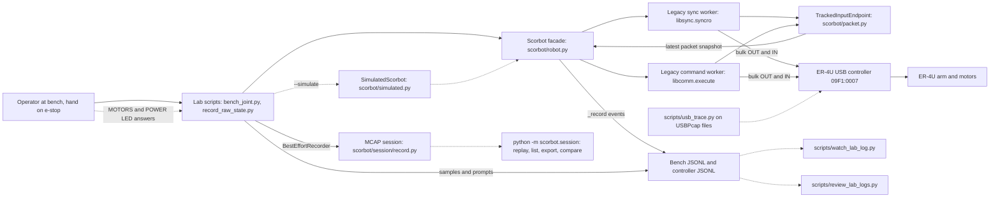
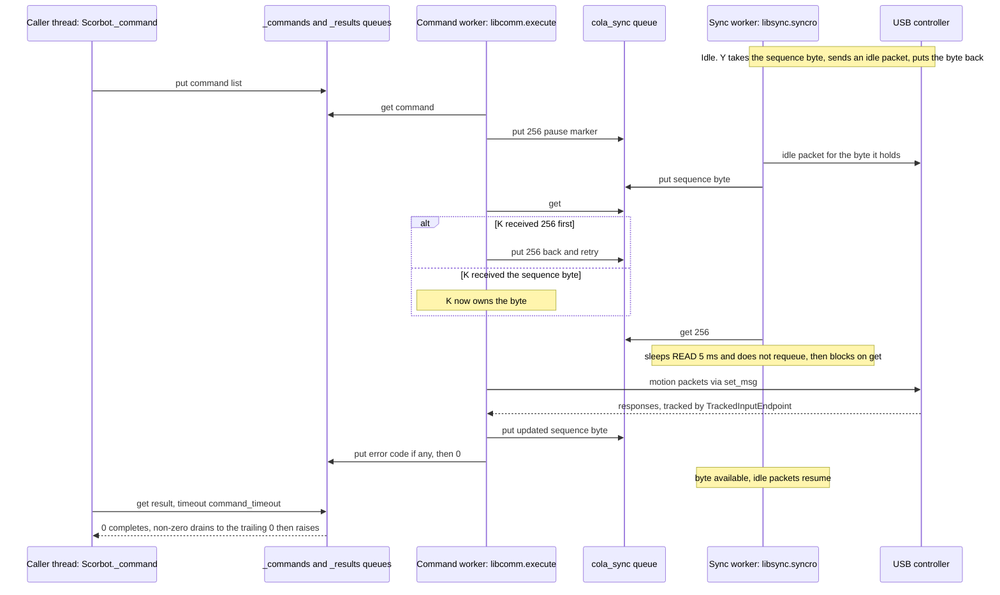
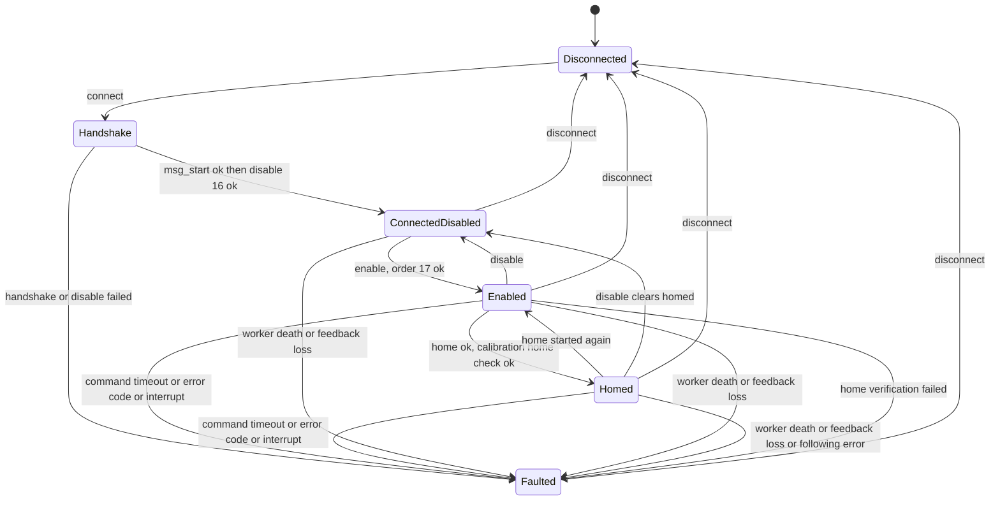
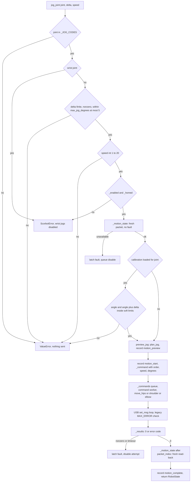
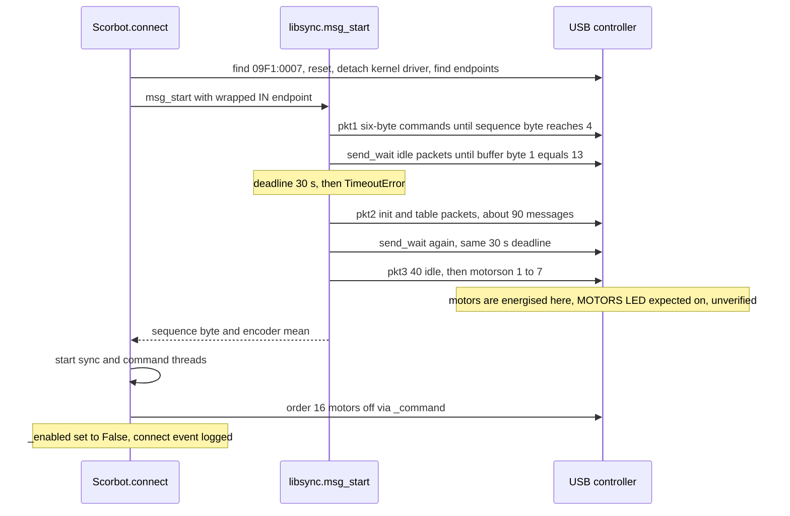

# ER-4U Python SDK: system architecture

Status: describes the code as of 2026-09-29. Nothing here is verified on hardware; see section 10.

Related: [PROTOCOL.md](PROTOCOL.md) (packet layout), [SAFETY_CASE.md](SAFETY_CASE.md) (hazards and controls), [HARDWARE_REFERENCE.md](HARDWARE_REFERENCE.md) (manual facts), [EXPERIMENT_RECORDING.md](EXPERIMENT_RECORDING.md) (MCAP sessions), [USB_CAPTURE.md](USB_CAPTURE.md) (USBPcap traces).

## 1. Purpose and scope

Decision (unchanged): keep the inherited USB packet path as a legacy backend and put a controller-neutral Python API in front of it. No Cartesian or autonomous motion is exposed until feedback, limits and stop behaviour are measured on the arm.

| In scope | Out of scope |
|---|---|
| Connect, read raw encoders, enable, home, bounded single-joint jog, disconnect | Coordinated or Cartesian motion (`scorbot/kinematics.py` is offline only) |
| Software safety gates, fault latch, event logging, MCAP recording, offline analysis | Any claim that software stops the arm; the physical e-stop is authoritative |
| Simulated controller behind the same facade | ROS 2, cameras in the driver, VLA policies |

## 2. Context

Solid arrows are runtime data flow. Dashed arrows are read-only or offline: watch, review, replay and `usb_trace` never import USB control code and cannot send a command. `usb_trace` reads capture files made earlier, it does not touch the bus.

## 3. Components

| Component | Responsibility | Path |
|---|---|---|
| `Scorbot` | Session owner: validation gates, one-command-at-a-time lock, fault latch, software `enabled`/`homed` flags, JSONL events | `scorbot/robot.py:Scorbot` |
| `TrackedInputEndpoint` | Wraps the USB IN endpoint; copies each response out of the legacy reused buffer, numbers it, timestamps it (host monotonic); serves `snapshot(after_index, max_age)` | `scorbot/packet.py:TrackedInputEndpoint` |
| `decode_state`, `RobotState` | Decode a packet: six encoder counts, sign bytes, six error counts, home-switch byte 5. No angles | `scorbot/state.py` |
| Legacy sync worker | Idle packets with the shared sequence byte; keeps the averaged encoder vector | `openScorbot/libsync.py:syncro` |
| Legacy handshake | Three packet groups, then motors on | `openScorbot/libsync.py:msg_start` |
| Legacy command worker | Dispatch of numeric orders (jog 4-13, clamp 14-15, off 16, on 17, home 18, XYZ 19, exit 528) | `openScorbot/libcomm.py:execute` |
| Legacy packet I/O | `set_msg`, `check`: write, sleep, read, sleep; wrap errors as `RuntimeError` | `openScorbot/libdef.py:set_msg`, `check` |
| Homing | Sequential switch search, fixed start pose assumed, 30 s per-switch deadline, cancel event | `openScorbot/setHome.py:homing` |
| Jog planner | Offline step plan per jog (`plan_jog`) | `openScorbot/motion_profile.py` |
| Calibration | Per-arm counts-to-degrees for base, shoulder, elbow; loads only `validated` files with matching `robot_id`; one's-complement count delta | `scorbot/calibration.py:load_calibration`, `signed_count_delta` |
| Nominal values | Manual figures (spans, ratios), marked not measured; used only as sanity bounds | `scorbot/nominal.py:check_soft_limit_span` |
| Kinematics | Offline DH forward/inverse, trapezoid profile. Not connected to the facade | `scorbot/kinematics.py:forward`, `inverse`, `trapezoid` |
| Simulator | Fake controller behind the real facade; replaces only `connect`, `disconnect`, `_record`, `get_state` | `scorbot/simulated.py:SimulatedScorbot`, `SimulatedController` |
| Preflight, provenance | Environment checks; hash of motion-relevant source for records | `scorbot/preflight.py:run_checks`, `scorbot/provenance.py:motion_source_sha256` |
| Session recorder | Crash-safe append-only MCAP writer; `BestEffortRecorder` drops recording errors after one warning | `scorbot/session/record.py:SessionWriter`, `BestEffortRecorder` |
| Session replay and analysis | Timeline, integrity findings, CSV export, run comparison | `scorbot/session/replay.py`, `analysis.py`, `__main__.py` |
| Lab scripts | Supervised procedures with LED prompts, primary JSONL plus controller JSONL plus MCAP | `examples/bench_joint.py`, `examples/record_raw_state.py` |
| Read-only tools | Live follow of the JSONL, log review, USBPcap parse | `scripts/watch_lab_log.py`, `scripts/review_lab_logs.py`, `scripts/usb_trace.py` |
| Legacy GUI | Original UI, reference only; the SDK does not import it | `openScorbot/gui.py:main`, `set_conection` |

`src/robot.py` is license text only. Controller-neutral `ControllerBackend` and `backends/` from the earlier proposal do not exist; the seam is `Scorbot._input`/`_commands`/`_results`, which `SimulatedScorbot` swaps.

## 4. Threading and data flow

Three threads touch the controller: the caller (holds `Scorbot._motion_lock` for motion methods and `Scorbot._lock` around one command), `scorbot-sync` and `scorbot-commands` (daemon threads started in `connect`). The legacy loops have no error handling of their own; `Scorbot._run_sync_worker` and `_run_command_worker` catch any exception and call `_worker_died`.

| Queue or object | Producer to consumer | Content |
|---|---|---|
| `_commands` | caller to command worker | `[order, speed, value]` |
| `_results` | command worker (and `_worker_died`) to caller | `0` done, non-zero error code (then a `0`), or an `Exception` object |
| `_sync` (`cola_sync`) | both workers, both consume | sequence byte, `MAX_COUNT` (256) pause marker, `EXIT` (528) |
| `_reads` (`cola_read`) | both workers | averaged encoder vector, passed by hand-off |
| `TrackedInputEndpoint` | both workers write via `read`; caller reads via `snapshot` | last full-length response with index and timestamp |

If the 30 s wait (or 180 s for home) elapses, `_command` latches a fault, sets the cancel event and queues a best-effort disable. If either worker thread dies, `_link_alive` is false and no further command is queued (`_command`, `_motion_state`, `disconnect`). Whether the controller tolerates the sync worker pausing for a whole command is inherited behaviour: unverified on hardware.

State reads never go through the command path: `Scorbot.get_state` calls `TrackedInputEndpoint.snapshot`, which requires a full-length packet (`PACKET_MIN_LENGTH`), newer than `after_index`, no older than `response_timeout` (2 s default). Failure raises `ScorbotError`.

## 5. State and fault model

`enabled` and `homed` are software-tracked: `Scorbot._enabled` (`True`, `False`, or `None` = unverified after a fault) and `_homed`. `RobotState` copies them; the controller never reports them. The observable evidence is the MOTORS LED (and POWER LED), which the lab scripts ask the operator to read at each step (`examples/bench_joint.py:observe_leds`). Software flag and LED can disagree; the scripts record and flag the mismatch.

Code quirk, not drawn: on an invalid calibrated count in `jog_joint` or `get_joint_angles`, the code sets `_fault` and clears `_homed` and `_home_counts` directly, without `_latch_fault`, so `_enabled` is left unchanged. Effectively the session is faulted (every `_command` and `_motion_state` rejects on `_fault`).

| Trigger | Code path | `_fault` | `_enabled` | `_homed` | Extra action |
|---|---|---|---|---|---|
| Command timeout | `_command` on `queue.Empty` | set | `None` | false | cancel event; queue disable (best effort) |
| Non-zero error code | `_command` on `ScorbotError` | set | `None` | false | drain results to `0`; queue disable and wait up to 2 s, if link alive and order is not 16 |
| Worker death | `_worker_died` | set (first kept) | `None` | false | cancel event; `_WorkerCrashed` into `_results`; stderr banner; no disable queued |
| Feedback loss or bad packet | `_motion_state` | set | `None` | false | best-effort disable if link alive |
| Ctrl-C or exit in a command | `_command` | set | `None` | false | cancel event; queue disable |
| Home verification failed | `home` | set | `None` | false | none queued |
| Following error over 2 degrees | `move_joint` | set | `None` | false | none queued |
| Invalid calibrated state | `jog_joint`, `get_joint_angles` | set directly | unchanged | false | none |
| `disable()` | `disable` | unchanged | false | false | order 16 |
| `disconnect()` | `disconnect` | kept | false | false | order 528 via `_command` if not faulted |

A fault is never cleared. `connect` refuses on a faulted instance ("Create a new Scorbot instance"). Any new session re-runs the handshake, which sends motor-on (section 7).

## 6. Command path: `jog_joint`

Gates run in this order inside `Scorbot.jog_joint` under `_motion_lock`; every gate before USB rejects without queuing a packet (`tests/test_arm_control.py:test_wrist_jog_rejected_without_queuing_motion`, `test_stale_feedback_faults_before_any_motion`).

`move_joint` adds: calibration required, target inside soft limits, one-jog reach (delta at most `max_jog_degrees`), then `jog_joint`, then a 2 degree following-error check. Legacy motion loops stop on `MAX_ERROR` (40) in the controller error bytes and return code 1; the meaning of those bytes on the real controller is unverified.

## 7. Connect handshake

Between `motorson` and the disable there is a window in which the controller is commanded on. Its length is not measured. On any failure `connect` latches a fault, sets the cancel event, calls `disconnect`, and raises with a "motor state is unverified" message.

## 8. Safety architecture

| Layer | Mechanism | Where | Status |
|---|---|---|---|
| Physical e-stop | Cuts motor power, MOTORS LED off, controller in COFF until CON | Controller (manual, [HARDWARE_REFERENCE.md](HARDWARE_REFERENCE.md)) | Manual statement; not exercised with this code. Authoritative |
| Controller comm-failure shutdown | "On communication failure, motor power shutdown" | Controller | Manual statement, unverified with this code |
| Controller per-axis watchdog, position-error and impact protection, current limits | Independent of Python | Controller | Manual statement; what the legacy error bytes report is unknown |
| Input validation, jog ceiling 5 degrees, speed 1-20, wrist jogs blocked | Reject before queuing | `Scorbot.jog_joint`, `preview_jog`, `__init__` | Tested against simulator |
| Enabled and homed gates | Reject before queuing | `Scorbot.jog_joint`, `home` | Tested against simulator |
| Fresh-feedback gate | Motion needs a packet newer than the last, within 2 s | `Scorbot._motion_state`, `TrackedInputEndpoint.snapshot` | Tested; real packet rate unmeasured |
| Home-switch byte check | Refuse homing if byte 5 has bits outside the five known | `Scorbot.home` | Tested; switch polarity unverified |
| Calibrated soft limits | Only base, shoulder, elbow; validated per-arm file | `Scorbot.jog_joint`, `scorbot/calibration.py` | Tested with synthetic files; no measured arm file yet |
| Fault latch | No motion after any fault | `Scorbot._latch_fault` | Tested against simulator |
| Timeouts | 30 s command, 180 s home, 30 s per switch, 30 s handshake waits, 2 s feedback | `robot.py`, `setHome.py`, `libsync.py` | Values provisional |
| Queued disable | Best-effort order 16 after faults | `Scorbot._command`, `disable` | **Not an emergency stop**: it queues behind the running command and needs a live command worker |
| Operator LED check | MOTORS and POWER LED prompts, mismatch flagged | `examples/bench_joint.py:observe_leds` | Only independent view of motor power |

Design rule: software may refuse, log and try to disable. It may not claim the arm stopped. The `SimulatedScorbot` states carry `simulated=True` and prove nothing about physical safety.

## 9. Interfaces

Public API (`scorbot/__init__.py`: `Scorbot`, `ScorbotError`, `RobotState`, `SimulatedScorbot`). Calls are synchronous and blocking.

| Call | Effect | Gates and notes |
|---|---|---|
| `Scorbot(log_path, command_timeout=30, max_jog_degrees=5, response_timeout=2, robot_id, calibration_path)` | Construct; no USB | `calibration_path` needs `robot_id`; jog ceiling limited to 0-5 |
| `connect()`, context manager | Handshake, threads, disable | Refuses if connected or faulted |
| `disconnect()` | Exit order, join workers, release USB | Skips exit if a worker died; raises if a worker stays alive |
| `get_state(after_index=None)` | Fresh decoded `RobotState` | Not connected, sync worker dead or stale feedback raise `ScorbotError` |
| `enable()` / `disable()` | Order 17 / 16 | `enable` needs fresh feedback; `disable` clears `homed` |
| `home(start_position_confirmed=True)` | Order 18 | Needs enabled; caller must confirm the legacy start pose; validates home against calibration if loaded |
| `preview_jog(joint, delta, speed)` | Offline plan | Never opens USB |
| `jog_joint(joint, delta, speed)` | One bounded relative jog, returns read-back state | Section 6 |
| `get_joint_angles()` | Calibrated angles | Needs calibration and verified home |
| `move_joint(joint, target, speed)` | One bounded absolute step | Needs calibration; at most one jog of travel |
| `SimulatedScorbot(controller=...)`, `SimulatedController.inject(kind)` | Same facade, no USB; kinds: `timeout`, `late_answer`, `controller_error`, `worker_crash`, `stale_feedback`, `corrupt_packet` | States and log rows marked simulated |

Files: bench JSONL (`--output`) plus `<stem>.controller.jsonl` (SDK events: `command_start`, `command_error`, `feedback_fault`, `sync_worker_crashed` and others) plus one MCAP session. Formats: [EXPERIMENT_RECORDING.md](EXPERIMENT_RECORDING.md).

## 10. Verification status

| Item | In tests (no hardware) | On hardware | Unverified assumption |
|---|---|---|---|
| Packet decode, sign bytes, short packet | `tests/test_python_api.py`, `test_simulated.py` | none yet | Byte offsets match the real controller only by the legacy code |
| Fresh-snapshot tracking, stale rejection | `tests/test_arm_control.py:test_tracks_new_usb_reads_and_rejects_reused_state` | none yet | Real response rate |
| Command and result queues separate; late answer cannot answer a later command | `test_command_and_reply_are_separate`, `test_late_answer_after_timeout_cannot_answer_a_later_command` | none yet | none |
| Timeout, error-code drain, worker death, sync death, faulted disconnect | `tests/test_python_api.py`, `tests/test_simulated.py` | none yet | Legacy loops behave as read |
| Handshake wait deadline, homing cancel and deadline | `test_handshake_acknowledgment_wait_has_deadline`, `test_homing_search_stops_on_cancel_or_deadline` | none yet | 30 s is enough for a real handshake and switch search |
| Jog gates, wrist block, soft limits, preview matches plan | `tests/test_arm_control.py`, `test_python_api.py` | none yet | Jog direction, degrees per count, speed units |
| Calibration load, count wrap | `tests/test_arm_control.py` | no measured arm file | Fit method is adequate |
| Kinematics, nominal spans | `tests/test_kinematics.py`, `test_nominal.py` | none | DH geometry vs arm |
| MCAP write, replay, review, watch, USBPcap parse | `tests/test_session.py`, `test_analysis.py`, `test_lab_log_review.py`, `test_watch_lab_log.py`, `test_usb_trace.py` | none yet | none |
| Full G1 sequence, offline | `tests/test_bench_joint.py`, `test_simulated.py` | none yet | Simulator matches controller: it does not model timing, dynamics or backlash |
| Motors energised by handshake, then off after disable | not testable | none yet | MOTORS LED behaviour, exposure window length |
| Controller cuts power on comm loss or sync-worker death | not testable | none yet | Manual claim only |
| Sync worker pause during a command is tolerated | not testable | none yet | Inherited from GUI behaviour |
| Home switch polarity, homing repeatability, home pose vs vendor pose | not testable | none yet | `setHome.homing` overshoots 12 packets past the switch; vendor procedure backs off |
| Stop latency of queued disable | not testable | none yet | unknown |

No test moves a real robot; no test opens USB.

## 11. Known gaps and roadmap

Gaps found in code:

| Gap | Where |
|---|---|
| No emergency stop through software; disable queues behind motion | `Scorbot._command` |
| Wrist (two-motor differential) and gripper jogs blocked; calibration covers base, shoulder, elbow only | `jog_joint`, `scorbot/calibration.py` |
| Calibration fault paths set `_fault` without `_latch_fault`, leaving `_enabled` unchanged | `jog_joint`, `get_joint_angles` |
| `disconnect` on a faulted session with a dead worker leaves the USB handle open | `Scorbot.disconnect` |
| Legacy `check` waits up to `TIME_OUT_W` and `TIME_OUT_R` (both 1500 in `openScorbot/conf.py`, passed as the pyusb timeout) per write or read, then raises; no retry | `libdef.check` |
| Handshake energises motors before the SDK can disable | `libsync.send_pkt3` |
| One fault ends the session; no in-place recovery | `Scorbot.connect` |
| No CLI daemon: a process exit disconnects | none |
| Legacy math mixes UI, protocol and kinematics; `moveXYZ.controlXYZ` (order 19) unvalidated and unexposed | `openScorbot/libdef.py`, `moveXYZ.py` |

Roadmap (previous list, updated):

| Version | Content | State |
|---|---|---|
| 0.1 | Bench-verify connect, raw encoder read, homing, one bounded jog, disconnect | Code and simulator done; hardware pending. First task: supervised golden trace (USB backend, connect and disable, idle packets, switch bits at known poses, one-degree base jog each way, disconnect) with `examples/bench_joint.py`, then compare against the code |
| 0.2 | Verified disable and stop behaviour, fault state, calibrated limits, telemetry | Fault latch, telemetry (JSONL, MCAP) and base/shoulder/elbow calibration exist; disable/stop verification pending |
| 0.3 | Simulator, coordinated joint motion | Simulator exists; coordinated motion not started |
| 0.4 | FK/IK, Cartesian planning | Offline `scorbot/kinematics.py` only |
| 0.5 | Trajectory validation, repeatability experiments | `kinematics.trapezoid` offline; manual repeatability figure is a target to test |
| 0.6 | Camera time sync, perception | MCAP schema carries frames and detections; no capture in the driver |
| 0.7 | Optional ROS 2 | Not started; publish only calibrated angles |

Decisions kept: extract a controller-neutral backend only after packets are captured and compared against a replacement driver; TOML per-robot config was proposed but calibration is JSON today; unit, protocol and simulator tests never move the robot; hardware tests need an explicit opt-in and a present operator.
