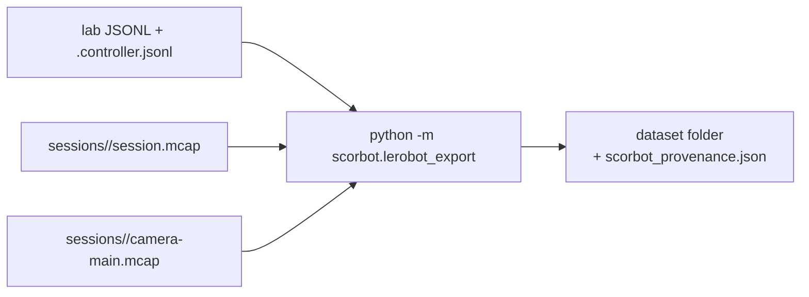

# Exporting lab sessions to a LeRobot dataset

Turns the episodes you recorded in teleop mode (`python -m scorbot.lab`, keys
`t` then `r`) into a [LeRobot](https://github.com/huggingface/lerobot)
dataset on your disk, for training a policy later. Nothing is uploaded.



## One-time setup (separate environment)

LeRobot needs PyTorch and pins an older OpenCV than this project, so it lives
in its own environment, `.venv-lerobot` (git-ignored). CPU-only is enough for
exporting.

```powershell
.\.venv\Scripts\uv.exe venv .venv-lerobot --python 3.13
.\.venv\Scripts\uv.exe pip install --python .venv-lerobot\Scripts\python.exe "lerobot[dataset]==0.6.1"
.\.venv\Scripts\uv.exe pip install --python .venv-lerobot\Scripts\python.exe -e . --no-deps
.\.venv\Scripts\uv.exe pip install --python .venv-lerobot\Scripts\python.exe "mcap>=1.5,<2" "pyusb>=1.2,<2"
```

## Export

Check first; the dry run needs no LeRobot and writes nothing:

```powershell
.\.venv\Scripts\python.exe -m scorbot.lerobot_export logs\lab-er4u-1-2026-10-09-01.jsonl --out datasets\reach-01 --repo-id local/scorbot-reach --dry-run
```

Every episode is listed as `KEEP` or `SKIP` with the reason; a whole input
can be `REFUSE`d. Then write it from the LeRobot environment:

```powershell
.\.venv-lerobot\Scripts\python.exe -m scorbot.lerobot_export logs\lab-er4u-1-2026-10-09-01.jsonl --out datasets\reach-01 --repo-id local/scorbot-reach
```

Options: `--fps 10` (default), `--max-frame-gap 0.2` (seconds), `--no-video`
(robot-only dataset, required when the session had no camera). Several lab
logs can go into one dataset. The output folder must not exist; the dataset
is built in a temporary folder, checked by reopening it, and only then
renamed into place, so a failed export never leaves a partial dataset.

## What each frame holds

| Feature | Meaning |
|---|---|
| `observation.state` | base, shoulder, elbow, wrist motor 1, wrist motor 2: encoder counts from the session home, uncalibrated |
| `action` | the target the SDK sent while a jog is moving (or was commanded since the last frame), otherwise the current position |
| `observation.images.main` | the latest camera frame at or before the frame time |
| `task` | the task text you typed for the episode |

## What is refused, and why

| Refused | Why |
|---|---|
| real and simulated sessions together | a rehearsal must never pass as lab data |
| episodes with and without camera together, or no camera without `--no-video` | LeRobot needs the same features in every episode |
| sessions with integrity errors, a failed session, no home, or a clock coarser than 1 ms | the record cannot be trusted or timed |
| episodes not ended with `r` (aborted, crashed) | not demonstrations |
| episodes missing from the MCAP record, or with a fault or counts drift inside | evidence incomplete or the arm state unverified |
| a jog whose lab target and SDK target differ by more than 20 counts | the action must be what was actually sent |
| two jogs inside one frame interval | one frame cannot carry two actions |
| motion during a frame with no recorded controller packets (video episodes) | the image would show motion the state cannot describe |
| no camera frame for more than `--max-frame-gap` | frozen video |
| fewer than 2 frames | nothing to learn from |

## Limitations (read before training)

- **Step-and-stop motion.** Teleop moves 1 degree per key press; the data
  shows steps, not smooth paths, until the streaming motion layer (S2).
- **Uncalibrated counts.** No degrees until a physical calibration exists.
- **Simulated sessions** have no USB packets; their jogs finish instantly, so
  no frame falls inside one. Their video is synthetic.
- **Image latency is unmeasured.** Frame times are when `read()` returned, not
  when the picture was taken; a webcam may buffer frames. Measure it once in
  the lab: run `python -m scorbot.camera check --record <folder>` while the
  webcam films a phone stopwatch next to the PC clock, then compare the
  stopwatch in a frame with that frame's time. Until then every dataset's
  `scorbot_provenance.json` says `"image_latency": "unmeasured"`.

## Provenance

`scorbot_provenance.json` inside the dataset lists the exporter version, fps,
units, data source, each input session (log path and SHA-256, MCAP session
id, motion-code fingerprint, software commit), each exported episode and
every refusal.

## Test

```powershell
.\.venv\Scripts\python.exe -m unittest tests.test_lerobot_export
.\.venv-lerobot\Scripts\python.exe -m unittest discover -s tests -p "test_lerobot_export_write.py"
```

The second runs a real round trip through LeRobot. It is run with `discover`
because a third-party package in `.venv-lerobot` is named `tests`.
