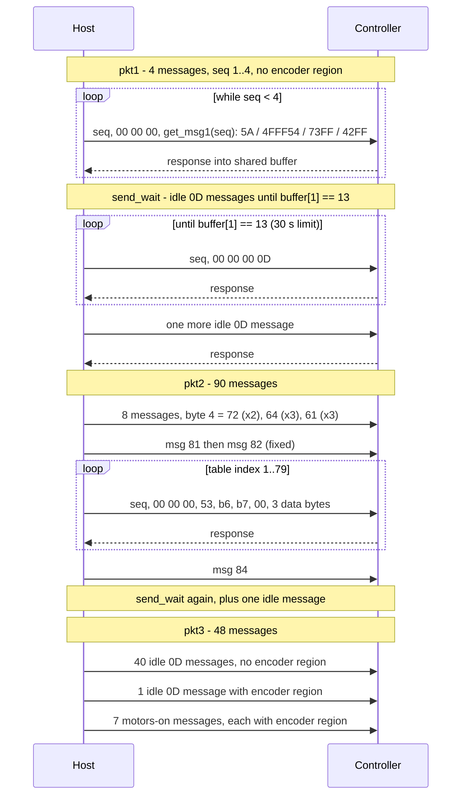
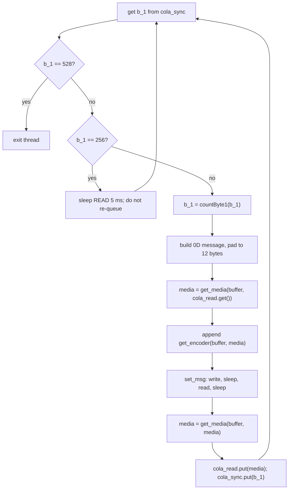
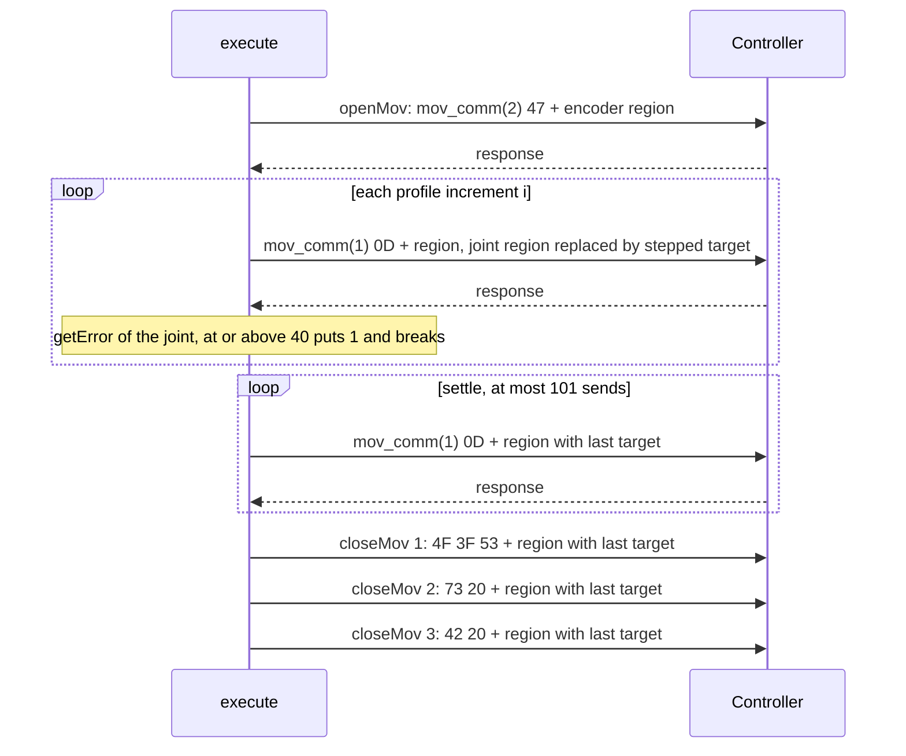

# Legacy USB protocol as implemented in `openScorbot/`

Reference for engineers comparing this repository's traffic with USBPcap captures of the Intelitek software (see [USB_CAPTURE.md](USB_CAPTURE.md)). Sections 1-11 are derived from the code; section 12 collects what third-party documents and Intelitek's configuration files say about the vendor DLL. Nothing here has been checked against a capture or against the controller firmware.

Conventions:

- **K** = known from code (the code emits or parses exactly this). **I** = inferred (a reading of how the code uses the value; the controller's meaning is not confirmed). **U** = unknown (not established by the code).
- Byte offsets are 0-based from the start of the USB payload. Packet "byte 5" in `scorbot/state.py` is `buffer[5]`; `libdef.get_switch` calls the same byte "byte 6" in a comment (1-based).
- `path:function` cites the source. All paths are relative to the repository root.
- Nothing in this document was obtained by opening USB.

## 1. Transport

| Item | Value | Status | Source |
|---|---|---|---|
| Device | VID:PID 09F1:0007 | K | `scorbot/robot.py:connect`, `openScorbot/gui.py` |
| Interface / endpoints | Interface 0, alt 0 of the active configuration. First endpoint with direction IN and first with direction OUT. Addresses, transfer type and `wMaxPacketSize` are not in the code | K (selection), U (addresses, type, size) | `scorbot/robot.py:connect` |
| Read buffer | `usb.util.create_buffer(wMaxPacketSize)`, zero-filled, reused for every read; one shared buffer for both worker threads | K | `scorbot/robot.py:connect` |
| OUT message length | `MSG_LEN = 128` **hex characters**; `fill_msg` pads with `'0'` characters and `bytes.fromhex` gives **64 bytes** | K | `openScorbot/conf.py:setup`, `libdef.py:set_msg` |
| Exchange | Strict lockstep: one write, sleep `WRITE`, one read into the shared buffer, sleep `READ`. No message is sent before the previous read returns | K | `libdef.py:check` |
| Timeouts | `TIME_OUT_W = 1500`, `TIME_OUT_R = 1500` (PyUSB units, milliseconds). Any exception is re-raised as `RuntimeError("USB write failed"/"USB read failed")` | K | `conf.py:setup`, `libdef.py:check` |
| Delays | Idle and handshake: `WRITE` 0.008 s, `READ` 0.005 s. Motion uses per-joint values (below) | K | `conf.py:setup` |

Per-joint sleeps (`conf.py:setup`), write / read, and the resulting sleep-only cycle:

| Context | write | read | sleep per cycle |
|---|---|---|---|
| Idle sync, handshake, motors on/off, homing "transition" | 0.008 | 0.005 | 13 ms |
| Base (`cadera`), shoulder (`hombro`), elbow (`codo`) motion | 0.008 | 0.012 | 20 ms |
| Wrist motion | 0.008 | 0.013 | 21 ms |
| Gripper (`pinza`) | 0.008 | 0.019 | 27 ms |

The sleeps are a lower bound on the cycle time. USB round-trip time is added, and `conf.readData` re-opens and parses `data.json` on every call (several calls per message in `set_msg`, `check`, `countByte1`), so the real period is longer and unmeasured (U). `scripts/usb_trace.py compare` reports the OUT-to-OUT interval and OUT-to-IN latency.

**Payload size.** By the code the OUT payload is 64 bytes (128 hex characters). [USB_CAPTURE.md](USB_CAPTURE.md) uses that size to identify the controller in `usb_trace.py summary`; a capture with any other OUT size needs explaining first (unknown 1 in section 10).

## 2. OUT message layout

Every OUT message is built as a hex string, right-padded with zeros to 128 characters (`libdef.py:set_msg`).

| Offset | Length | Field | Status | Notes / source |
|---|---|---|---|---|
| 0 | 1 | Sequence byte | K | `libdef.py:countByte1`, `f_byte`. Values 1..255, see below |
| 1-3 | 3 | Zero | K | Zero in every template in `libhex.py` except `get_msg2(84)`, where byte 2 = 0x0C |
| 4 | 1+ | Command / message-type byte(s) | K (values), U (meaning) | `libhex.py:mov_comm` and the other tables. Values are printable ASCII or 0x0D in every case; the code never names them |
| 5-11 | 7 | Command arguments, otherwise zero | K | Extra command bytes start at byte 5 (e.g. `4F3F53`); pkt2 table messages use bytes 5-10 (section 4) |
| 12-35 | 24 | Encoder / setpoint region: 6 joints x 4 bytes | K (layout), I (semantics) | Written by `libdef.py:get_encoder`; overwritten per joint by `getStruct` |
| 36-63 | 28 | Zero padding | K | `fill_msg` |

Messages without an encoder region (the encoder region is all zero): handshake pkt1, pkt2, `send_wait`, and the first 40 messages of pkt3 (section 4). All others carry it.

### 2.1 Sequence byte

`countByte1` returns `b_1 + 1` while the result is below `MAX_COUNT` (256), else 1. The values sent are therefore 1..255 and the counter wraps 255 -> 1. Byte value 0 is never sent by this code, and 256 is never sent: the value 256 is an in-process queue sentinel (section 6). `f_byte` formats as two lowercase hex digits; for 256 it would produce a wrong string (`'10'`), which is never reached. K.

The sequence byte is a single counter shared by both threads: it travels between `syncro` and `execute` through `cola_sync` as a token, so whichever thread holds it is the only one sending (I: derived from queue usage in `libsync.py:syncro`, `libcomm.py:execute`).

### 2.2 Command bytes at offset 4

| Template | Bytes at offset 4.. | Length used before encoder region | Used by |
|---|---|---|---|
| `mov_comm(1)` | `0D` | idle / setpoint carrier | idle sync, motion steps, settle loops, handshake waits |
| `mov_comm(2)` | `47` | | `openMov`; homing axis start |
| `mov_comm(3)` | `4F 3F 53 00 00 00 00 00` | 12 bytes, no pad needed | `closeMov` step 1 |
| `mov_comm(4)` | `73 20 00 00 00 00 00 00` | | `closeMov` step 2 |
| `mov_comm(5)` | `42 20 00 00 00 00 00 00` | | `closeMov` step 3 |
| `mov_comm(6)` | (prefix only) `{seq} 00 00 00` | | prefix for `get_msg1`, `motorson`, `get_scorbotoff` |
| `clamp(1..5)` | `4F 20 53`, `4C 20 00`, `42 20 01`, `73 20`, `42 20` | | gripper sequence |
| `get_msg1(1..4)` | `5A`, `4F FF 54`, `73 FF`, `42 FF` | | handshake pkt1 |
| `motorson(1..7)` | `0D`, `47`, `0D`, `4F FF 53`, `42 FF 01`, `73 20`, `42 20` | | `send_pkt3`, `libcomm.py:motors_on` |
| `motorsoff(1..26)` | 8 commands `0D 47 73FF 42FF 4FFF53 73FF 7320 4220`, then `64` x3, `61` x3 repeated three times (26 total) | | `libcomm.py:motors_off` |
| `get_scorbotoff(1..11)` | `47`, `4F FF 53`, `73 20`, `42 20`, `64` x3, `61` x4 | | `libcomm.py:scorbotoff` |

K for every value above. U for what each command does on the controller. Observation only: several values (`47` 'G', `4F` 'O', `53` 'S', `73` 's', `42` 'B', `64` 'd', `61` 'a') are ASCII letters, and `0D` equals the IN byte 1 value the code waits for (section 3). Neither is used by the code as a decoding.

### 2.3 Encoder / setpoint region (offsets 12-35)

Each joint occupies 4 bytes: a 2-byte little-endian value (`detrans`) and a 2-byte sign word (`get_signo`): `00 00` if the last response's sign byte was 128, `FF FF` if it was 127; any other sign byte raises `ValueError` (`libdef.py:get_signo`). K.

| Offset | Joint | Wrist pair | Response sign byte read (`buffer[i]`) |
|---|---|---|---|
| 12-15 | base | | 21 |
| 16-19 | shoulder | | 26 |
| 20-23 | elbow | | 31 |
| 24-27 | wrist motor 1 | 24-31 (order 10-13 write 16 bytes together) | 36 |
| 28-31 | wrist motor 2 | | 41 |
| 32-35 | gripper | | 46 |

`getStruct` replaces regions by hex-character slice of the 48-character region (`libdef.py:getStruct`):

| Order | Replaced (region offset, bytes) | Replacement |
|---|---|---|
| 4, 5 | 12-15 (base) | 8 chars |
| 6, 7 | 16-19 (shoulder) | 8 chars |
| 8, 9 | 20-23 (elbow) | 8 chars |
| 10-13 | 24-31 (wrist motors 1 and 2) | 16 chars |
| 14, 15 | 32-35 (gripper) | 8 chars |
| 20 | 12-23 (base, shoulder, elbow) | 24 chars (XYZ move, `moveXYZ.py`) |

Semantics (I): in idle messages the region echoes the smoothed measured position (section 5), which holds the axis in place. In motion the moving joint's region carries a stepped target; other joints keep echoing their smoothed position. The controller's interpretation (setpoint, offset, or something else) is U.

## 3. IN response layout

Source: `scorbot/state.py:decode_state`, `openScorbot/conf.py` (`VEC_POS`, `VEC_ERROR`), `libdef.py:transform`, `get_switch`, `getError`, `libsync.py:send_wait`. Minimum length used: `PACKET_MIN_LENGTH` = 49. The actual length is U (buffer size is `wMaxPacketSize`).

| Offset | Length | Field | Status | Notes |
|---|---|---|---|---|
| 0 | 1 | Unknown | U | Not read by any code |
| 1 | 1 | Handshake acknowledgment | K (use), U (meaning) | `send_wait` loops until `buffer[1] == 13` |
| 2-4 | 3 | Unknown | U | |
| 5 | 1 | Home-switch bits | K (bit map), U (polarity) | `get_switch`, `state.HOME_SWITCH_BITS` |
| 6-18 | 13 | Unknown | U | |
| 19-20 | 2 | Base count, little-endian u16 | K | `VEC_POS[0]` |
| 21 | 1 | Base sign byte, 127 or 128 | K | Other values raise `ValueError` |
| 22-23 | 2 | Base error word, LE u16 | K (position), U (meaning) | `VEC_ERROR[0]` |
| 24-28 | 5 | Shoulder: count 24-25, sign 26, error 27-28 | K | |
| 29-33 | 5 | Elbow: count 29-30, sign 31, error 32-33 | K | |
| 34-38 | 5 | Wrist motor 1: count 34-35, sign 36, error 37-38 | K | |
| 39-43 | 5 | Wrist motor 2: count 39-40, sign 41, error 42-43 | K | |
| 44-48 | 5 | Gripper: count 44-45, sign 46, error 47-48 | K | |
| 49+ | | Unknown | U | Ignored |

Home-switch bits in byte 5 (`libdef.py:get_switch`, `scorbot/state.py:HOME_SWITCH_BITS`):

| Bit value | Axis | Config key |
|---|---|---|
| 1 | base | `cadera.switch` |
| 2 | shoulder | `hombro.switch` |
| 4 | elbow | `codo.switch` |
| 8 | wrist pitch | `wrist.switch_pitch` |
| 16 | wrist roll | `wrist.switch_roll` |
| 32, 64, 128 | not decoded | U |

The code treats a set bit as "at the switch". Polarity has not been verified on hardware (`state.py` comment). `get_switch` decomposes the byte greedily starting at 16; a value with bit 5 or above set is mis-decomposed for axes other than the base.

Error words: `getError` reads the LE u16; if it is at least 65500 it returns `abs(65535 - x)`, otherwise `x`. A joint is treated as at its limit when the result is at least `MAX_ERROR` (40). The threshold is therefore +40 in one direction and about -36 (65499) in the other. What the word measures (following error, PWM, current) is U.

## 4. Handshake (`libsync.py:msg_start`)

Called once after the device is opened, with a zero-filled buffer. The initial smoothed-position vector `media` is read from that buffer (six zeros).

Details (all K unless noted):

- pkt1 (`send_pkt1`): `while b_1 < 4`, so sequence 1, 2, 3, 4 with `get_msg1(b_1)`. Message = `seq 00 00 00` + command bytes, zero padded. No encoder region.
- `send_wait`: sends `mov_comm(1)` idle messages (no encoder region) while `buffer[1] != 13`, checked before each send, so zero idle messages if the byte is already 13. After the loop it sends one more idle message. Raises `TimeoutError` after `HANDSHAKE_WAIT_TIMEOUT_S` = 30 s.
- pkt2 (`send_pkt2`), 8 + 2 + 79 + 1 = 90 messages:
  - 8 messages from `get_msg2(80)` = `seq 00 00 00 {cmd}`; `cmd` = `72` for i=1,2; `64` for i=3..5; `61` for i=6..8.
  - `get_msg2(81)` = `seq 00 00 00 53 00 08 00 10`; `get_msg2(82)` = `seq 00 00 00 53 01 00 00 00 F0`.
  - 79 messages `get_msg2(83)` + `get_msg2(i)`: `seq 00 00 00 53 b6 b7 00` followed by 3 data bytes from the table `get_msg2(1..79)`. Data bytes are written as they appear in the table (`E80300` is sent as `E8 03 00`; read as a little-endian 24-bit value that is 1000; I).
  - `get_msg2(84)` = `seq 00 0C 00 0D`: byte 2 is 0x0C, unlike `mov_comm(1)`.
  - `countByte7` cycles `1..7, 9, 10, 0` (skips 8, period 10). `countByte6` starts at 1 and doubles when `b_7` is 0, so b6 is 1 for messages 1-9, 2 for 10-19, ... 64 for 60-69, 128 for 70-79. The table has 10-word groups with `00F000` (or similar) at group ends. I: b6 is a record index (power of two) and b7 a word index within the record; the meaning of the table itself (controller configuration such as limits or gains) is U.
- pkt3 (`send_pkt3`), 48 messages:
  - 40 `mov_comm(1)` messages: no encoder region. `media` is updated but not sent.
  - 1 `mov_comm(1)` message with encoder region.
  - 7 messages `seq 00 00 00` + `motorson(1..7)` + encoder region.
- Sequence values after the handshake: `msg_start` returns the last `b_1` (it continues counting across all phases; 4 + waits + 90 + waits + 48 messages), which is handed to `syncro` via `cola_sync`.
- `scorbot/robot.py:connect` issues command 16 (motors off) immediately after the handshake, because the handshake enables motors.

## 5. Idle synchronization (`libsync.py:syncro`, `libdef.py:get_media`)

`syncro` runs in its own thread for the life of the connection. Each cycle sends one idle message carrying the smoothed measured position, so the controller receives a setpoint equal to the current position (I).

`get_media(buffer, media)`, per joint i: `dato` = LE u16 at `VEC_POS[i]` of the last response. If `abs(dato - media[i]) >= 1000`, `media[i] = dato` (snap). Otherwise `media[i] = round((media[i] + dato) / 2)` using Python's `round` (ties to even). K. The 1000-count test is not wrap-aware: a joint crossing 0/65535 snaps. The sign word in the echo is taken from the latest raw sign byte, not from the smoothed value, so the two can disagree near the seam (I).

## 6. Motion

### 6.1 Thread hand-off (I, from queue usage)

`execute` (`libcomm.py`) puts 256 on `cola_sync`, then loops on `cola_sync.get()`: a value of 256 is put back; any other value is the sequence byte and `execute` now owns the bus. `syncro` discards 256 after a 5 ms sleep. Since only the holder of the numeric token sends, the two threads do not interleave writes. When the command ends `execute` puts `b_1` back and `syncro` resumes. `cola_read` carries the smoothed vector the same way (`media = cola_read.get()` at the start, `cola_read.put(media)` at the end).

### 6.2 Single-joint jog (orders 4-13)

Steps (K, `libcomm.py:move_hips/move_shoulder/move_elbow/move_wrist`, `libdef.py`):

1. `openMov`: one `mov_comm(2)` message with the smoothed-position echo.
2. Profile: `motion_profile.plan_jog(orden, ang, vel)["increments"]`: integer increments whose sum is the requested count, each at most `vel`, ramped up and down over about 12 steps. Scales are inherited assumptions (`COUNTS_PER_DEGREE`), not calibration.
3. Per step (`libdef.builder`): message = `mov_comm(1)` + echo region with the moving joint's region replaced by `detrans(target) + sign word`. Target = previous target plus (`suma`, orders 5, 6, 9, 14) or minus (`resta`, others) the step. After each response the joint's error word is checked against `MAX_ERROR`; at or above, the loop breaks after putting result 1.
4. Settle loop: `while abs(target - media[joint]) > 20 and error < MAX_ERROR`; each iteration re-sends the last target. After a send, if the counter is 100 the loop breaks and puts result 2, so at most 101 messages. The comparison is not wrap-aware: a target near 0 with measured position near 65535 (or the reverse) cannot converge and ends with result 2 after 101 messages (K from code; the consequence is I).
5. `closeMov`: three messages `mov_comm(3)`, `(4)`, `(5)`, each with the echo region (`media` refreshed between them) and the moving joint region replaced with the last target.

Wrist (orders 10-13, `move_wrist`): two motors are stepped together, 16 bytes at region offset 24-31. Order 10: motor 1 `resta`, motor 2 `suma`. Order 11: motor 1 `suma`, motor 2 `resta`. Order 12: both `suma`. Order 13: both `resta`. The settle loop requires both motors within 20 counts. Per `libdef.info_text` and `gui.py`, 10/11 are pitch and 12/13 are roll (differential drive; joint-to-motor mapping I).

Gripper (orders 14, 15, `libcomm.py:clamp`): `libhex.clamp(1..3)` with echo; 30 builder steps at fixed `vel` 150 (ramp 12 steps up, 12 down, `incremento`); 15 hold messages; a loop that runs while the target equals the measured gripper count (at most 101 sends, then result 1); then `clamp(4)`, `clamp(5)` carrying the last target. Order 14 uses `suma`, 15 uses `resta`.

## 7. Command codes (`libcomm.py:execute`)

The command is a list `[code, vel, ang]`; for 19 it is `[19, [x, y, z], vel]`. `select[1]`, `select[2]` are read as `vel`, `ite` (the `ang` argument) for every code except 19.

| Code | Action | Function | Notes |
|---|---|---|---|
| 4 / 5 | Base jog, `resta` / `suma` | `move_hips` | |
| 6 / 7 | Shoulder jog, `suma` / `resta` | `move_shoulder` | |
| 8 / 9 | Elbow jog, `resta` / `suma` | `move_elbow` | |
| 10 / 11 | Wrist pitch: m1-/m2+ and m1+/m2- | `move_wrist` | |
| 12 / 13 | Wrist roll: both + / both - | `move_wrist` | |
| 14 / 15 | Gripper open / close (`suma` / `resta`) | `clamp` | Direction-to-physical-motion U |
| 16 | Motors off: 26 messages | `motors_off` | Each with echo region |
| 17 | Motors on: 7 messages | `motors_on` | |
| 18 | Home | `setHome.homing` | Section 9 |
| 19 | Move to XYZ | `moveXYZ.controlXYZ` | Needs `home == True` else result 5 |
| 528 (`EXIT`) | Motors off, `scorbotoff`, stop `syncro` (puts 528), put DONE, leave loop | `scorbotoff` | 11 messages, then `send_wait`, then `get_msg1(4)` and `get_msg1(2)` with echo |

Any code other than 16, 17, 19 clears the host-side `home` flag before running (and 19 only runs if it is set); 18 sets it again on success.

Result codes put on the result queue (`cola_result`, or `cola_orden` when none was passed). After every non-EXIT command `execute` also puts `DONE` (0), so a failing command yields `[error codes..., 0]`.

| Code | Meaning | Put by |
|---|---|---|
| 0 | DONE | end of `execute` (always), EXIT path |
| 1 | Joint error word at or above `MAX_ERROR`; also homing failure summary, and gripper no-motion timeout | `move_*`, `setHome.homing`, `clamp`, `execute` after a failed home |
| 2 | Settle loop reached 100 iterations; homing cancelled or search timed out; motors-off failed after a failed home | `move_*`, `setHome.search_must_stop`, `execute` |
| 3 | XYZ target unreachable | `moveXYZ.controlXYZ` |
| 4 | Inverse kinematics returned -1 (angle not computable) | `moveXYZ.controlXYZ` |
| 5 | Not homed (code 19) | `execute` |
| 6, 7, 8 | XYZ base / shoulder / elbow angle outside workspace | `moveXYZ.controlXYZ` |
| 9 | XYZ fields empty (`TypeError`) | `moveXYZ.controlXYZ` |
| 10 | XYZ fields not integers (`ValueError`) | `moveXYZ.controlXYZ` |

## 8. Encoder number format

- Wire value: unsigned 16-bit little-endian, plus a sign byte (IN) or sign word (OUT). IN sign byte: 128 -> `00 00`, 127 -> `FF FF`. K (`libdef.get_signo`, `transform`, `detrans`).
- Signed reading (`state.decode_state`): sign 128 -> `count`; sign 127 -> `count - 65535`. The modulus is 65535, not 65536, so 0 and 65535 both denote zero (ones'-complement-like; I: which form the firmware uses is U). `signed_encoder_counts` jumps by 65536 at the seam; differences must use `scorbot/calibration.py:signed_count_delta`: `(value - origin) % 65535`, mapped to `delta` if below 32767 else `delta - 65535`; it raises for 32767 and 32768.
- `libdef.suma`: `value += step`; if above 65535, `value -= 65535` and sign word becomes `0000`. `resta`: `value -= step`; if below 0, `value = 65535 + value` and sign word becomes `ffff`. The sign word changes only on wrap; otherwise it stays as read at the start of the move. K.
- `detrans` uses `format(x, '04x')` and then takes characters 2, 3, 0, 1, so it always emits 4 hex digits. A value above 65535 therefore keeps the packet layout intact but writes a silently wrong count: `detrans(65536)` is `'0010'` (count 4096), `detrans(131070)` is `'ff1f'`. `suma` keeps values in range except when a single step exceeds 65535.

## 9. Homing (`setHome.py:homing`)

Order: shoulder, elbow, wrist pitch, wrist roll, base. Each axis follows the same pattern (K):

1. If `get_switch(axis, buffer[5])` is already true, skip the axis: no motion, no back-off.
2. Otherwise send `mov_comm(2)` with echo, then search: each iteration sends one step message and checks the switch bit in the reply, then the error word. `cont_vel` ramps 0..12 (`incremento` ramp-up), then stays at 12, giving constant `vel` per message.
3. Search direction: shoulder `suma` (order 6), elbow `resta` (8), base `resta` (4), pitch motor 1 `suma` / motor 2 `resta`, roll both `resta`. The pitch search direction is the opposite of jog order 10 (it matches order 11); the roll search matches order 13 (K, from the calls).
4. Deadline: `HOME_SEARCH_TIMEOUT_S` = 30 s per axis (provisional per the source comment) and `cancel_event`, checked only in the search loops (`search_must_stop`, result 2). Error word at or above 40 also aborts (result 1).
5. After the switch: shoulder, elbow, base send 12 "braking" messages with `cont_vel` = 88 and `ite` = 100, so `incremento(88, vel, 100)` = `round(vel/12 * 12)` = `vel`. `cont_vel` is not changed inside the loop, so all 12 steps are at full `vel`; there is no ramp-down. Pitch and roll first send 60 messages at `cont_vel` = 87 (also full `vel`, "offset adjustment") and then 12 at full `vel`. Approximate post-switch travel in target counts: shoulder 120, elbow 240, base 240, each wrist motor 720 (`h_vel` 10, 20, 20, 10; the target counts, not measured travel).
6. Settle loop (`abs(target - media) > 20`, at most 100 iterations, then result 2 and block), then `closeMov` with the axis's order (6, 8, 10, 4).
7. 20 idle messages carrying the echo region between axes.

No message in `setHome.py` sets or zeroes a controller-side counter. The reference positions (`posRef`, `angRef`) are host-side; the GUI records counts after homing (`libdef.py:control_error`). I: the controller's counters are not reset by homing.

Vendor procedure (`docs/HARDWARE_REFERENCE.md`, Homing): move each axis until its switch activates, then move slightly until the switch turns off; that point is home. The legacy code stops after continuing past the switch and does not observe the switch release. The home pose therefore differs from the vendor pose by a speed-dependent overshoot that also depends on the unknown switch polarity.

## 10. Unknowns and how to test them

Trace commands: `python scripts/usb_trace.py summary CAP`, `export CAP --device N --out F.jsonl`, `compare A.jsonl B.jsonl`. `export` rows carry `hex`, `byte0`..`byte7`, and decoded state for IN packets of 49+ bytes; anything else is read from `hex` directly.

| # | Question | Test |
|---|---|---|
| 1 | Is the OUT payload 64 bytes as the code implies? What are the endpoint addresses, transfer type and IN packet length? | `summary` on the Python capture: payload sizes per endpoint. Compare with the Intelitek capture. |
| 2 | Does the original software use the same handshake (4 + wait + 90 + wait + 48 messages)? Same 79-entry table? | `export` both; compare `OUT headers` in `compare` and diff the `hex` of the table messages. |
| 3 | Does the original send sequence byte 0, or wrap 255 -> 0? | `compare`: `seq byte0 min / zero_seen / wraps`. |
| 4 | Is IN byte 1 = 13 an echo of command byte 0x0D, a status, or a counter? What are bytes 0, 2-4, 6-18, 49+? | `export` the idle capture; look at `hex` across idle, motors-on, and motion, and which OUT command precedes byte 1 = 13. |
| 5 | Home switch polarity (set bit = pressed or released) and bits 32-128 | Capture while pressing each switch by hand (arm supervised, motors off); read `home_switch_bits` changes. |
| 6 | Encoder wrap at the seam: is 65535 followed by 0 with a sign flip, or 65535 -> 1? Which sign byte accompanies each side? | Jog base across zero in both captures; watch `encoder_counts` and `encoder_sign_bytes`. |
| 7 | What do the error words measure, and is the threshold 40 meaningful? | Idle vs. jog vs. blocked-motion capture; read `controller_error_counts`. |
| 8 | What is the encoder/setpoint region: absolute setpoint, or an echo? Does the controller act on the value in idle messages? | In the Intelitek capture, compare region bytes 12-35 during idle and jogs against the IN counts one packet earlier. |
| 9 | What do the `mov_comm(2)` (`47`) and `closeMov` (`4F3F53`, `7320`, `4220`) messages do, and does the original send them? | `compare`: message types present in one file only; inspect `byte4`..`byte7` in the jog window. |
| 10 | What are `get_msg2` table entries (b6/b7 structure, values)? | `export` the handshake; tabulate bytes 5-10 of messages with byte 4 = 0x53. |
| 11 | Does the original brake and back off after the homing switch? How many counts does it travel and at what rate? | Home in the Intelitek capture; find OUT rows after the `home_switch_bits` change and the count trajectory (`compare`, section on braking in USB_CAPTURE.md). |
| 12 | Real cycle period and OUT-to-IN latency compared with the 13 ms nominal | `compare`: `OUT->OUT interval` median and p95, `OUT->IN latency`. |
| 13 | What happens to the controller when host traffic stops (motor-power cutout per the manual)? | Bench observation of the MOTORS LED; a capture shows where the last OUT message occurs. |

## 11. Executable form: `scorbot/transport/codec.py`

`scorbot/transport/codec.py` is sections 2, 4, 6 and 8 written as code. It is a pure, standard-library module (no `usb`, `openScorbot` or `numpy`) that builds every OUT packet above from named fields:

- every `libhex.py` table under its legacy index: `MOV_COMM`, `GET_MSG1`, `GET_MSG2`, `MOTORS_ON`, `MOTORS_OFF`, `SCORBOT_OFF`, `CLAMP`;
- the pkt2 message formats: `pkt2_mode_command`, `PKT2_SETUP_1`/`PKT2_SETUP_2`, `pkt2_table_command`, `PKT2_END_HEADER`/`PKT2_END_COMMAND`;
- `next_sequence` (`countByte1`), `encode_count`/`encode_region` (`detrans` plus sign word, `get_encoder`), `step_count` (`suma`/`resta`), and `build_out` (the 64-byte packet).

Signs are the IN sign byte as `state.decode_state` reports it: 128 is written as `00 00`, 127 as `FF FF`. Where the legacy code is wrong (a step above 65535, a sequence byte outside 1..255) the codec raises `ValueError` instead of reproducing the bug.

Proof: `tests/test_transport_codec.py` compares the codec with the legacy functions byte for byte. It covers every table entry for every sequence byte, every count value, `suma`/`resta` at the seams and at random (Hypothesis), `builder` + `set_msg` jog steps, and the wrist and XYZ `getStruct` regions. It also captures, with fake endpoints and no device, the full `msg_start` handshake and the `openMov`/`closeMov`, `motors_on`, `motors_off` and `scorbotoff` sequences.

This proves equality with the legacy code only. Like the rest of this document, the codec is unverified against the controller until phase B compares it with captures. Nothing in the SDK uses it yet: `Scorbot` still sends through `openScorbot/`.

## 12. Evidence from Intelitek's own software stack

Sections 1-11 describe what `openScorbot/` sends. This section collects what third parties and Intelitek's configuration files say about the vendor stack (SCORBASE -> `USBC.dll` -> Intelitek kernel driver -> controller). None of it is a byte-level decode: no public source describes the USB packets. It tells us what the vendor DLL *can ask the controller to do*, which narrows what to look for in the S1 captures. Status labels: **D** = documented by the source named (a DLL-level fact, still unverified at the USB level), **I** = our inference from it.

Sources:

- [Mosebo] J. C. Mosebo, *The Scorbot-ER 4U: Function reference and notes for the usbc.dll* (community document, about 2005), `theoldrobots.com/book45/USBC-document.pdf`. Written from Intelitek's `usbc.h`/`usbcdef.h`; many entries are marked "?".
- [MTIS] C. Wick, J. Esposito, K. Knowles, *The MATLAB Toolbox for the Intelitek Scorbot (MTIS)*, USNA (ASEE paper). They reached `USBC.dll` through a C++ shim because its exports are MSVC name-mangled.
- [Kutzer] M. Kutzer et al., ScorBot Toolbox for MATLAB, `github.com/kutzer/ScorBotToolbox` (successor of MTIS; ASEE paper). `ScorBotToolboxSupport/` ships Intelitek's `USBC.INI` and `ER4CONF.INI`.
- [RobotDll.h] The USNA C wrapper header around `USBC.dll` (not in this repository).

### 12.1 Timing and buffering (`ER4CONF.INI`, `USBC.INI`)

| Setting | Value | Status | Reading |
|---|---|---|---|
| `PCPeriod` | 16 | D (value), I (meaning) | Host-side period in ms. I: the DLL plans the trajectory on the PC and sends a setpoint every 16 ms. This is the streaming hypothesis behind S2 and the Ruckig planner (step 0c). Compare with our 20 ms motion cycle (section 1) and unknown 12 |
| `USBCPeriod` | 1.5 | D (value), U (unit, meaning) | Probably the controller's servo or interpolation period in ms |
| `Buffers` | 45 | D (value), I (meaning) | Queue depth for motion messages. MTIS reports commands are lost when the buffer overflows |
| `HomingBuffers`, `TPBuffers`, `ManualBuffers` | 20, 6, 4 | D | Separate queue depths for homing, teach pendant and manual (velocity) jogging |
| `Monitoring` (`USBC.INI`) | 100 | D | Interval in ms between the DLL's monitoring callbacks (`WatchJoint`, `ShowEnco`, ...). A host-side callback rate, not the USB period |
| `DriverLink` (`USBC.INI`) | `\\.\ERUSBDevice0` | D | SCORBASE talks to Intelitek's own kernel driver, not WinUSB. USBPcap sits below it, so captures still work (S1 card step 2 swaps drivers) |
| `PositBase Size_A` | 1000 | D | Up to 1000 stored positions for the arm group |
| `AxisConfig` | 8 axes, 5 DoF, `Gripper = 5`, `First_B = 6` | D | Axes 1-5 arm, 6 gripper, 7-8 peripherals (`NOC.INI` = not connected) |
| `ParFolder` | `PAR\ER4u\$Default`, one `ER4AxN.ini` per axis | D | Per-axis parameter files (gains, limits). Mosebo: changing them "can potentially damage the robots motors". Copy them at the lab (S1 card step 0); do not commit them |

Measured by MTIS over USB: one encoder read (`ScorGetJt`) took 0.02 s on average over 1000 trials, so state polling through the DLL tops out near 50 Hz (D).

### 12.2 What the DLL can command

| Capability | DLL call | Status | Consequence for us |
|---|---|---|---|
| Motors (servo control) on/off per group | `Control(group, on)`; groups `'A'` arm, `'B'` peripherals, `'G'` gripper, `'&'` all, `'0'`-`'7'` one axis | D | Per-axis control exists. Capture D should show the motors-off message |
| **Stop** | `Stop(group)` with the same group codes | D | A stop request exists at the DLL level. Unknown whether it is a controller message or the DLL simply stops streaming (capture F, unknown 14). Until a capture shows it, `disable()` stays not-an-e-stop |
| Joint, linear, circular, spline moves to stored points | `MoveJoint`, `MoveLinear`, `MoveCircularVect`, `MoveSplineJoint(Time)`, `MoveSplineLinear` on named vectors of points | D | Points are stored first (`DefineVector`, `Teach`, `Here`, `AddPoints`), then moved to. I: with `PCPeriod` 16 the PC-side planner turns each move into a setpoint stream |
| Move duration and speed | `Time(group, ms)`, `Speed(group, percent)`; 0 is invalid and out-of-range values are silently clamped | D | Speed is 1-100 % at the DLL; SCORBASE's 1-10 scale is a UI layer. Capture C shows how either reaches the wire |
| **Manual (velocity) jog** | `EnterManual(ENC or XYZ)`, `MoveManual(axis, velocity)`, `CloseManual()`; axis 0 base, 1 shoulder, 2 elbow, 3 pitch, 4 roll, 5 gripper, 7 conveyor | D | A velocity-mode jog exists, separate from point moves, with its own 4-deep buffer. I: the teach pendant's jog keys use it; it is the natural base for smooth teleop (capture H, unknown 16) |
| Raw PWM | `MoveTorque(array[8])` or `MoveTorque(axis, pwm)`, only with control **off** | D | The protocol can carry open-loop PWM. Mosebo: "no impact protection ... can potentially burn the motors". We never use it |
| Homing | `Home(group, callback)`; callback values `0xFF` started, `1`-`8` axis N homing, `0x40` ended (not a success flag) | D | Capture A can show the vendor homing order on the wire. `SetHome` only stores a position; it does not mark the arm homed |
| Callbacks | `WatchMotion` (start/end per group), `WatchControl` (bitmask per axis), `WatchJoint` (8 longs every `Monitoring` ms), `ShowPositErr`, `ShowHomeSwitches`, `ShowTorque` | D | I: the controller reports position error, home switches and torque/PWM per axis. Position error is the likeliest meaning of the IN "error words" (unknown 7) |
| Status | `IsEmergency`, `IsTeachMode`, `IsOnlineOk`, `GetMotionStatus(group)`, `GetConStatus(group)`, `GetCurrentPosition` | D | E-stop and pendant mode are visible to the host. I: they are bits in the IN packet (unknown 17) |
| Digital and analog I/O | 8 DI, 8 DO, 4 AI, 2 AO (`ER4CONF.INI`) | D | Not used by us |
| Undocumented setters | `SetJoint(RobotData*)` (`RobotData` = `long[8]`), `Velocity(axis, percent)`, `Impact(RobotData*)` | D (signature), U (meaning) | I: `SetJoint` taking eight longs is the best candidate for a direct per-axis setpoint, i.e. the streaming primitive. First target for static analysis of `USBC.dll` |

From the vendor `ROB_4u.INI` (`Par/er4u/$Default`, the same file the MTIS package ships), not yet used elsewhere in the repo (D):

- `[HomingSeq]`: the vendor homes axes in the order 2, 3, 5, 4, 1, 6 (shoulder, elbow, wrist motor 5, wrist motor 4, base, gripper). The legacy code homes shoulder, elbow, wrist, base (section 9), the same order except for the two wrist motors. Capture A can check this through the homing callback values.
- `[Gearing]`: `1, -1, -1, 1, 0` for axes 1-5. I: a per-axis sign between encoder counts and joint angle, which fits MTIS's remark that DLL directions differ from the pendant's. Not a measured sign; calibration still decides.
- `[Motion]`: `MaxJointSpeed = 2.0`, `MaxLinearSpeed = 0.20`, `AccelA = 0.3`, `TotalTimeA = 3.0`. Units are not stated; I: rad/s and m/s (0.20 m/s is below the manual's 600 mm/s path maximum). These are the vendor planner's limits, useful as an upper bound for the Ruckig planner, never as a measured value.

Other notes from [Mosebo]: before homing only `MoveJoint`, `MoveLinear` and `MoveManual` work, and only partly. `MoveManual` turns control (motors) on by itself if it is off (D); a velocity jog therefore energises the arm implicitly, which any future teleop on it must gate. `Initialization` has a DLL-only simulation mode (`INIT_MODE_SIMULAT = 2`). Exports are MSVC-mangled cdecl, e.g. `?GetParameterFolder@@YAHPAD@Z`. The SDK shipped `usbc.h`, `usbcdef.h` (constants and structs), `extern.h`, `error.h` and `usbc.lib`; if any of them is on the lab PC they replace guesswork (S1 card step 0). Reference version: `USBC.dll` 452 KB and `ER4conf.ini` 2 KB, both dated 10-05-2004; record the size and date of the lab copy before comparing.

Units (Mosebo, Kutzer): joint angles in 1/1000 degree, XYZ in micrometres, pitch and roll in 1/1000 degree. Home is close to XYZ (169000, 0, 500000, -63000, 0) per Mosebo. Point types: absolute XYZ, relative XYZ, absolute joint, relative joint (D). MTIS: the DLL's positive joint directions do not all match the teach pendant's labels, and joint pitch is relative to the forearm while Cartesian pitch is relative to the horizontal (D). Our jog signs come from `openScorbot/`, not from the DLL.

### 12.3 Behaviour reported by the toolbox authors

- `Initialization` returns before the connection is up; success is only signalled by its callback, which may never come. Kutzer polls `RIsInitDone` 20 times at 0.1 s; Mosebo suggests a 5 s timer. One connection, from one process, at a time (D).
- `RIsMotionDone` reports that the controller **received** the command, not that the arm finished (MTIS). Kutzer's `ScorWaitForMove` therefore also waits until successive joint readings stop changing, adds a 1.2 s dwell and gives up after 8 s; MTIS waits until the arm is within 5 mm of the target (D). I: the vendor stack has no reliable "move finished" signal, so our own settle check on the encoders (`DRIFT_COUNTS`) is the right design.
- In Teach mode (pendant switch) motion completion cannot be confirmed; both toolboxes require Auto mode (D). The S1 card already asks to record the switch position.
- Sending moves faster than the arm executes them overflows the buffer and loses commands. MTIS lost 12 of 100 rapid commands with the old RS-232 interface and none with their blocking USB toolbox (D).
- A `Time` that is too short makes the move fail (MTIS) (D).

DLL error codes (Kutzer `ScorParseErrorCode.m`, D): 201 position error during motion or impact; 202 thermal overload; 300/301 emergency on/off; 500 position or impact error; 561 homing time elapsed; 562 invalid command; 563 home switch not found; 901 home not done; 903 control disabled; 911 motion in progress; 912 configuration change; 937 robot home not done; 970-971 teach-pendant mode changes; 3 cannot communicate with PIC; 20 controller not responding; 50 PIC not ready. I: 201 and 500 are impact protection, so the controller or DLL watches position error itself. Once a capture identifies the matching IN status, it should latch our session fault like any other.

### 12.4 New unknowns

| # | Question | Test |
|---|---|---|
| 14 | Does `Stop` (SCORBASE F9) send a controller message, or does the setpoint stream just end? | Capture F: OUT messages after the key press, compared with the end of a normal go-to |
| 15 | During a go-to, is the OUT period 16 ms with a new setpoint in each message (streaming), or one target message followed by idle traffic? | Capture B with a long travel time (S1 card); `compare` OUT->OUT interval and region bytes 12-35 over the move |
| 16 | Does manual jog (`MoveManual`) use a velocity message distinct from point moves? | Capture H (S1 card): hold one jog key about 2 s; look for a message type absent from captures B and C |
| 17 | Which IN bits carry e-stop and teach/auto mode? | Capture E, plus flipping the pendant switch with the arm at rest; diff the IN bytes |

### 12.5 From disassembly of `USBC.dll`

The vendor message format, command letters, connect/control/stop sequences and reply layout, read from two builds of the DLL, are in [VENDOR_DLL_PROTOCOL.md](VENDOR_DLL_PROTOCOL.md). All of it is from disassembly and unverified. In short:

- Every command byte the legacy code sends is in the vendor's command table with the same axis masks, and the legacy handshake, motors-on and motors-off sequences match the vendor's.
- Unknown 7 (the IN "error word"): position error.
- Unknown 14: for the arm there is no stop message. `Stop` sends Clear communication buffer (`47`), then Mode S (`4F 3F 53`) and the gripper pair. The legacy `closeMov` is that sequence without the `47`, so it does not discard setpoints already queued in the controller. A capture is still needed to see what the arm does when this arrives mid-move.
- Unknown 15: the DLL streams setpoints in `0D` messages and paces them with the ID echoed in IN byte 0. The on-wire period still needs a capture.
- Unknown 16: no. `MoveManual` has no message of its own; it feeds the same setpoint stream with a smaller queue.
- Unknown 17: emergency is IN byte 2 bit 0. The teach/auto source was not found.
- New unknown 18: does the message ID wrap 255 -> 0 (vendor increment) or 255 -> 1 (legacy)? A capture of more than 256 vendor messages settles it.
