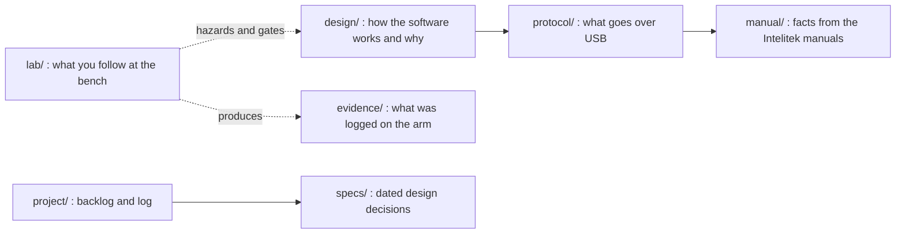

# Documentation index

Nothing in this repository has been verified on hardware; each document states its own evidence level. Offline tools and tests never open USB.

Start with [`../README.md`](../README.md) for the project summary and [`../START_HERE_WINDOWS.md`](../START_HERE_WINDOWS.md) to set up the lab PC.

## lab/ : at the bench

| Doc | Read when |
|---|---|
| [`LAB_VISIT_HANDOFF.md`](lab/LAB_VISIT_HANDOFF.md) | **Start here for the next visit**, person or AI: the situation, the rules, setup, a no-arm rehearsal, what each prompt and output means, troubleshooting, what to bring home |
| [`LAB_DAY_CARD.md`](lab/LAB_DAY_CARD.md) | **The next visit.** One sheet: idle, base jog, stop trial, phone-level check, stream trial, gripper trial, e-stop press, each with its command and what to write down |
| [`WINDOWS_BENCH_RUN.md`](lab/WINDOWS_BENCH_RUN.md) | Preparing a lab visit on Windows: copy, install, driver check, preflight |
| [`G1_LAB_CHECKLIST.md`](lab/G1_LAB_CHECKLIST.md) | At the bench: printable checklist, roles, pause points, stop conditions |
| [`ARM_CONTROL_BENCH.md`](lab/ARM_CONTROL_BENCH.md) | Running or rehearsing idle capture, home and one jog, command by command |
| [`LAB_SESSION.md`](lab/LAB_SESSION.md) | Using the guided session (`python -m scorbot.lab`) |
| [`VENDOR_PROTOCOL_LAB_PLAN.md`](lab/VENDOR_PROTOCOL_LAB_PLAN.md) | Confirming the vendor-protocol findings: the fast path (logs, e-stop press, stop trial, streaming trial) and what each result unlocks |
| [`S1_CAPTURE_LAB_CARD.md`](lab/S1_CAPTURE_LAB_CARD.md) | Capturing the Intelitek software's USB traffic, step by step |
| [`USB_CAPTURE.md`](lab/USB_CAPTURE.md) | Wireshark/USBPcap capture and comparison with this code's packets |
| [`PHYSICAL_CALIBRATION.md`](lab/PHYSICAL_CALIBRATION.md) | Starting calibration: what to do before measuring, measurement file formats, manual priors and bounds, count wrap, wrist |

## design/ : how it works and why

| Doc | Read when |
|---|---|
| [`ARCHITECTURE.md`](design/ARCHITECTURE.md) | Changing module boundaries or adding a backend. Mixed proposal and status; some statements predate later fixes |
| [`SAFETY_CASE.md`](design/SAFETY_CASE.md) | Changing a gate, a prompt, a fault path or a limit. Not a certification |
| [`OPERATOR_UX.md`](design/OPERATOR_UX.md) | Changing a prompt, warning or exit code |
| [`EXPERIMENT_RECORDING.md`](design/EXPERIMENT_RECORDING.md) | Recording, replaying or comparing runs; rehearsing without hardware |
| [`LEROBOT_EXPORT.md`](design/LEROBOT_EXPORT.md) | Turning lab sessions into a LeRobot dataset |
| [`DEPLOYMENT_OPTIONS.md`](design/DEPLOYMENT_OPTIONS.md) | Planning the lab PC and GPU server split, the LeRobot bridge, a front end |
| [`LAB_PLATFORM_VISION.md`](design/LAB_PLATFORM_VISION.md) | Asking where the project is heading |

## protocol/ : what goes over USB

| Doc | Read when |
|---|---|
| [`PROTOCOL.md`](protocol/PROTOCOL.md) | Editing packet code, decoding a capture, changing the handshake |
| [`VENDOR_DLL_PROTOCOL.md`](protocol/VENDOR_DLL_PROTOCOL.md) | Checking what the vendor's `USBC.dll` sends: message format, command letters, sequences, conversion, motion planner. From disassembly, unverified |

## manual/ : facts from the Intelitek manuals

| Doc | Read when |
|---|---|
| [`HARDWARE_REFERENCE.md`](manual/HARDWARE_REFERENCE.md) | Interpreting a LED, a limit or a manual claim. Nominal values |
| [`MANUAL_AND_PRIOR_ART_FINDINGS.md`](manual/MANUAL_AND_PRIOR_ART_FINDINGS.md) | Looking up vendor INI priors, SCORBASE facts and other projects' findings |
| [`MANUAL_VERIFICATION_IMPACT.md`](manual/MANUAL_VERIFICATION_IMPACT.md) | Seeing what the manual audit changed in the code |
| [`SCORBOT_Manual_Verification.md`](manual/SCORBOT_Manual_Verification.md) | Verifying a manual-derived constant or safety claim (the full audit; long) |
| [`SCORBOT_Numeric_Facts.yaml`](manual/SCORBOT_Numeric_Facts.yaml) | Tracing a number to its manual page. Machine-readable; not calibration or runtime configuration |

## project/, specs/, evidence/

| Doc | Read when |
|---|---|
| [`project/BACKLOG.md`](project/BACKLOG.md) | Choosing the next piece of work: every known bug and open item, prioritised |
| [`project/PROJECT_LOG.md`](project/PROJECT_LOG.md) | Catching up, or finding why something was decided |
| [`specs/`](specs) | Asking why a feature works as it does. Dated design specs; a spec records a past decision and may not match current code |
| [`evidence/`](evidence) | Checking what was actually logged on the arm (the 2026-09-29 idle capture) |

## For AI agents

`CLAUDE.md` at the repository root holds the rules (no USB, no motion, verification, style); `scorbot/`, `openScorbot/`, `scripts/`, `examples/` and `tests/` each have their own. Read the root one before any change and the directory's before editing there.

Constraints that hold across all docs:

- Never open USB from an agent session. Tests use synthetic packets and `SimulatedScorbot`.
- Do not claim hardware verification. Only a bench observation recorded in a reviewed log counts.
- Simulated output is labelled simulated and is not evidence about the arm.
- Neither `disable()` nor `request_stop()` is an emergency stop.
