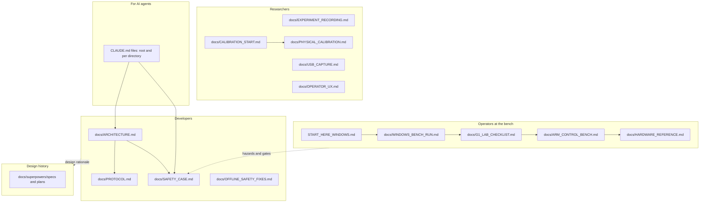

# Documentation index

Entry point for people and AI agents. Nothing in this repository has been verified on hardware; each document states its own evidence level. Offline tools and tests never open USB.

## Doc map

## Index

Status column: **stable** describes current behaviour; **plan** is forward-looking; **history** records a past design decision and may not match current code.

| Doc | Purpose | Read when | Status |
|---|---|---|---|
| [`../README.md`](../README.md) | Project summary, first Python session, tool list | First contact with the repository | stable |
| [`../START_HERE_WINDOWS.md`](../START_HERE_WINDOWS.md) | Install Python and check USB on the robot PC without commanding the arm | Setting up the bench PC | stable |
| [`WINDOWS_BENCH_RUN.md`](WINDOWS_BENCH_RUN.md) | Copy, install, driver check, read-only preflight, idle capture, small jogs | Preparing a lab visit on Windows | stable |
| [`G1_LAB_CHECKLIST.md`](G1_LAB_CHECKLIST.md) | Printable checklist, roles, pause points, stop conditions, observation sheet | At the bench, during gate G1 | stable |
| [`ARM_CONTROL_BENCH.md`](ARM_CONTROL_BENCH.md) | Full command-level procedure for idle capture, home and one base jog | Running or rehearsing G1 | stable |
| [`HARDWARE_REFERENCE.md`](HARDWARE_REFERENCE.md) | Manual facts (LEDs, controller protections, travel, homing) and what each means for the code | Interpreting a LED, a limit or a manual claim | stable, nominal values |
| [`SCORBOT_Manual_Verification.md`](SCORBOT_Manual_Verification.md) | Visual audit of the ER-4u Rev.B and Controller-USB Rev.G manuals: tables, citations, contradictions and documented unknowns | Verifying a manual-derived SDK constant or safety claim | source audit; hardware unverified |
| [`SCORBOT_Numeric_Facts.yaml`](SCORBOT_Numeric_Facts.yaml) | Machine-readable numeric evidence with units, source pages, tags and confidence | Tracing a number to its manual; not a calibration or runtime configuration | source transcription; hardware unverified |
| [`SAFETY_CASE.md`](SAFETY_CASE.md) | Hazard register, defence layers, fault response, gates G1-G3, open questions | Changing a gate, a prompt, a fault path or a limit; planning G2 | stable, not a certification |
| [`ARCHITECTURE.md`](ARCHITECTURE.md) | Systems review: legacy code assessment, target SDK structure, roadmap, risks | Changing module boundaries or adding a backend | mixed: proposal and status; some statements predate later fixes |
| [`PROTOCOL.md`](PROTOCOL.md) | USB packet layout and legacy command semantics | Editing packet code, decoding a capture, changing the handshake | stable |
| [`VENDOR_DLL_PROTOCOL.md`](VENDOR_DLL_PROTOCOL.md) | The vendor's message format, command letters, connect/control/stop sequences and reply layout, read from `USBC.dll` | Decoding a capture; designing stop, streaming or flow control; checking a legacy packet against the vendor's | from disassembly, unverified |
| [`OFFLINE_SAFETY_FIXES.md`](OFFLINE_SAFETY_FIXES.md) | Exact-count jog planner, signed decoder, wrist hold, jog preview | Reading or changing jog planning | stable |
| [`OPERATOR_UX.md`](OPERATOR_UX.md) | Evidence behind prompts and warnings; UX backlog | Changing a prompt, warning or exit code | stable |
| [`BACKLOG.md`](BACKLOG.md) | Every known bug and open item, prioritised, with code references | Choosing the next piece of work | plan |
| [`PHYSICAL_CALIBRATION.md`](PHYSICAL_CALIBRATION.md) | Measurement file formats, manual priors and bounds, count wrap, wrist | Collecting or fitting calibration data | stable |
| [`CALIBRATION_START.md`](CALIBRATION_START.md) | First measurement steps toward a validated calibration | Starting calibration work | plan |
| [`EXPERIMENT_RECORDING.md`](EXPERIMENT_RECORDING.md) | MCAP session recording, replay, analysis CLI, simulated robot, viewers | Recording, replaying or comparing runs; rehearsing without hardware | stable |
| [`USB_CAPTURE.md`](USB_CAPTURE.md) | Wireshark/USBPcap capture and comparison with this code's packets | Capturing the Intelitek software; G2 disable and handshake comparison | stable |
| [`DEPLOYMENT_OPTIONS.md`](DEPLOYMENT_OPTIONS.md) | Lab PC vs GPU server split, LeRobot plugin constraints, front end choice, demo target | Planning the LeRobot bridge, camera or web UI | plan |
| [`PROJECT_LOG.md`](PROJECT_LOG.md) | What happened, when and why: decisions, evidence and where each piece lives | Catching up on the project or finding why something was decided | log |
| [`evidence/`](evidence) | Lab evidence kept in the repo: the pasted 2026-09-29 idle-capture rows and the handoff note that explains them | Checking what was actually logged on the arm | evidence |
| [`superpowers/specs/`](superpowers/specs) | Design specs: experiment record, session analysis, simulated robot | Asking why a recording or simulation feature works as it does | history |

## For AI agents

| File | Purpose | Read when |
|---|---|---|
| `CLAUDE.md` (repository root) | Rules of engagement: no USB, no motion, verification and style conventions | Before any change |
| `CLAUDE.md` in `scorbot/`, `openScorbot/`, `scripts/`, `examples/`, `tests/` | Per-directory constraints and pointers | Before editing that directory |
| [`SAFETY_CASE.md`](SAFETY_CASE.md) | Which mitigation each test verifies; hazards with no test or no mitigation | Before weakening a gate, changing a fault path, or claiming a behaviour is safe |
| [`ARCHITECTURE.md`](ARCHITECTURE.md), [`PROTOCOL.md`](PROTOCOL.md) | Module responsibilities and packet facts | Before touching `scorbot/` or `openScorbot/` |

Constraints that hold across all docs:

- Never open USB from an agent session. Tests use synthetic packets and `SimulatedScorbot`.
- Do not claim hardware verification. Only a bench observation recorded in a reviewed log counts.
- Simulated output is labelled simulated and is not evidence about the arm.
- `disable()` is a queued command, not an emergency stop.
