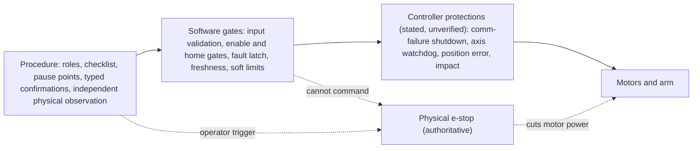
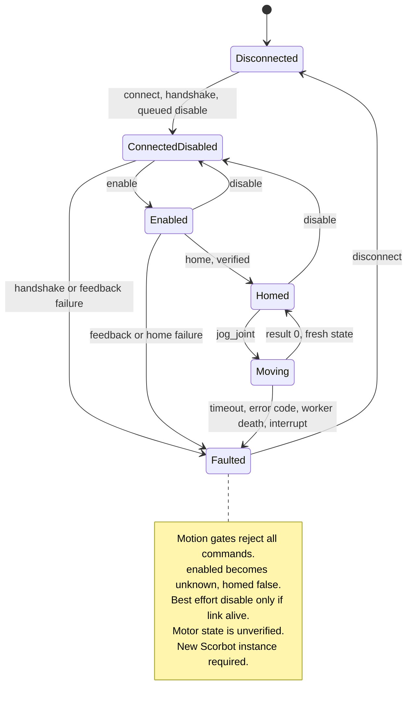

# Safety case: supervised bench operation

Engineering hazard register and safety argument for supervised bench tests of the ER-4U through this repository. **This is not a certification claim.** It does not assert conformance to ISO 10218, IEC 61508 or any other standard, and no independent assessor has reviewed it. Its purpose is to make each hazard, its layered mitigations, and the evidence behind them auditable.

Baseline: commit `99d3ab6` (branch `claude/docs-system-engineering`), 2026-09-29. **No test in this repository has run against real hardware.** Every hardware behaviour below is either taken from the Intelitek manuals ("stated") or is unverified. Offline tests establish software behaviour only.

## 1. Scope and assumptions

| ID | Statement | Basis |
|---|---|---|
| A1 | Scope: gate G1 (idle capture, one home, one base/shoulder/elbow jog of at most 1 degree per run) with G2 and G3 planned in section 6. Out of scope: Cartesian motion, autonomous operation, unattended use, wrist and gripper motion, the legacy GUI. | `docs/G1_LAB_CHECKLIST.md`, `docs/ARCHITECTURE.md` |
| A2 | Three roles held by three people: stop operator (hand at the emergency stop, eyes on the arm), keyboard operator, recorder. | `docs/G1_LAB_CHECKLIST.md` |
| A3 | The physical emergency stop is the only authoritative stop. Software `disable()` is a queued command and is not a stop. | `scorbot/robot.py:Scorbot.disable`, `docs/HARDWARE_REFERENCE.md` |
| A4 | Exactly one program owns the controller: Intelitek software and the legacy GUI are closed before Python connects. | Checklist section B; not enforced in code |
| A5 | The arm starts in the documented legacy homing pose; the base is secured and the whole arm path is clear. | Checklist sections B and D; not checkable in code |
| A6 | G1 limits: 1 degree per jog in `examples/bench_joint.py:main` (SDK ceiling 5 degrees in `scorbot/robot.py:Scorbot.__init__`), speed 1-20, base first, one direction per run, no wrist jogs. All G1 numbers are provisional. | Same files |
| A7 | Manual values are nominal. No encoder counts per revolution, zero or sign convention exist for this arm until measured. | `docs/HARDWARE_REFERENCE.md`, `scorbot/nominal.py` |
| A8 | Controller-side protections (communication-failure motor shutdown, per-axis watchdog, impact and position-error protection) are stated by the manual and unverified with this Python path. This case does not rely on them as the sole mitigation of any hazard. | `docs/HARDWARE_REFERENCE.md` |

## 2. Defence layers

Independence: procedure and physical stop do not depend on Python. Software gates depend on the USB path and cannot act after the link is lost. Controller protections are outside this repository and unobserved.

## 3. Hazard register

Mitigation prefixes: **P** procedural, **S** software, **C** controller hardware (stated by manual, unverified). Test IDs are `tests/file.py::Class::test`. "Unverified on hardware" means no bench observation exists. Status: **Open** (no adequate mitigation), **Mitigated offline** (software behaviour tested, hardware effect unverified), **Accepted G1** (residual accepted only under G1 limits and supervision).

| ID | Hazard | Cause | Consequence | Mitigations | Verification | Residual risk | Status |
|---|---|---|---|---|---|---|---|
| HZ-01 | Unexpected motion or torque on connect | The legacy handshake sends motor-on packets (`openScorbot/libsync.py:send_pkt3` via `motorson`) before Python can issue any command | Motors energised, possible motion or drop before the first disable | P: acknowledge flag `--acknowledge-connect-handshake`, e-stop tested first, start pose secured. S: `Scorbot.connect` queues `[16,1,1]` right after the handshake; `bench_joint.py:observe_leds` asks for the MOTORS LED at `after_connect`. C: none stated | Simulated only: `tests/test_simulated.py::SimulatedRobotTests::test_connection_lifecycle_matches_the_real_facade`, `tests/test_bench_joint.py::BenchGateTests::test_operator_declining_home_prevents_jog`. Real handshake window: unverified on hardware (G1 lab card: People and stop, Idle capture) | Motors are live for an unmeasured interval; the disable is queued behind the handshake, not concurrent | Accepted G1 |
| HZ-02 | Wrong jog direction or scale | Direction codes and counts per degree (2837/20 for the base) are inherited from the old code, not measured | Arm moves opposite to plan or by a different angle than requested | P: sign chosen from visible clearance, spoken read-back, separate observation of physical motion. S: `Scorbot.preview_jog` plan printed before `MOVE`; jog limited to 5 degrees (1 in the script) and speed 1-20; `scripts/review_lab_logs.py:review_bench` compares planned and observed counts | `tests/test_arm_control.py::CalibrationTests::test_jog_ceiling_cannot_be_raised_past_five_degrees`, `tests/test_python_api.py::CommandTests::test_jog_requires_homing_and_bounded_delta`, `tests/test_motion_profile.py::MotionProfileTests::test_exact_target_and_bounded_monotonic_setpoints`, `tests/test_lab_log_review.py::LabLogReviewTests::test_bench_reports_count_mismatch_without_claiming_motion_safe`. Direction and scale: unverified on hardware | Software checks counts, not physical angle; the first jog in each direction is an experiment | Accepted G1 |
| HZ-03 | Jog into a mechanical stop | No soft limits exist before calibration (G1); joint zero unknown | Stall against a hard stop, gear or belt stress | P: at most 1 degree per run, direction from visible clearance. S: none until a validated calibration is loaded (`Scorbot.jog_joint` soft-limit check). C: position-error and impact protection stated | Soft-limit gate offline: `tests/test_arm_control.py::CalibrationTests::test_calibrated_jog_cannot_bypass_soft_limit`. Uncalibrated case and controller protection: unverified on hardware | At G1 the only limit is procedural | Accepted G1 |
| HZ-04 | Homing from the wrong pose | Legacy homing assumes a start pose and does not check it (`openScorbot/setHome.py:homing` header) | Joint drives toward or past a mechanical stop, or a switch already active is misread as home | P: photo of start pose, typed `HOME`, pause point, stop operator confirms. S: `Scorbot.home` needs `start_position_confirmed=True` and enabled motors | `tests/test_bench_joint.py::BenchGateTests::test_operator_declining_home_prevents_jog` (prompt flow only). Pose correctness cannot be tested in software | Correctness depends on the operator; no pose sensing | Accepted G1 |
| HZ-05 | Base (and other axis) search travel unbounded (review finding H2) | Each search loop in `setHome.homing` is bounded by time (`HOME_SEARCH_TIMEOUT_S`, 30 s per axis) and by the controller error byte (`MAX_ERROR`), not by travel | Up to 30 s of continuous motion per axis if the switch is never seen; polarity and travel per second unmeasured | P: watch the entire search, decline `HOME_OK`, stop operator. S: 30 s deadline and `cancel_event` per axis (`setHome.search_must_stop`); `Scorbot.home` 180 s command timeout | Deadline logic only: `tests/test_python_api.py::LegacyPacketTests::test_homing_search_stops_on_cancel_or_deadline`. No test bounds travel; behaviour unverified on hardware | Travel in 30 s at homing speed may exceed the mechanical range. The 30 s value is not tuned | **Open** |
| HZ-06 | Home overshoot (review finding H3) | After the switch, `setHome.homing` runs a 12-packet braking loop and a settle loop instead of the manual's back-off until the switch turns off (`docs/HARDWARE_REFERENCE.md`) | Python home pose differs from the vendor home pose; overshoot past the switch | P: `HOME_OK` observation. S: `Scorbot.home` runs `JointCalibration.validate_home` when a calibration is loaded | No test of the overshoot. `validate_home` failure path has no test (`tests/test_arm_control.py::CalibrationTests::test_fit_and_load_use_holdout_and_provenance` only parses the tolerance). Unverified on hardware | Overshoot magnitude unknown; no mitigation of the motion itself | **Open** |
| HZ-07 | Home switch byte 32 or more misdecoded | `openScorbot/libdef.py:get_switch` assumes byte 5 below 32; a higher bit hides the shoulder switch and reports elbow, pitch and roll as home | Shoulder search never ends within the deadline; other joints skipped | P: the G1 lab card forbids homing at 32 or more. S: `Scorbot.home` refuses before sending any packet; `scripts/watch_lab_log.py` warns | `tests/test_python_api.py::CommandTests::test_home_refuses_switch_byte_the_legacy_decoder_misreads`, `tests/test_watch_lab_log.py::WatchLabLogTests::test_switch_byte_with_high_bit_warns_not_to_home` | The byte is read once before homing; a change during the search is not checked. Switch polarity is unverified | Mitigated offline |
| HZ-08 | USB loss, or sync or command worker death | Legacy loops have no error handling; a USB error kills the thread. The workers pass the sequence byte, so one death stops both | Idle packets stop; queued commands never execute, including disable; motor state unknown | S: `Scorbot._worker_died` latches the fault, wakes the waiting command, prints a stderr banner; `Scorbot._link_alive` skips a disable nobody will read; `Scorbot.get_state` refuses when the sync worker is dead; faulted `Scorbot.disconnect` keeps the USB handle. P: stop on the banner. C: comm-failure motor shutdown (stated, see HZ-16) | `tests/test_python_api.py::CommandTests::test_sync_worker_crash_faults_session_and_blocks_state`, `::test_sync_worker_crash_wakes_a_pending_command`, `::test_command_worker_crash_is_loud_and_names_the_worker`, `::test_disconnect_after_sync_crash_does_not_queue_exit`, `::test_faulted_disconnect_keeps_usb_handle_if_worker_is_active`; `tests/test_simulated.py::ReviewLeftoverTests::test_worker_crash_does_not_wait_for_a_disable_nobody_will_answer`. Real USB unplug: unverified on hardware | After link loss software cannot stop the arm | Accepted G1 |
| HZ-09 | Python crash or kill mid-motion | Process exit, console closed, Ctrl-C during a move | Motion may continue to the end of the queued command; disable is queued behind it or skipped | S: `Scorbot._command` latches, sets the cancel event and queues a disable on KeyboardInterrupt (behind the move; cancel reaches only the homing search). P: the G1 lab card states Ctrl-C does not stop a move; use the physical stop. C: comm-failure shutdown (unverified) | Log side only: `tests/test_simulated.py::BenchRecorderIsSecondaryTests::test_interrupt_during_the_jog_marks_the_open_command_faulted_once`. No test or bench observation of the arm stopping | **No software mitigation is possible after process death** | **Open** (procedural and hardware reliance) |
| HZ-10 | Disable is queued behind motion (not an e-stop) | One serialized command worker (`openScorbot/libcomm.py:execute`); only `setHome.search_must_stop` reads `cancel_event`; jog loops do not | `disable()` cannot interrupt a jog or a stalled command | P: wording in README and the G1 lab card never calls disable a stop. S: 30 s command timeout latches a fault and queues a best-effort disable (`Scorbot._command`) | `tests/test_python_api.py::CommandTests::test_timeout_requests_homing_cancel_and_disable` (order of queued commands, not stopping) | Stop latency of a jog is unmeasured | Accepted G1 |
| HZ-11 | Stale or missing feedback | Sync worker stalled, USB packet reused, buffer overwritten by legacy code | Gate or plan evaluated on old counts | S: `scorbot/packet.py:TrackedInputEndpoint.snapshot` returns only copied, full-length, fresh packets newer than a given index; `Scorbot._motion_state` latches a fault and queues a best-effort disable | `tests/test_arm_control.py::PacketTests::test_tracks_new_usb_reads_and_rejects_reused_state`, `tests/test_arm_control.py::CalibrationTests::test_stale_feedback_faults_before_any_motion`, `tests/test_simulated.py::SimulatedRobotTests::test_stale_feedback_queues_no_motion` | A fresh packet proves the link, not movement or switch state | Mitigated offline |
| HZ-12 | Count wrap at 0/65535 | Counter wraps at 65535 (one's complement with sign byte); `libcomm.py` settle checks use `abs(target - measured) > 20`, not wrap aware | A move that crosses the seam never settles and aborts with a spurious motion error; naive differences of signed counts jump by 65536 | S: `scorbot/calibration.py:signed_count_delta` (rejects the ambiguous half range) in the SDK, `scripts/review_lab_logs.py`, `scorbot/session` analysis. Legacy settle loop unchanged. P: none | `tests/test_properties.py::LegacyKnownBugs::test_legacy_settle_check_is_not_wrap_aware` (documents the defect, cannot detect a fix), `tests/test_arm_control.py::CalibrationTests::test_count_wrap_and_ambiguity`, `tests/test_lab_log_review.py::LabLogReviewTests::test_idle_range_is_wrap_aware_at_the_zero_seam`. Wrap rule vs real packets: unverified on hardware | Failure direction is a spurious fault, not extra motion. No procedural check of distance from the seam before a jog | **Open** (legacy loop unfixed) |
| HZ-13 | Calibration errors | Vendor display or manual used as data; span beyond travel; zero or sign wrong; wrong arm's file | Soft limits inside the file but outside the real envelope; false confidence in absolute moves | S: `scorbot/calibration.py:load_calibration` needs `status` validated, matching `robot_id`, source SHA-256, fit, holdout and home point counts, error at most 2 degrees; `scorbot/nominal.py:check_soft_limit_span` bounds the span only; `scripts/fit_calibration.py` refuses vendor-only data; `Scorbot.move_joint` faults on a miss over 2 degrees | `tests/test_arm_control.py::CalibrationTests::test_vendor_display_cannot_validate_calibration`, `::test_fit_and_load_use_holdout_and_provenance`, `::test_calibrated_move_reuses_one_bounded_jog`; `tests/test_nominal.py::ManualBoundsIntegrationTests::test_load_rejects_span_beyond_manual`, `::test_load_checks_shoulder_span_not_signed_limits`. Real calibration: none exists | A span check cannot detect a wrong zero or sign. Not used at G1 | Open until G3 |
| HZ-14 | Wrist two-motor coupling | Pitch and roll are driven by motors 4 and 5 in a differential; sign and scale unmeasured | A single-motor assumption moves the wrist in the wrong axis | S: `Scorbot.jog_joint` rejects `wrist_*` before queuing; `preview_jog` is offline only | `tests/test_arm_control.py::CalibrationTests::test_wrist_jog_rejected_without_queuing_motion`. **`Scorbot.home` still moves pitch and roll** (`setHome.homing`), and the legacy GUI is ungated: unverified on hardware | The gate covers jogs only. Homing exercises the wrist with no test of its direction | Accepted G1 (homing wrist motion) |
| HZ-15 | Operator error | Prompt habituation, leading questions, unsure answers, declines treated as faults | Wrong go decision; evidence biased toward the expected result; alarm fatigue | P: typed words `HOME`, `HOME_OK`, `MOVE`; recorder reports physical motion before count review; three roles; spoken pause points. S: `bench_joint.py:ask_key` never states the expectation; required LED checks fail before sampling or homing on a contradictory or unsure answer; a typed-confirmation decline is `OperatorDeclined`, exit code 3 (`EXIT_DECLINED`), not an alarm | `tests/test_bench_joint.py::BenchGateTests::test_motors_led_off_after_enable_stops_before_home`, `::test_operator_declining_home_prevents_jog`, `LedPromptTests::test_unsure_is_never_a_mismatch`, `::test_end_of_input_records_unsure_without_blocking`; `tests/test_lab_log_review.py::LabLogReviewTests::test_bench_with_led_prompts_needs_every_step`. Human effect: unverified | Remaining leading or habituating prompts: fixed word `MOVE`, compound `HOME_OK`, "(write 'none' if none)", observation asked after the plan is printed (`docs/OPERATOR_UX.md` backlog 1-3). `review_bench` lists steps missing from a declined run as problems (exit 1); no test covers a declined log | Open (backlog) |
| HZ-16 | Manual's communication-failure shutdown claimed, not verified | The manual states motor power shuts down on communication failure; never observed with this code | HZ-08 and HZ-09 rely on it for the case software cannot cover | P: G2 observation planned (section 6). S: none. C: as stated | None. Unverified on hardware | Unknown; treat as absent until observed | **Open** |
| HZ-17 | E-stop release leaves controller in COFF and SDK state stale | After release the controller stays in COFF until a new control-on; `Scorbot._enabled` is command history | SDK reports enabled with motors off, or resumes after a stop with unknown state | P: after a stop, no retry; new Python session only after log review (G1 lab card: Stop and keep evidence). S: the required LED check after `enable` ends the run before homing on a mismatch or unsure answer. No SDK detection of an e-stop | `tests/test_bench_joint.py::BenchGateTests::test_motors_led_off_after_enable_stops_before_home`. E-stop effect on packets and error bytes: unverified on hardware | Software cannot see an e-stop; only the LED does. The LED check runs after `enable` only, so an e-stop or controller-side motors-off during the jog loop is not seen until a later command fails (see HZ-21) | Accepted G1 |
| HZ-18 | Real and simulated data mixed | Rehearsal logs copied among lab evidence; `--simulate` omitted on a robot PC | Simulated evidence read as hardware evidence, or a rehearsal command connects to the real controller | S: `RobotState.simulated`, log rows marked; `scorbot/session` writer rejects mixed sources; `scripts/review_lab_logs.py:main` flags mixed logs and repeats the SIMULATED banner. P: rehearsal folder separate from `logs`; unplug the controller when rehearsing on the robot PC (G1 lab card: Check the PC once) | `tests/test_session.py::SourceMixingTests::test_simulated_state_rejected_in_real_and_synthetic_sessions`, `::test_real_state_rejected_in_simulated_session`; `tests/test_simulated.py::SimulatedRobotTests::test_event_log_rows_are_marked_simulated`, `::test_facade_gates_are_the_real_ones`; `tests/test_analysis.py::SummaryAndComparisonTests::test_mixed_sources_never_pool` | A pasted command without `--simulate` is a real connect; only the checklist prevents it | Accepted G1 |
| HZ-19 | Stale `openScorbot/data.json` | The legacy code creates it once and never overwrites it (`openScorbot/conf.py`, `CONFIG_PATH`); an old copy replaces packet timing and limits | Unknown timing and limit values in the motion path | P: the G1 lab card rejects a copied or hand-edited file and asks for review if its origin is unclear. S: `scorbot/provenance.py:motion_source_sha256` fingerprints source, not this file | None (no code checks the file). Unverified | Undetected in software | **Open** (procedural only) |
| HZ-20 | Two programs own the controller, or USB driver replaced | Intelitek software or old GUI left open; driver swapped to fit `libusb` | Interleaved packets, sequence-byte corruption, loss of the vendor tool | P: close other software; do not change a working driver (`docs/WINDOWS_BENCH_RUN.md`). S: `scorbot/preflight.py:run_checks` enumerates only | `tests/test_preflight.py::PreflightTests::test_missing_device_reports_driver_ambiguity`. No exclusivity check | Not detected in software | Open (procedural only) |
| HZ-21 | Controller turns motors off without the SDK knowing | E-stop, over-current or communication time-out cut motor power in the controller (Controller-USB manual pp. 10-11, 25); no decoded state byte is known to show motor power (`scorbot/state.py`) | `Scorbot._enabled` and `_homed` stay true while motors are off; the operator or a later step acts on a stale state | P: MOTORS LED check after `enable` (HZ-17). S: none until a command fails through the legacy error path (inferred) | None. Unverified on hardware | Detection is late, not absent (inferred) | **Open** |
| HZ-22 | Home reference shifts silently | Controller-USB manual p. 29, troubleshooting item 9: electrical noise can change Home suddenly, and the robot continues relative to the new Home. The manual does not say whether home survives COFF/CON, e-stop, reconnect or power cycle | Stored `home_counts`, marked positions or back-to-start plans point to the wrong physical pose | S: `Scorbot.disable`, faults and `disconnect` clear `_homed` and `_home_counts`. P: re-home each session | None for the noise case. Unverified on hardware | A shift inside one session is not detected | **Open** |
| HZ-23 | Arm may not hold its pose with motors off | No brake or holding specification in either manual; disable, finish, e-stop and comm time-out all remove motor power, possibly with shoulder or elbow off home | Shoulder or elbow sags under gravity onto a hand or object | P: keep hands and objects clear below the arm whenever motors go off. S: none | None. Unverified on hardware | Unknown until observed | **Open** |
| HZ-24 | Sync worker stalls while alive | The legacy worker blocks (for example a console QuickEdit selection or paging on a low-RAM PC) without dying, so idle packets stop | The controller may time out and cut power mid-motion with no SDK fault (inferred); see HZ-21 and HZ-23 | S: thread death is latched (HZ-08); a stall is not. P: disable console QuickEdit on the lab PC | None | Undetected in software | **Open** |

### Hazards with no test at all

HZ-06 (overshoot; home-failure path), HZ-09 (crash mid-motion, arm behaviour), HZ-16 (controller shutdown), HZ-19 (stale `data.json`), HZ-20 (exclusive ownership), HZ-21 (motors off unseen), HZ-22 (home shift), HZ-23 (holding with motors off), HZ-24 (stalled worker). HZ-05 has a test for the deadline mechanism only.

### Hazards with no software mitigation

HZ-05 (travel bound), HZ-06 (overshoot motion), HZ-09 (after process death), HZ-16, HZ-19, HZ-20, HZ-21, HZ-23, HZ-24.

## 4. Fault response

| Trigger | Detection (`scorbot/robot.py`) | Software action | Disable sent | Operator action |
|---|---|---|---|---|
| Command timeout (30 s; home 180 s) | `Scorbot._command` on `queue.Empty` | `_latch_fault`, `_cancel_event` set, disable queued | Queued behind the stuck command, best effort | Physical stop if arm moves |
| Controller error code | `Scorbot._command` result not 0 | Drain remaining results, latch | Yes, if `_link_alive` | Review log |
| Sync or command worker death | `Scorbot._worker_died` | Latch (first fault kept), cancel set, `_WorkerCrashed` wakes waiter, stderr banner | No (`_link_alive` false) | Physical stop; controller shutdown unverified |
| Feedback stale, short or invalid | `Scorbot._motion_state` | Latch, refuse motion | Yes, if `_link_alive` | Review log |
| Home verification failed | `Scorbot.home` with calibration | Latch, `home_failed` row | No | Re-measure |
| KeyboardInterrupt in a command | `Scorbot._command` | Latch, cancel set | Queued behind the move | Physical stop |
| Operator declines a prompt | `bench_joint.py:main` `OperatorDeclined` | Disconnect, `operator_declined` row, exit 3 | Via disconnect | None; not a fault |

Known gap: `Scorbot.jog_joint` and `Scorbot.get_joint_angles` set `_fault` directly on a calibrated-state error instead of calling `_latch_fault`, so `_enabled` is not set to unknown there.

## 5. Evidence rules

| Rule | Implementation |
|---|---|
| Review exit code 0 means the log parses, not that motion was safe | `scripts/review_lab_logs.py:review_bench` sets `physical_review_required` |
| Hardware evidence is recorded with commit and motion-source SHA-256 | `scorbot/provenance.py:motion_source_sha256`, `bench_joint.py` session row |
| Simulated results never count toward a gate | HZ-18 |

## 6. Verification plan

| Gate | Entry criteria | Activities | Exit criteria |
|---|---|---|---|
| G1 (current) | Offline tests and one `--simulate` rehearsal pass for this checkout; three roles assigned; e-stop pressed and released once; preflight passes; `data.json` origin checked; start pose photographed or sketched; switch byte below 32 | Idle capture; one home; one base jog of 1 degree; LED checks at each step; separate recorder watches the arm | Fresh before and after packets; observed direction recorded before count results are reviewed; no fault, no e-stop; logs reviewed and copied. **Does not** establish calibration, limits or stop behaviour |
| G2 | G1 passed. Idle capture understood. Both directions of the base, then shoulder and elbow, each at 1 degree | Controller watchdog observation: with a supervised, non-moving arm, stop the sync worker or unplug USB and record MOTORS and POWER LEDs and timing (closes HZ-16). Direction and scale for each joint against an independent reference. Real disable: compare captured Intelitek packets with `[16,1,1]` using `scripts/usb_trace.py` (`docs/USB_CAPTURE.md`). E-stop release behaviour in packets and error bytes (HZ-17). Handshake motor-on interval (HZ-01). Distance-from-seam check before jogs (HZ-12) | Each hazard row with "unverified on hardware" either gets an observation or stays open with a recorded reason. Direction and counts per degree measured for the joints in use. HZ-16 answered yes or no |
| G3 | G2 passed. Homing travel and overshoot understood (HZ-05, HZ-06), ideally with a manual-style back-off. Independent angle reference available | Measurement files and `scripts/fit_calibration.py` with holdout; validated calibration file loaded; soft limits from measured travel; return-to-home; repeat-home repeatability vs `home_tolerance_counts` | Calibration `validated` with holdout and motion checks under 2 degrees; soft-limit gate exercised on hardware; return-to-home repeatable within tolerance; wrist gate reviewed separately |

## 7. Open questions

| ID | Question | Affects |
|---|---|---|
| Q1 | Does the controller cut motor power on USB or communication timeout when the sync worker stops, and how long does it take? | HZ-08, HZ-09, HZ-16 |
| Q2 | How far does each axis travel in 30 s of homing search, and is a travel bound needed? | HZ-05 |
| Q3 | What is the home overshoot in counts, and what does a manual-style back-off change? | HZ-06 |
| Q4 | Is switch byte polarity as `libdef.get_switch` assumes, and does it change during a search? | HZ-07 |
| Q5 | How long are motors live during the handshake before the queued disable takes effect? | HZ-01 |
| Q6 | What do packets and error bytes report after an e-stop and its release? | HZ-17 |
| Q7 | What do the controller error bytes mean, and is `MAX_ERROR` a usable following-error limit? | HZ-05, HZ-03 |
| Q8 | Are the sign, wrap rule and counts per degree inherited by the legacy code correct for this arm? | HZ-02, HZ-12 |
| Q9 | Should the legacy settle loops in `openScorbot/libcomm.py` be made wrap aware, and should jogs be cancellable by `cancel_event`? | HZ-10, HZ-12 |
| Q10 | Can `home()` be replaced or gated so wrist motion during homing is verified before G3? | HZ-14 |
| Q11 | Should `review_bench` treat an `operator_declined` run as complete rather than as missing steps? | HZ-15 |
