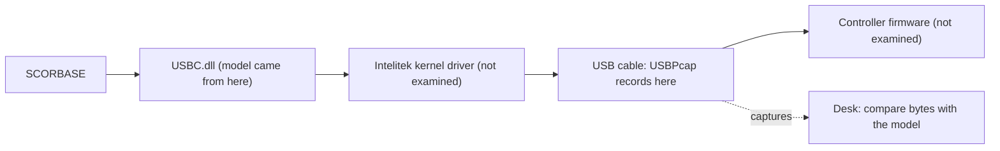

# Lab plan: confirm the vendor protocol on the real controller

Status: plan, 2026-10-04. Nothing here has been run.

## 1. What this is for

[VENDOR_DLL_PROTOCOL.md](VENDOR_DLL_PROTOCOL.md) says what Intelitek's DLL would send and how it reads the reply. That came from reading the DLL's code. It is a model of the system, not a measurement of it. Three things could make the model wrong for the lab's arm:

1. The lab's `USBC.dll` may be a different build from the two that were read.
2. Intelitek's kernel driver sits between the DLL and the cable and was never examined.
3. The controller's firmware may not behave the way the DLL assumes.

A USB capture of SCORBASE driving the arm is taken below all three, on the wire. If the captured bytes match the model, the model is confirmed for this controller. That is the whole plan: **capture, compare, record the verdict per claim.** The vendor DLL is never run by our code.



Why it matters: until 2026-10-04 the project rule was that packet code in `openScorbot/` does not change without a captured trace. The rule now also accepts the disassembly for sequences built only from command bytes the legacy code already sends, tried first on a 1 degree jog. That covers the stop and a connect that leaves motors off. Anything using a byte the legacy code never sends is still blocked until a capture confirms it.

## Fast path (do this first)

The vendor's messages are not in doubt: SCORBASE has driven these arms for decades. The only open question is whether **we read them correctly**, and most of that can be answered by our own code, in a normal lab session, with no SCORBASE, no Wireshark and no driver swap.

Two facts make that possible:

- On 2026-09-29 our code connected, homed and jogged the real arm. The legacy bytes it sent are the vendor's bytes (same command letters, same masks, same handshake). So V2, V7 and V12 already have hardware support: the controller accepted them.
- Every jog our SDK runs logs the raw packets both ways (`motion_trace`). Those packets go straight from our code to the controller, with no Intelitek driver in between, which is the path we actually care about.

| Step | What you do at the lab | Extra effort | Settles |
|---|---|---|---|
| F1 | Bring back the `logs\` folder from any session with jogs | none | V1, V2, V4 and, if a joint crosses its power-on position, V14 |
| F2 | Record idle with our code, press the e-stop at rest, release it per the lab procedure | one button press. Built: each idle sample row now carries `raw_hex` | V6 |
| F3 | Try the vendor stop from our own code: `bench_joint.py --stop-after-ms 150` on a 1 degree jog | built, simulator-tested, never run on the arm | V3 |

| F4 | Try streaming: one motor, a target one degree away, with `Scorbot.start_stream(travel_cap_deg=2)` | built, simulator-tested, never run on the arm; needs a small bench script first | whether the arm follows a stream of setpoints, the real loop period, the tracking error |

At a desk, for F1:

```powershell
python scripts\usb_trace.py from-log <file>.controller.jsonl --out trace.jsonl
python scripts\vendor_check.py trace.jsonl
```

It prints one line per claim: matches, CONTRADICTED, or not seen.

F3 is the first real "try". The risk is bounded: both bytes are ones the controller already accepts from us (`47` opens every legacy move, `4F 3F 53` closes it), the jog is 1 degree, and someone is at the physical stop. The worst expected outcome is that the arm finishes its 1 degree. The code is in place (`Scorbot.request_stop`, design in `docs/superpowers/specs/2026-10-04-software-stop-design.md`) and goes through the usual gates.

The SCORBASE captures in sections 2-4 become the **slow path**: only needed for what our own code cannot show, which is how SCORBASE itself behaves (its connect mode V5, its streaming period V8, its jog queue V9, what it does on close V15). They are worth doing once, but nothing in the fast path waits for them.

## 2. What needs testing, and why

Each row is one claim from the model. "Capture" names a file from the [S1 lab card](S1_CAPTURE_LAB_CARD.md); that card has the click-by-click steps and is unchanged. Priority 1 claims unblock safety work.

| # | Claim (from disassembly) | Why it matters to us | Capture | Confirmed if | Priority |
|---|---|---|---|---|---|
| V1 | Traffic is one 64-byte OUT then one 64-byte IN, bytes unchanged by the driver | Everything else assumes the capture shows the DLL's own messages | any (A) | OUT and IN are 64 bytes and alternate; OUT byte 4 only takes values from the command table | 1 |
| V2 | OUT byte 4 is a command letter, byte 5 an axis bitmask (`3F` arm, `20` gripper, `FF` all) | The legacy packets are built on this without knowing it | A, D | Every OUT byte 4 is in the table; masks are only those values | 1 |
| V3 | Arm stop = `47` (clear buffer) then `4F 3F 53`. The legacy `closeMov` lacks the `47` | A software stop that works mid-move (BACKLOG 6) | F | After F9: a `47` message, then `4F 3F 53`, and the setpoint stream stops changing; the arm stops at once (your note) | 1 |
| V4 | IN byte 0 echoes an OUT message ID, lagging by the number of messages queued in the controller | Flow control for the streaming driver; today we send blind | A (idle), B | IN byte 0 always equals a recently sent OUT byte 0; the lag is small at idle and grows during a go-to, never above about 45 | 1 |
| V5 | Which connect SCORBASE uses: reset handshake ending in motors off, or control on | Whether a connect that does not energise the arm is possible | A (start), plus the LED photo | The first messages are `5A`, `4F FF 54`, `73 FF`, `42 FF 00`; note whether `42 FF 01` follows before you click anything, and what the MOTORS LED did | 1 |
| V6 | IN byte 2 bit 0 = emergency | A fault source that should latch our session | E | The bit is 0 before the press, 1 while pressed, 0 after release | 1 |
| V7 | Control on = `47`, `4F FF 53`, `42 FF 01`, `73 20`, `42 20`; control off = `47`, `73 FF`, `42 FF 00`, `4F FF 53`, `73 FF`, `73 20`, `42 20` | Confirms our motors-on and motors-off messages against the vendor's | D | Those commands in that order after each click | 2 |
| V8 | Motion is a stream of `0D` messages whose per-axis values (bytes 12-43, signed 32-bit) change every message | The design assumption of the Ruckig planner (unknown 15) | B (slow go-to) | During the move the values change smoothly message to message; note the OUT period | 2 |
| V9 | Manual jog uses the same `0D` stream, with a smaller queue (4) | How to make teleop responsive (unknown 16) | H | No new command letter while the key is held; the V4 lag stays at about 4 or less | 2 |
| V10 | IN bytes 22+5N are position error | A following-error check of our own; what the legacy "error word" is (unknown 7) | B | Near zero at rest, grows while a joint moves, returns to near zero | 2 |
| V11 | IN byte 5 = home switches, one bit per axis; homing waits for on, then off | Our homing stops after the switch and never sees it release | A (home) | Each axis's bit goes 0 -> 1 -> 0 during that axis's homing, in the order you wrote down | 2 |
| V12 | Connect downloads parameters with `53`; parameter 8 = 16 | Tells us what host period the controller is told to expect | A (start) | A `53 00 08 00 10` message, then `53` messages with one axis bit each | 3 |
| V13 | The ID after 255 is 0 (vendor increment) or 1 (legacy) | Our sequence byte may be skipping a value the controller expects | A (idle, more than 256 messages) | Read the OUT byte 0 sequence across the wrap | 3 |
| V14 | Position is a 24-bit number, zero at `0x7FFFFF` | A decoder without the double zero | any capture where a joint crosses its power-on position | The three bytes step `FE FF 7F`, `FF FF 7F`, `00 00 80`, `01 00 80` with no jump | 3 |
| V15 | Closing SCORBASE sends a motors-off sequence | Whether the controller needs to be told, or times out | G | A control-off sequence (V7) before traffic ends | 3 |
| V16 | Counts per degree are 141.89 (base) and 113.51 (shoulder, elbow), from the vendor formula | The starting point for calibration; the legacy shoulder and elbow scales differ by about 1% | our own bench jogs with a physical angle measurement (`docs/PHYSICAL_CALIBRATION.md`) | Measured counts per degree within the measurement error of those values | 2 |
| V17 | The forearm and gripper keep their orientation to the horizontal when only the shoulder motor moves | Decides how counts become joint angles for kinematics, limits and dataset state | a shoulder bench jog with an inclinometer or phone level on the forearm | The forearm's angle to the horizontal does not change while the upper arm's does | 2 |
| V19 | A vendor point move is a jerk-limited S-curve by time: 30% speeding up, 40% cruising, 30% slowing down by default, all joints finishing together | Says what limits to give our own planner, and whether the vendor plans by time | B (the slow go-to) | The OUT setpoints of each moving joint, normalised by its distance, lie on the curve in `scorbot/vendor_profile.py`; joints start and finish in the same messages | 2 |
| V18 | Wrist: pitch from half the difference of the two motors, roll from half the sum, 27.9 counts per degree each (the legacy pitch scale is 33.8) | Needed before wrist jogs can be enabled | the wrist bench test, when it is designed | Opposite motor motion pitches, same-direction motion rolls, and the measured scale | 3 |

Already supported by data we have: the 2026-09-29 idle capture from the arm (`docs/evidence/`) shows all six joints within 2 counts of `0x7FFFFF` just after power-on, which is what V14 predicts for a controller that has not moved. It does not prove V14; the legacy reading fits the same numbers.

Deliberately not tested: the impact flag (IN byte 59) would need the arm to hit something. Do not provoke it. If it ever shows up in a capture, note it.

## 3. At the lab

Safety rules are those of the [G1 card](G1_LAB_CHECKLIST.md) and the S1 card: someone at the physical stop for every motion, one program connected at a time, press the stop and end the session if anything moves unexpectedly. `Control Off` and F9 are not an emergency stop.

**Step 0, before anything moves (10 min, no arm motion).** This is S1 card step 0, with two additions in bold.

- [ ] Copy the whole `logs\` folder to a USB stick. This includes the G1 logs that never left the lab PC.
- [ ] Copy `USBC.INI`, `ER4CONF.INI` and the `PAR\` folder from the SCORBASE install folder.
- [ ] **Copy `USBC.dll` itself** to the USB stick, and write down its size and date. In PowerShell: `Get-FileHash "C:\path\to\USBC.dll"`. It is a vendor file: take it home, never commit it. With it we can check that the lab's build matches the one that was read.
- [ ] **Write down the SCORBASE version** (Help -> About).

**Step 1, captures.** Follow the S1 card. If time is short, do them in this order and stop when you run out; each one is useful alone.

| Order | Capture | Claims it settles | Arm moves? |
|---|---|---|---|
| 1 | A basic (connect, idle 60 s, home, jog) | V1, V2, V4, V5, V11, V12, V13 | yes (home, small jog) |
| 2 | F stop (F9 during a small go-to) | V3 | yes |
| 3 | D control (Control Off / On at rest) | V7 | no commanded motion; watch for sag |
| 4 | E e-stop (at rest, only if the lab allows) | V6 | no |
| 5 | B go-to, including one slow move | V8, V10 | yes |
| 6 | H manual jog | V9 | yes |
| 7 | G close | V15 | no |
| 8 | C speeds | none here; it serves the S1 card's own questions | yes |

For capture A, start Wireshark **before** SCORBASE connects, so the connect sequence (V5, V12) is in the file.

**What to write down that the capture cannot show.** For V5: what the MOTORS LED did between SCORBASE connecting and your first click. For V3: whether the arm stopped at once on F9 and whether control stayed on. For V11: the order the axes homed in. For every capture: the pendant switch position.

## 4. Back at a desk

No arm needed.

1. `python scripts\usb_trace.py summary <capture>` to find the controller's device number, then `export` each capture to JSONL ([USB_CAPTURE.md section 4](USB_CAPTURE.md#4-find-the-device-export-compare)).
2. Decompile the lab's `USBC.dll` with [tools/usbc_analysis](../tools/usbc_analysis/README.md) and compare it with the builds already read.
3. For each row of the table in section 2, check the "confirmed if" condition against the exported rows.
4. Record the verdict in VENDOR_DLL_PROTOCOL.md: each claim becomes **confirmed by capture**, **contradicted** (with the bytes seen), or stays **unverified** (not captured).

`python scripts\vendor_check.py <exported trace>` does step 3 for V1, V2, V4, V6, V13 and V14 and prints one line per claim. The rest (the stop, control and connect sequences, the setpoint stream) are read by hand from the exported rows.

## 5. What each verdict unlocks

| If confirmed | Then we may build (each still gated and tested) |
|---|---|
| V1, V2 | Treat the vendor command table as the meaning of the legacy bytes |
| V3 | A stop that clears the controller's queue, sent mid-move. Still not an emergency stop |
| V4 | Flow control in the phase C streaming driver |
| V5 | A connect that does not turn the motors on |
| V6 | Latch a session fault on the emergency bit |
| V8, V9 | Streaming with a short queue for teleop |
| V10 | A following-error fault of our own |
| V14 | A count decoder without the double zero |

If a claim is contradicted, the model is wrong there: the doc is corrected and nothing is built on it.
