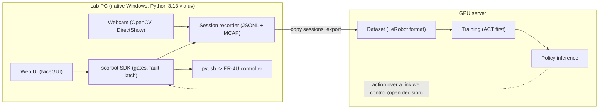

# Deployment options: lab PC, GPU server and front end

Status: plan, 2026-10-01. Nothing here is built unless it says so, and nothing is verified on hardware. Goal and sub-projects: [LAB_PLATFORM_VISION.md](LAB_PLATFORM_VISION.md). Target for the semester: a supervised demo (see "Demo target").

**Evidence level.** The findings below come from web search summaries on 2026-10-01, not from reading the primary documents: `huggingface.co` and the CVE write-ups were blocked by the network proxy in the session that produced this file. Re-check the LeRobot items against the current LeRobot docs and release notes before relying on them.

## Decisions

| Area | Choice |
|---|---|
| Lab PC | Native Windows. Control, camera, recording and UI run here. Python 3.13 managed by `uv` (3.12 confirmed available; 3.13 chosen 2026-10-01 because its Windows monotonic clock ticks every 100 ns instead of about 15.6 ms). Built 2026-10-01: `uv.lock`, `.python-version`, [START_HERE_WINDOWS.md](../../START_HERE_WINDOWS.md) option A. |
| GPU server | Training. Policy inference too, unless the lab PC gets a GPU. The team has a server PC with GPUs. |
| Learning stack | LeRobot, in a separate package that needs Python 3.12 or newer. This repo keeps supporting Python 3.10 and up. |
| Front end | A local web app served by Python on the lab PC (NiceGUI), flat tile layout. |
| Review viewer | Rerun (open source, reads MCAP). Foxglove stays optional. |

## What the research found

| Finding | Consequence |
|---|---|
| LeRobot needs Python 3.12 or newer and supports Windows. TorchCodec on Windows needs PyTorch 2.8 or newer; older PyTorch falls back to `pyav`. | The plugin lives outside this repo's core package. |
| LeRobot auto-discovers installed packages named `lerobot_robot_*`, `lerobot_teleoperator_*` and `lerobot_camera_*`. | Name ours `lerobot_robot_scorbot` and `lerobot_teleoperator_scorbot`. |
| A reported LeRobot issue (#2460) says editable installs are not discovered. | Install the plugin non-editable on the machine that runs LeRobot, or pass an explicit discover path. |
| The robot interface is `observation_features`, `action_features`, `is_connected`, `get_observation()` and `send_action()`. `send_action()` returns the action actually sent, possibly clipped by safety limits. | `send_action` must go through the SDK gates (5 degree jog ceiling, fault latch, calibration check), never around them. |
| **CVE-2026-25874:** LeRobot's async inference server (`PolicyServer`, gRPC) calls `pickle.loads` on unauthenticated, unencrypted input. All versions through 0.5.1 are affected (CVSS 9.8). At disclosure on 2026-04-28 no released version had a fix. The fix (PR #3048, safetensors and JSON) was planned for 0.6.0. | **Fix status today is unverified.** Do not run LeRobot's async policy server where anything else can reach it. Either confirm a fixed release, or keep inference in-process or behind our own authenticated link (see below). |
| USB through WSL2 with `usbipd-win` has reported dropped zero-length packets, crashes under Python and dropped connections after sleep. | The arm's USB stays on native Windows. Our packet timing is already marked load-bearing and unverified. |
| `uv` installs CPython without admin rights and writes a portable lockfile (`uv sync --locked`). | Use it for the lab-PC install. The WinUSB driver step still needs admin once ([WINDOWS_BENCH_RUN.md](../lab/WINDOWS_BENCH_RUN.md)). |
| A community report trained a 52M-parameter ACT policy on 50 demonstrations in about 4 hours on a 12 GB RTX 3080. That was an SO-101 arm, not a ScorBot. | A server with GPUs is more than enough for ACT. Our demonstration count and time are unknown. |
| OpenCV on Windows: the DirectShow backend (`CAP_DSHOW`) opens faster than MSMF, which has slow-start issues. Backend timestamps are unreliable and often 0. | Use `CAP_DSHOW`, stamp every frame with `time.perf_counter()` right after `read()`, lock exposure and focus. A slow `read()` and a dropped frame look the same by wall clock alone. |

## Where each piece runs

Only the lab PC ever touches USB. The server never imports the SDK's USB path, and tests, simulators and CI still never open USB.

## Lab PC run options

| Option | Verdict |
|---|---|
| **Native Windows with `uv`-managed Python 3.13** | Recommended. It is the only route with a proven USB path. |
| WSL2 with `usbipd-win` | Rejected: reported USB reliability problems, see above. |
| Docker Desktop on Windows | Not researched. Assumed to go through WSL2 and inherit its USB problems (unverified). Not pursued. |

## Front end

| Tool | Verdict |
|---|---|
| **NiceGUI** | Choice. FastAPI backend, Vue/Quasar front end, live updates over websockets, used in production by a robotics company (Zauberzeug). Quasar themes well into flat tiles. Smaller community. A pip dependency, so it goes in an optional extra and the core SDK stays light. |
| Streamlit | Reruns the script on each interaction and can reset state. A poor fit for a control panel. |
| Plain FastAPI plus static HTML | More control and more work. The fallback if NiceGUI disappoints. |

Layout: tiles for arm state, LEDs, calibration status, current session and live camera. Safety rules carry over from [CLAUDE.md](../../CLAUDE.md) and [OPERATOR_UX.md](OPERATOR_UX.md):

- The UI never bypasses SDK gates and is never presented as an emergency stop. The physical stop is authoritative.
- Simulated sessions always show a SIMULATED banner and never share a view with real data.
- Plots and video review reuse Rerun rather than custom charts.

The UI waits until the exporter and camera capture exist, so it has real data to show. The guided terminal session (`python -m scorbot.lab`) is the operator tool until then.

## Demo target

1. An operator teleoperates reach episodes by keyboard or gamepad while the webcam records.
2. Sessions are exported as a LeRobot dataset and an ACT policy is trained on the GPU server.
3. The policy moves the arm to a visible target under supervision, through the same gates.
4. The web UI shows state, the SIMULATED banner and session review.

VLA is not planned for the semester demo. If it is attempted, SmolVLA is the candidate: search results put inference under 1 GB of VRAM for the SmolVLM backbone and fine-tuning around 16 GB (unverified for our setup).

**Largest risk (S1).** If the controller cannot accept streamed setpoints, control runs at about 1 Hz. ACT predicts action chunks, so it may still work at that rate. That is an inference, not a measurement.

## Open design decisions

| # | Decision | Notes |
|---|---|---|
| 1 | How the policy's action reaches the lab PC | The lab PC has no GPU (decision 4), so inference runs on the server and the link is required. Options: confirm a fixed LeRobot async server and bind it to localhost behind an SSH tunnel; or a small server of our own with authentication and JSON or safetensors only. Never pickle over a network. CPU inference on the lab PC is not ruled out for a small policy but is unmeasured. |
| 2 | Camera model, mount and exposure settings | A standard OpenCV-compatible webcam is on order. Fix focus and exposure before recording training data. |
| 3 | Teleop device order | Keyboard first (the lab session already has the keys), gamepad second. A leader arm is deferred: it needs a second arm with readable encoders, which is unverified. |
| 4 | Whether the lab PC has a GPU | Answered 2026-10-01: no. The lab PC is a small cube Windows PC, GPU not confirmed but assumed absent. Open: is the server on the same network as the lab PC? |

## Sources

- LeRobot installation: <https://huggingface.co/docs/lerobot/installation>
- LeRobot, Bring Your Own Hardware: <https://huggingface.co/docs/lerobot/en/integrate_hardware>
- LeRobot plugin discovery issue: <https://github.com/huggingface/lerobot/issues/2460>
- CVE-2026-25874, Cloud Security Alliance note: <https://labs.cloudsecurityalliance.org/research/csa-research-note-lerobot-cve-2026-25874-unauth-rce-20260429/>
- CVE-2026-25874, The Hacker News: <https://thehackernews.com/2026/04/critical-cve-2026-25874-leaves-hugging.html>
- `usbipd-win` issue on dropped transfers: <https://github.com/dorssel/usbipd-win/issues/924>
- Connecting USB devices to WSL: <https://devblogs.microsoft.com/commandline/connecting-usb-devices-to-wsl/>
- `uv` Python install without admin: <https://pydevtools.com/handbook/how-to/how-to-install-python-with-uv/>
- OpenCV MSMF slow start: <https://github.com/opencv/opencv/issues/27917>
- OpenCV frame timestamps: <https://forum.opencv.org/t/get-framerate-and-frame-timestamp-from-live-webcam-stream/14475>
- NiceGUI vs Streamlit: <https://www.bitdoze.com/streamlit-vs-nicegui/>
- Rerun vs Foxglove: <https://foxglove.dev/robotics/rerun-vs-foxglove>
- ACT on SO-101 training report: <https://huggingface.co/blog/sherryxychen/train-act-on-so-101>
