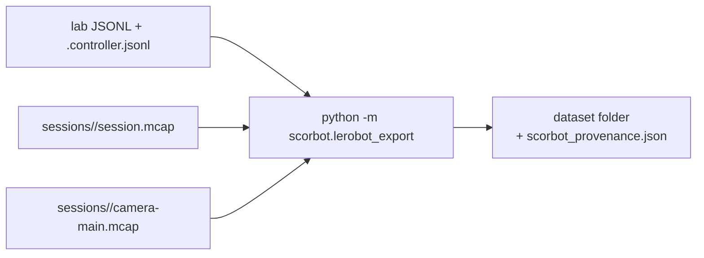

# Exporting lab sessions to a LeRobot dataset

> **Removed 2026-10-08:** the code this document describes was deleted from the repo (see git history before that date). Kept for reference only.

Turns the episodes you recorded in teleop mode (`python -m scorbot.lab`, keys
`t` then `r`) into a [LeRobot](https://github.com/huggingface/lerobot)
dataset on your disk, for training a policy later. Nothing is uploaded.



## One-time setup (separate environment)

LeRobot needs PyTorch and pins an older OpenCV than this project, so it lives
in its own environment, `.venv-lerobot` (git-ignored). CPU-only is enough for
exporting.

```powershell
.\.venv\Scripts\uv.exe venv .venv-lerobot --python 3.13
.\.venv\Scripts\uv.exe pip install --python .venv-lerobot\Scripts\python.exe "lerobot[dataset]==0.6.1"
.\.venv\Scripts\uv.exe pip install --python .venv-lerobot\Scripts\python.exe -e . --no-deps
.\.venv\Scripts\uv.exe pip install --python .venv-lerobot\Scripts\python.exe "mcap>=1.5,<2" "pyusb>=1.2,<2"
```

## Export

Check first; the dry run needs no LeRobot and writes nothing:

```powershell
.\.venv\Scripts\python.exe -m scorbot.lerobot_export logs\lab-er4u-1-2026-10-09-01.jsonl --out datasets\reach-01 --repo-id local/scorbot-reach --dry-run
```

Every episode is listed as `KEEP` or `SKIP` with the reason; a whole input
can be `REFUSE`d. Then write it from the LeRobot environment:

```powershell
.\.venv-lerobot\Scripts\python.exe -m scorbot.lerobot_export logs\lab-er4u-1-2026-10-09-01.jsonl --out datasets\reach-01 --repo-id local/scorbot-reach
```

LeRobot may print `torchcodec` DLL errors on Windows: it tries its fast video
decoder (which needs FFmpeg's shared libraries) and falls back to PyAV. The
export still succeeds.

Options: `--fps 10` (default), `--max-frame-gap 0.2` (seconds), `--no-video`
(robot-only dataset, required when the session had no camera). Several lab
logs can go into one dataset. The output folder must not exist; the dataset
is built in a temporary folder, checked by reopening it, and only then
renamed into place, so a failed export never leaves a partial dataset.

## Preview before exporting

Add `--preview report.html` (works with `--dry-run`, needs no LeRobot): one
page you open in any browser, with per kept episode its task, length, up to 8
camera thumbnails and a plot per arm joint of position (solid) against target
(dashed), and every refused episode with its reason. It loads nothing from the
internet and stays small (images capped).

## Replay on the arm (lab tool, key `p`)

Every exported dataset also holds `scorbot_episodes.jsonl`, the actions in a
form the lab PC reads without LeRobot. To replay an episode on the arm, run the
guided session as usual, arm with `a`, then press `p`, type the dataset folder
and the dataset episode number (0 is the first). Before anything moves the
lab tool checks the dataset:

- the sidecar is unchanged since export (its sha256 matches the provenance);
- it is real data for a real session (simulated data only in `--simulate`
  rehearsals) and was recorded on this robot id;
- units, motor order and the step scale match this software;
- every target stays inside the travel cap (`limits.TRAVEL_CAP_DEG`, 180 degrees since 2026-10-06; the joint limits bind first) and the wrist never moves;
- consecutive targets change by at most one step on one joint.

Then, if the arm is not at the episode's start pose, it shows the moves and
asks you to type `START <n>`; then it shows the replay and asks for
`PLAY <n>`. Both run one step at a time; **any key stops after the current
step** (a software pause, not an emergency stop: the physical stop is the
stop), and on the real arm a terminal that cannot read keys is refused. At
the end it compares the arm with the recorded final position.

## Replay with LeRobot's tools (simulator only)

`plugins/lerobot_robot_scorbot` lets LeRobot drive the **simulated** arm, for
checking a dataset end to end and as the bridge for training later (M2).
Install it once into the LeRobot environment and replay:

```powershell
.\.venv\Scripts\uv.exe pip install --python .venv-lerobot\Scripts\python.exe -e plugins\lerobot_robot_scorbot --no-deps
.\.venv-lerobot\Scripts\lerobot-replay.exe --robot.type=scorbot --robot.simulate=true --dataset.repo_id=local/scorbot-reach --dataset.root=datasets\reach-01 --dataset.episode=0 --play_sounds=false
```

**Two ways to follow actions.** By default each `send_action` is at most one
1 degree jog and waits for it, which suits replaying a keyboard recording.
With `--robot.streaming=true` each `send_action` only moves the target of
`Scorbot.start_stream` and returns at once, and the streaming driver moves
the three arm motors toward it together: what a policy that acts many times a
second needs. Same motors, same travel cap. Streaming needs Ruckig in the
LeRobot environment:

```powershell
.\.venv\Scripts\uv.exe pip install --python .venv-lerobot\Scripts\python.exe "ruckig>=0.12,<1"
```

`tests/test_lerobot_plugin.py` runs an observe, decide, act loop through the
plugin in both modes. Neither has run on the arm.

The plugin refuses the real arm (`simulate=false`) and points to the lab
tool: LeRobot's replay connects outside its cleanup and has no stop key.
Real-arm use through LeRobot gets its own reviewed design in M2.

## What each frame holds

| Feature | Meaning |
|---|---|
| `observation.state` | base, shoulder, elbow, wrist motor 1, wrist motor 2: encoder counts from the session home, uncalibrated |
| `action` | the target the SDK sent while a jog is moving (or was commanded since the last frame), otherwise the current position |
| `observation.images.main` | the latest camera frame at or before the frame time |
| `task` | the task text you typed for the episode |

## What is refused, and why

| Refused | Why |
|---|---|
| real and simulated sessions together | a rehearsal must never pass as lab data |
| episodes with and without camera together, or no camera without `--no-video` | LeRobot needs the same features in every episode |
| sessions with integrity errors, a failed session, no home, or a clock coarser than 1 ms | the record cannot be trusted or timed |
| a session or camera file that never closed cleanly (crash, stuck stop), or an MCAP folder whose data source or robot id differs from the lab log | not proof of a complete, matching recording |
| MCAP jog commands that do not match the SDK's jog records one for one | a lost record would label a real move as "stay still" |
| episodes not ended with `r` and `y` (discarded, aborted, crashed), or with no jog at all | not demonstrations |
| episodes missing from the MCAP record, or with a fault or counts drift inside | evidence incomplete or the arm state unverified |
| a jog whose lab target and SDK target differ by more than 20 counts | the action must be what was actually sent |
| two jogs inside one frame interval | one frame cannot carry two actions |
| motion during a frame with no recorded controller packets | the state would sit still while the arm moves |
| no camera frame for more than `--max-frame-gap` | frozen video |
| fewer than 2 frames | nothing to learn from |

## Limitations (read before training)

- **Step-and-stop motion.** Teleop moves 1 degree per key press; the data
  shows steps, not smooth paths, until the streaming motion layer (S2).
- **Uncalibrated counts.** No degrees until a physical calibration exists.
- **Simulated sessions** have no USB packets; their jogs finish instantly, so
  no frame falls inside one. Their video is synthetic.
- **Image latency is unmeasured.** Frame times are when `read()` returned, not
  when the picture was taken; a webcam may buffer frames. Measure it once in
  the lab: run `python -m scorbot.camera check --record <folder>` while the
  webcam films a phone stopwatch next to the PC clock, then compare the
  stopwatch in a frame with that frame's time. Until then every dataset's
  `scorbot_provenance.json` says `"image_latency": "unmeasured"`.

## Provenance

`scorbot_provenance.json` inside the dataset lists the exporter version, fps,
units, data source, each input session (log path and SHA-256, MCAP session
id, motion-code fingerprint, software commit), each exported episode and
every refusal.

## Test

```powershell
.\.venv\Scripts\python.exe -m unittest tests.test_lerobot_export
.\.venv-lerobot\Scripts\python.exe -m unittest discover -s tests -p "test_lerobot_export_write.py"
.\.venv-lerobot\Scripts\python.exe -m unittest discover -s tests -p "test_lerobot_plugin.py"
```

The second runs a real round trip through LeRobot. It is run with `discover`
because a third-party package in `.venv-lerobot` is named `tests`.
