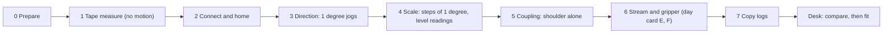

# Source-model acceptance run

Written 2026-10-05. Nothing here has been run on the arm.

The arm's numbers in [ER4U_MODEL.md](../manual/ER4U_MODEL.md) come from the vendor's files, not from this arm. This run measures the six things listed at the bottom of that page, small and supervised. It is meant to follow [LAB_DAY_CARD.md](LAB_DAY_CARD.md) steps A to F in the same visit, or to replace the parts of it you have no time for. Safety rules are those of the [G1 card](G1_LAB_CHECKLIST.md): someone at the physical stop for every motion; neither Ctrl-C nor a software stop is an emergency stop; a fault ends the session and nothing is retried.

## Why not the jogs of plus and minus 2 degrees

`examples/bench_joint.py` refuses `--delta` above 1 degree, on purpose. One degree is only 114 to 142 counts, and a phone level reads to about 0.1 degree, so a single 1 degree jog is good to roughly 10 percent. The two shoulder scales being told apart (113.5 against 101.7 counts per degree) are 11.6 percent apart. So the scale step uses the guided session (`python -m scorbot.lab`), which takes single 1 degree steps and lets a joint go up to 10 degrees from home: 5 degrees gives about 2 percent, which separates them. No limit is raised.

## 0. Prepare (no arm motion)

- [ ] Do day card section 0 (copy `logs\`, update, install, USB check, close SCORBASE).
- [ ] Bring: a phone or digital angle gauge with a level app, a tape measure, a printed protractor or the gauge for the base, paper for the tables below.
- [ ] Rehearse once with `python -m scorbot.lab --simulate --profile rehearsal\lab.json --logs rehearsal`.

## 1. Tape measure (arm powered down or at rest; no software)

| Measure | Model says | You measured |
|---|---|---|
| Shoulder axis above the base bottom | 349 mm (manuals disagree: 346 to 364) | |
| Tool point at the homing start pose, out from the base axis | about 169 mm | |
| Tool point, height above the base bottom | about 504 mm plus the base-bottom offset | |

Rough numbers are fine: the question is 349 or 364, not a millimetre.

## 2. Connect and home

`python -m scorbot.lab` (real arm, no `--simulate`). Answer the LED prompts as the card says, do the idle, home with `HOME`.

- [ ] Write down the homing start pose and whether home looked right.

What the session asks that this card does not repeat (all of it is in [LAB_SESSION.md](LAB_SESSION.md), and every prompt was rehearsed in the simulator on 2026-10-05):

- The first time you press a joint key it asks you to **type the move** (for example `BASE +1`); pressing the same key again repeats it without typing.
- After every step it asks which way the joint went and whether anything else moved, then prints `Step n: planned ..., measured ...`. **Write that `n` down.**
- `b` (back to start) needs the typed word `BACK`, runs one step per degree, and asks at the end whether the arm is where it should be. **Those steps take step numbers too**, so after a `b` the next `-` step is not number 6. Always copy the number printed on screen.
- The `measured` counts on that line are for one step. Add up the steps of one run to get the counts change, or read the summary table the session prints at the end (every step, its number and its measured counts).

## 3. Direction (item 2 of the list)

In the same session, arm (`a`) and step each joint **one** step of 1 degree in its `+` key (`1`, `2`, `3`). For each, answer the "toward or away" prompt for the landmark, and write down which way the joint went in plain words (base: left or right seen from above; shoulder and elbow: up or down).

| Joint | `+` went | Source model says `+` |
|---|---|---|
| base | | |
| shoulder | | |
| elbow | | |

Use `b` (back to start) between joints. A direction that disagrees with the model is a result, not a failure: stop that joint, keep the log, go on to the next.

## 4. Scale (item 1)

For each joint in turn, from the home pose: read the physical angle with the level or protractor (A0). Step `+` five times, one step per press, waiting for the arm to stop. Read the angle again (A5). Then `b` back to start and do the same with `-` for five steps (A-5).

The shoulder goes up only 3.7 degrees from home before its joint limit refuses further steps, so for the shoulder do `-` first and stop going up at three.

| Joint | Direction | Presses | A0 | A after | Step n | Angle change | Counts change (from the log) | Counts per degree |
|---|---|---|---|---|---|---|---|---|
| base | + | 5 | | | | | | |
| base | - | 5 | | | | | | |
| shoulder | - | 5 | | | | | | |
| shoulder | + | 3 | | | | | | |
| elbow | + | 5 | | | | | | |
| elbow | - | 5 | | | | | | |

The counts change is the sum of the `measured` counts the session printed for the steps of that run (about 142 per base step if the model is right), or `encoder_counts` of the log row after the last step minus the one before, taken with `scorbot.calibration.signed_count_delta`, never by plain subtraction.

What to compare, from the model:

| Joint | Model counts per degree | Alternative being excluded |
|---|---|---|
| base | 141.89 | |
| shoulder | 113.51 | 101.7 |
| elbow | 113.51 | 101.7 |

Within about 5 percent of the model: the scale is confirmed for this arm to the accuracy of the measurement. Closer to the alternative, or neither: keep the numbers, the model's scale is **wrong for this arm** and the motion that depends on it stays inside the cap.

## 5. Coupling (item 3)

Same as day card step D: the level on the **forearm**, one shoulder step of 1 degree, forearm angle before and after.

- [ ] Forearm before ______ after ______. Unchanged: the model's coupling holds. Changed by about the shoulder's step: it does not, and every elbow angle the model gives is off by the shoulder's.

## 6. Stream, stop and gripper (item 6)

Day card steps C, E and F, in that order, each with its own output name. They need the arm homed in a fresh `bench_*` run; end the guided session first (`x`).

## 7. Before you leave

- [ ] Copy the whole `logs\` folder, including `sessions\`.
- [ ] Photograph the tables above.

## Back at a desk

1. Fill the counts-per-degree column from the log, and compare with the model column.
2. Update [ER4U_MODEL.md](../manual/ER4U_MODEL.md): each of the six items becomes confirmed, contradicted (with the number) or still open.
3. Only if you want a calibration of this arm (the only tier that may widen travel): the session prints `Step n:` after every jog, so write the step number beside each angle you read. Put the readings in a file and run `scripts\build_calibration_csv.py` as [PHYSICAL_CALIBRATION.md](PHYSICAL_CALIBRATION.md) describes; it takes the counts from the logs and tells you what is still missing. The fitter wants 13 rows per joint (3 homes, so 3 sessions, plus 4 fit, 3 verify, 3 move verification, both directions) and angles out to about 9.5 degrees. Five steps each way is enough for a quick look but not for the fitter.

## What each result unlocks

| Result | Then |
|---|---|
| Scales and directions confirmed | The Mover and the teaching API may be offered on the real arm inside the cap, in a separate design. Today they refuse anything but the simulator |
| A scale or direction contradicted | Correct `source_model.py` from the measurement; the browser page and the teaching API stay simulator-only until then |
| Coupling confirmed | Elbow angle is taken as the model gives it |
| Stream, stop, gripper work | As the day card says |
