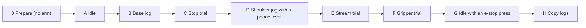

# Lab day card: the six things to bring back

One sheet for the visit after the vendor-protocol work. Each step is one command and one thing to look at. Reasons are in the [lab plan](VENDOR_PROTOCOL_LAB_PLAN.md); safety rules are those of the [G1 card](G1_LAB_CHECKLIST.md).

**None of the new parts has run on the arm:** the software stop, the streaming driver, the gripper and the layout checker are from disassembly, the legacy code and the simulator. Someone is at the physical stop for every step from B to F. Neither Ctrl-C nor a software stop is an emergency stop. If anything moves unexpectedly, the MOTORS LED disagrees with the software, or a step faults: use the physical stop, end the session, keep the logs. Do not retry a faulted command.



Each step stands alone: if one fails, stop, keep the logs, and the earlier steps are still useful. Every command needs a new `--output` name; a file is never overwritten.

## 0. Prepare (no arm motion)

- [ ] Copy the existing `logs\` folder to a USB stick **before anything else**. It holds the 2026-09-29 run, which never left the lab PC.
- [ ] Update the code, then install. `--extra planning` is new and step E needs it:

```powershell
uv sync --locked --extra windows --extra test --extra planning
powershell -NoProfile -ExecutionPolicy Bypass -File .\scripts\windows_usb_check.ps1
```

- [ ] Wanted: `PASS USB 09F1:0007`. If preflight fails, stop here.
- [ ] Close SCORBASE and every other program that could talk to the controller. Close what you can besides: a busy PC makes step E's timing worse.
- [ ] Put the arm in the known homing start pose. Set the labels once for this terminal:

```powershell
$py = '.\.venv\Scripts\python.exe'
$id = @('--robot-id', 'YOUR-ARM-ID', '--arm-label', 'YOUR-ARM', '--controller-label', 'YOUR-CONTROLLER', '--driver', 'YOUR-DRIVER', '--operator', 'YOUR-INITIALS')
```

Optional, if SCORBASE is installed on this PC: copy its `USBC.dll` to the USB stick and note its size and date. Take it home; never commit it.

## A. Idle recording (connects; no commanded motion)

```powershell
& $py examples\record_raw_state.py --output logs\idle-01.jsonl @id --pose-note "homing start pose" --seconds 10 --acknowledge-connect-handshake
& $py scripts\review_lab_logs.py --idle logs\idle-01.jsonl
```

- [ ] LED prompts answered from the controller front panel (MOTORS off, POWER green expected).
- [ ] The review reports no problem and `home_switch_bits` is below 32. Otherwise stop before homing.

## B. One base jog (the known-good baseline)

Type `HOME`, `HOME_OK`, `MOVE` at the prompts.

```powershell
& $py examples\bench_joint.py --output logs\base-01.jsonl @id --start-pose-note "homing start pose" --joint base --delta 1 --acknowledge-supervised-motion
& $py scripts\review_lab_logs.py --idle logs\idle-01.jsonl --bench logs\base-01.jsonl
```

- [ ] Write down which way the base turned for `+1`. Step E uses the same direction.

## C. Stop trial (first run of the software stop)

The same jog, with a stop requested 150 ms after it starts. Worst expected outcome: the arm finishes its 1 degree.

```powershell
& $py examples\bench_joint.py --output logs\stop-01.jsonl @id --start-pose-note "homing start pose" --joint base --delta 1 --stop-after-ms 150 --acknowledge-supervised-motion
```

- [ ] Write down the line it prints after `MOVE`:

| It prints | Meaning | Next |
|---|---|---|
| `The jog ended early on the stop request.` | The stop works on this arm | Done |
| `The jog completed; the stop request came too late or had no effect.` | Inconclusive | Run once more with `--stop-after-ms 60` and a new output name |
| `The stop request arrived before the jog started` | Too early | Run once more with `--stop-after-ms 300` |
| `A stop was reported, but the counts show the full planned travel.` | The stop did not shorten the move | Keep the log; do not rely on the stop |

- [ ] Did the arm stop cleanly, or jerk or sag? Say so at the "issue" prompt.

## D. Shoulder jog with a phone level on the forearm

Tape or hold a phone with a level app flat on the **forearm** (the link between elbow and wrist). Read the angle before and after.

```powershell
& $py examples\bench_joint.py --output logs\shoulder-01.jsonl @id --start-pose-note "homing start pose" --joint shoulder --delta 1 --acknowledge-supervised-motion
```

- [ ] Forearm angle before: ______ after: ______ (type both at the "observed direction" prompt too).
- [ ] If you can, the same for the upper arm in a second run.

What it answers: the vendor's maths says the forearm keeps its angle to the horizontal when only the shoulder motor moves. Unchanged forearm, changed upper arm: confirmed. Forearm changed by about a degree: contradicted. Both are useful.

## E. Stream trial (first run of the streaming driver)

Only after B showed the base moves the right way. The script refuses to stream if any of the three motors is more than 5 counts from home when you type `STREAM`. One motor goes out 1 degree, holds, comes back. Type `HOME`, `HOME_OK`, `STREAM`.

```powershell
& $py examples\bench_stream.py --output logs\stream-base-01.jsonl @id --start-pose-note "homing start pose" --motor base --delta 1 --acknowledge-supervised-motion
& $py scripts\review_lab_logs.py --idle logs\idle-01.jsonl --stream logs\stream-base-01.jsonl
```

The live view in a second terminal (`& $py scripts\watch_lab_log.py logs\stream-base-01.jsonl`) shows the plan, the counts and a `stream trial FAILED` alarm if the verdict is bad.

- [ ] Write down the lines it prints. The last one is the verdict: `Trial result: PASSED.` or `!!! Trial result: FAILED (reason)`. A failed trial still finishes its prompts and switches the motors off; it exits with code 1.

| Line | Good | If not |
|---|---|---|
| `Reached the target:` | `yes` | `NO` fails the trial; do not try a larger move |
| `Returned to home:` | `yes` | same |
| `Largest lead of the command over the arm:` | well under 284 counts (2 degrees). Sampled once per step, so the true peak can be a little higher | note the number |
| `Other two motors moved at most` | a few counts | more than 10 fails the trial; say what you saw at the "other joint" prompt |
| `Time between steps: median ... max ...` | median near 24 ms | a large max means the PC stalled; note it and close other programs |

- [ ] Was the motion smooth, or did it buzz, step or hunt? Say so at the "issue" prompt. This is the main thing only you can see.
- [ ] If it went well and there is time: the same with `--motor shoulder` after a look at step D, then `--motor elbow` after an elbow jog. One motor per run.

Two things are new on the wire here: messages come a few milliseconds further apart than in a jog, and each one carries three setpoints. If the stream faults, the script says so and the log has every step.

## F. Gripper trial (first run of the gripper)

**Empty jaws. Fingers clear.** The gripper moves a fixed distance with no force limit, by a sequence this project has never sent to the arm. The arm is not homed in this step and no arm joint is commanded. Type `ENABLE`, then `GRIP` before each move.

```powershell
& $py examples\bench_gripper.py --output logs\gripper-01.jsonl @id --start-pose-note "as left after step E" --moves open close --acknowledge-supervised-motion
& $py scripts\review_lab_logs.py --idle logs\idle-01.jsonl --gripper logs\gripper-01.jsonl
```

- [ ] Write down the line it prints for each move, for example `open: moved +2700 of 2700 counts (full travel)`.

| What you see | Meaning | Next |
|---|---|---|
| Jaws open, then close; both lines say `full travel` | The legacy gripper sequence works on this arm | A second run with a soft object (a sponge) in the jaws: `--moves open close`, put it in after the open |
| A line says `stopped short` with empty jaws | The jaws reached the end of their own travel before the fixed distance | Note the counts; that is the gripper's range |
| The jaws go the wrong way for the word on screen | Open and close are swapped in the inherited code | Say so at the "issue" prompt; do not grip anything |
| Nothing moves, or the script reports a fault | The sequence does not drive this gripper as written | Keep the log; the vendor's own sequence needs a capture first |
| An arm joint moves | The script faults by itself if it is more than 20 counts | Use the physical stop if in doubt; keep the log |

- [ ] With an object: did it hold it? Did the gripper buzz, stall or get warm? Say so at the "issue" prompt. Do not leave it squeezing: the sequence switches the gripper off at the end of each move.

## G. Idle recording with an e-stop press (last, on purpose)

Last because the controller may need a reset afterwards. Arm at rest, nothing commanded. Start the recording, wait about 10 seconds, press the e-stop, wait about 10 seconds, release it the way the lab procedure says.

```powershell
& $py examples\record_raw_state.py --output logs\idle-estop-01.jsonl @id --pose-note "at rest, e-stop pressed around 10 s and released around 20 s" --seconds 30 --hz 10 --acknowledge-connect-handshake
& $py scripts\vendor_check.py logs\idle-estop-01.jsonl
```

- [ ] Write down the times you pressed and released, and what the LEDs did.
- [ ] If the recording ends with a fault when the stop is pressed, that is a result too: keep the log and note it.
- [ ] Look for the emergency line in the check. `bit 0 never changes` means the bit did not show the press.

## H. Before you leave

- [ ] Copy the whole `logs\` folder again, including every `.controller.jsonl` and `sessions\`.
- [ ] Photograph this card if you wrote on paper.

## Back at a desk

```powershell
python scripts\usb_trace.py from-log logs\base-01.controller.jsonl --out trace-base.jsonl
python scripts\vendor_check.py trace-base.jsonl
python scripts\usb_trace.py from-log logs\stream-base-01.controller.jsonl --out trace-stream.jsonl
python scripts\vendor_check.py trace-stream.jsonl
```

One line per claim: matches, CONTRADICTED, or not seen. `from-log` reads the packets the SDK copied during jogs and streams.

## What each result unlocks

| Step | If it works | Then |
|---|---|---|
| A, B, desk check | The message layout and the echoed message number match | Pacing on the echo can be switched on |
| C | The stop ends a jog early | A stop key in the lab tool and teleop |
| D | The forearm keeps its angle | The vendor's count-to-angle maths can be used as the calibration starting point |
| E | The arm follows a stream | Wider travel in stages, then teleop and the LeRobot plugin on streaming |
| F | The gripper opens and closes, and holds a soft object | Pick-and-place steps in a demo; a grip key in the lab tool |
| G | The emergency bit follows the button | The session can fault on an e-stop |

## Rehearsal

Every command on this card was run once in the simulator on 2026-10-05 (add `--simulate`, write to `rehearsal\` instead of `logs\`). The simulator copies no packets, so `from-log` finds nothing there, and it has no e-stop, so the emergency line reads "never changes". Step timing in a rehearsal reflects the PC you rehearse on, not the arm.
