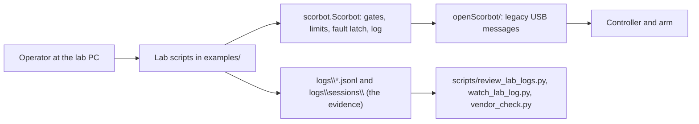

# Lab visit handoff: read this first

For whoever helps run the next lab visit, person or AI, starting cold. It says what the visit is for, what state the code is in, how to run and rehearse every step, what each output means, and what to do when something goes wrong. The step-by-step sheet to follow at the bench is [LAB_DAY_CARD.md](LAB_DAY_CARD.md); this page is everything around it.

Written 2026-10-05. Branch `feat/vendor-dll-analysis`.

## 1. The situation in one minute

- **The arm:** an Intelitek ScorBot ER-4U with the original Controller-USB (USB `09F1:0007`), driven from a Windows lab PC by this repository's Python SDK. The SDK wraps old open-source protocol code in `openScorbot/`.
- **What has run on the real arm:** one visit, 2026-09-29. Connect, read state, home, and small jogs of base, shoulder and elbow worked. Nothing else has ever touched the arm.
- **What is new and untested on the arm:** a software stop, a streaming driver (the arm follows a moving target), the gripper, and a checker for the message format. All were built from the vendor DLL's disassembly, the legacy code and the simulator.
- **What this visit is for:** try each new piece once, small and supervised, and bring the logs home. Seven short steps, A to G. To also check the arm model's scale, directions and coupling in the same visit, add [ACCEPTANCE_RUN.md](ACCEPTANCE_RUN.md); the browser page and teaching API (`scorbot.ui`, `scorbot.toolbox`) are simulator only and not part of the visit.
- **Tests:** about 950 pass in two to three minutes (`python -m unittest discover -s tests`). They never touch USB.



## 2. Rules that do not bend

For an AI assistant in particular:

1. **You never start a real run.** Any command without `--simulate` connects to the controller and energises the motors. The operator types those, with someone at the physical stop. You may run anything with `--simulate`, the tests, and the review tools on saved logs.
2. **The physical stop is the only stop.** `disable()`, `request_stop()` and Ctrl-C are not emergency stops. Never call them one.
3. **A fault ends the session.** Do not retry a faulted command, and do not suggest a larger move after a failed small one. Keep the logs, note what was seen, move to the next step only if it is independent.
4. **Do not edit `openScorbot/` or the motion code at the lab.** A change there changes the bytes sent to the arm and the fingerprint recorded in every log.
5. **Logs are evidence.** Never overwrite, edit or delete a file in `logs\`. Every run needs a new `--output` name. Rehearsals go in `rehearsal\`, never `logs\`.
6. **Real and simulated data never mix** in one review.
7. **Say "unverified" unless a log from the arm shows it.** A passing simulation is not evidence about the arm.
8. **Never commit vendor files:** manuals, `USBC.dll`, its decompiled output, the CAD meshes.
9. **Do not push or open a pull request unless asked.** Commit messages carry no AI attribution.

The full list, with the reason for each, is the table at the top of the root [CLAUDE.md](../../CLAUDE.md).

## 3. Get the lab PC ready

From the repository folder, in PowerShell:

```powershell
git fetch origin
git checkout feat/vendor-dll-analysis
git pull
uv sync --locked --extra windows --extra test --extra planning
.\.venv\Scripts\python.exe -m unittest discover -s tests
powershell -NoProfile -ExecutionPolicy Bypass -File .\scripts\windows_usb_check.ps1
```

- No Git on the PC: download the branch as a ZIP from the repository page instead, and extract it to a new folder. Copy the old folder's `logs\` somewhere safe first.
- No `uv`: `powershell -NoProfile -ExecutionPolicy Bypass -File .\scripts\setup_windows.ps1` does the same with pip.
- `--extra planning` installs Ruckig. Without it step E refuses to start (it says so before connecting).
- Wanted from the last line: `PASS USB 09F1:0007`. If it fails, see [WINDOWS_BENCH_RUN.md](WINDOWS_BENCH_RUN.md) section 2 (driver) and stop before any connection.
- First-time setup of a PC with only VS Code: [START_HERE_WINDOWS.md](../../START_HERE_WINDOWS.md).

## 4. Rehearse first (no arm, about five minutes)

Run this on any PC, including the lab PC with the controller unplugged. Every line has `--simulate`; every output says SIMULATED.

```powershell
$py = '.\.venv\Scripts\python.exe'
$id = @('--robot-id', 'rehearsal-arm', '--arm-label', 'x', '--controller-label', 'x', '--driver', 'none', '--operator', 'XX')
$r  = "rehearsal\visit-$(Get-Date -Format HHmmss)"

& $py examples\record_raw_state.py --output $r\idle-01.jsonl @id --pose-note rehearsal --seconds 3 --simulate --acknowledge-connect-handshake
& $py scripts\review_lab_logs.py --idle $r\idle-01.jsonl
& $py examples\bench_joint.py --output $r\base-01.jsonl @id --start-pose-note rehearsal --joint base --delta 1 --simulate --acknowledge-supervised-motion
& $py examples\bench_joint.py --output $r\stop-01.jsonl @id --start-pose-note rehearsal --joint base --delta 1 --stop-after-ms 150 --simulate --acknowledge-supervised-motion
& $py examples\bench_stream.py --output $r\stream-base-01.jsonl @id --start-pose-note rehearsal --motor base --delta 1 --simulate --acknowledge-supervised-motion
& $py examples\bench_gripper.py --output $r\gripper-01.jsonl @id --start-pose-note rehearsal --moves open close --simulate --acknowledge-supervised-motion
& $py scripts\review_lab_logs.py --idle $r\idle-01.jsonl --bench $r\base-01.jsonl --stream $r\stream-base-01.jsonl --gripper $r\gripper-01.jsonl
```

What to type at the prompts is in section 6. In a rehearsal the stop trial normally prints "The jog completed": a simulated jog is instant, so the stop arrives too late. That is expected and says nothing about the arm.

## 5. The visit, step by step

Exact commands, with `logs\` paths, are on the [lab day card](LAB_DAY_CARD.md). This table is the map.

| Step | Script | Arm moves? | You type | A good result | Record written |
|---|---|---|---|---|---|
| 0 Prepare | `windows_usb_check.ps1` | no | nothing | `PASS USB 09F1:0007` | none |
| A Idle | `examples\record_raw_state.py` | no (connects) | LED answers | review shows `"problems": []`, `home_switch_bits` below 32 | `idle-01.jsonl` |
| B Base jog | `examples\bench_joint.py` | yes, 1 degree | `HOME`, `HOME_OK`, `MOVE` | base turns about a degree; review clean | `base-01.jsonl` |
| C Stop trial | `bench_joint.py --stop-after-ms 150` | yes, up to 1 degree | same as B | `The jog ended early on the stop request.` | `stop-01.jsonl` |
| D Shoulder + phone level | `bench_joint.py --joint shoulder` | yes, 1 degree | same as B | forearm angle unchanged, upper arm changed | `shoulder-01.jsonl` |
| E Stream trial | `examples\bench_stream.py` | yes, 1 degree out and back | `HOME`, `HOME_OK`, `STREAM` | `Trial result: PASSED.` and smooth motion | `stream-base-01.jsonl` |
| F Gripper trial | `examples\bench_gripper.py` | gripper only | `ENABLE`, `GRIP` per move | jaws open then close, `full travel` twice | `gripper-01.jsonl` |
| G E-stop idle | `record_raw_state.py --seconds 30 --hz 10` | no | LED answers; press the e-stop at about 10 s | the emergency line in `vendor_check.py` changes | `idle-estop-01.jsonl` |
| H Leave | copy `logs\` | no | nothing | whole folder on the USB stick | none |

Each record `X.jsonl` comes with `X.controller.jsonl` (the SDK's own event log, including every packet copied during a jog or a stream) and a folder under `logs\sessions\` (an MCAP recording). All three matter; copy the whole `logs\` folder.

Order matters in two places: B before E (the stream uses the direction B showed), and G last (the controller may need a reset after an e-stop). Otherwise the steps stand alone, so a failure in one does not waste the others.

## 6. What the prompts mean

| Prompt | Answer | Notes |
|---|---|---|
| `MOTORS LED lit? [y/n/u=unsure]` | what the controller's front panel shows | Answer what you see. The script never shows the expected answer first |
| `POWER LED colour? [g/o/f/u]` | green, orange, flashing, unsure | Green means the controller is talking to the PC |
| `Type HOME to search home:` | `HOME` | Only with the arm in the known homing start pose. Anything else declines |
| `Type HOME_OK:` | `HOME_OK` | Only if the homing looked right and the path is clear |
| `Type MOVE` / `STREAM` / `ENABLE` / `GRIP` | that word | Anything else declines the step, safely |
| "Describe..." and "Observed..." | plain words | What you saw: direction, size, noises, anything odd. "none" if nothing |

- A wrong or empty typed word **declines**: the script ends cleanly with exit code 3 and nothing further is sent.
- An "unsure" or contradicting answer to an LED check after connect or after enable **ends the run** before any motion. That is by design: the MOTORS LED is the only independent evidence of motor power.

Exit codes: `0` completed, `1` failed (a fault, a failed stream trial, or a recorder error), `2` bad arguments (nothing was connected), `3` the operator declined.

## 7. When something goes wrong

| What you see | What it means | What to do |
|---|---|---|
| Arm moves unexpectedly, or keeps moving | Anything | **Physical stop.** End the session. Photograph the pose. Keep the logs |
| `FAIL USB` at preflight | Windows or Python cannot see the controller | Check power, cable, and that SCORBASE is closed. Then [WINDOWS_BENCH_RUN.md](WINDOWS_BENCH_RUN.md) section 2. Do not connect |
| `LED check ... not confirmed` | The front panel disagrees with the software, or the answer was "unsure" | The run has ended. Look at the controller. If MOTORS is lit when it should be off, use the physical stop |
| `Output already exists; choose a new session filename` | That log name was used | Pick the next number (`base-02`). Never delete the old file |
| `Streaming needs the planning extra` | Ruckig is not installed | Run the `uv sync` line in section 3 again |
| `The arm is not at home ...; no stream was started` | A motor drifted more than 5 counts between homing and typing `STREAM` | Nothing was sent. Rerun step E; type `STREAM` sooner. If it repeats, note which motor drifts |
| `--delta plans ... counts, too small` | The move is inside the "arrived" tolerance | Use `--delta 1` |
| `Trial result: FAILED (...)` | The arm did not follow, overshot, or another motor moved | The script still switched the motors off. Do not try a bigger move. Keep the log and write down what the arm did |
| `Session failed. ... use the physical stop` and a traceback | The SDK latched a fault | Read the last line of the traceback: it says why. That session is over; a new run starts a new session |
| `stopped short` on a gripper move with empty jaws | The jaws ran out of travel before the fixed distance | Not a fault. Write the counts down |
| The jaws go the wrong way, or the script says `The gripper moved the wrong way` | Open and close are swapped in the inherited code | Do not grip anything. Note it; it is a one-line fix at a desk |
| The e-stop press ends the idle recording with an error | The controller cut the link | That is a result. Keep the log. Reset the controller the way the lab procedure says |
| A very large `max` in `Time between steps` | The PC stalled | Close other programs and rerun; write both results down |
| `SIMULATED` on screen during the real visit | `--simulate` was left on the command | Nothing touched the arm. Remove the flag and use a `logs\` path |

Watching live: in a second terminal, `& $py scripts\watch_lab_log.py logs\<the output name>` follows a run and shows alarms. It is read-only and sends nothing.

## 8. What to bring home, and what to do with it

Bring: the whole `logs\` folder (twice: before step A and after step G), the notes from each step, and, if SCORBASE is installed on the lab PC, a copy of its `USBC.dll` with its size and date (take it home; never commit it).

At a desk:

```powershell
python scripts\review_lab_logs.py --idle logs\idle-01.jsonl --bench logs\base-01.jsonl --bench logs\stop-01.jsonl --bench logs\shoulder-01.jsonl --stream logs\stream-base-01.jsonl --gripper logs\gripper-01.jsonl
python scripts\usb_trace.py from-log logs\base-01.controller.jsonl --out trace-base.jsonl
python scripts\vendor_check.py trace-base.jsonl
python scripts\usb_trace.py from-log logs\stream-base-01.controller.jsonl --out trace-stream.jsonl
python scripts\vendor_check.py trace-stream.jsonl
python scripts\vendor_check.py logs\idle-estop-01.jsonl
python -m scorbot.session list logs\sessions
```

`vendor_check.py` prints one line per claim about the message format: matches, CONTRADICTED, or not seen. A match is evidence about that trace, not a safety verdict.

| If this worked on the arm | Then this is unblocked |
|---|---|
| A, B and the desk check: the layout and the echoed message number match | Pacing a stream on the controller's echo (not built yet; to be designed) |
| C: the stop ends a jog early | A stop key in the guided session and in teleop |
| D: the forearm keeps its angle | The vendor's count-to-angle formula as the calibration starting point |
| E: the arm follows a stream | Wider travel in stages (the cap is 180 degrees since 2026-10-06, so the joint limits bind; the bench trial stays at 2), then teleop and the LeRobot plugin on streaming |
| F: the gripper opens, closes and holds a soft object | Pick-and-place in a demo; a grip key in the guided session |
| G: the emergency bit follows the button | Switching on the e-stop fault in a stream (`use_emergency_bit`) |

After the visit, record what happened in [PROJECT_LOG.md](../project/PROJECT_LOG.md) and move the settled items in [BACKLOG.md](../project/BACKLOG.md). A claim becomes "verified" only with the log file that shows it.

## 9. Where things are

| You need | Look in |
|---|---|
| The commands for the visit, in order | [LAB_DAY_CARD.md](LAB_DAY_CARD.md) |
| Why each step exists, claim by claim | [VENDOR_PROTOCOL_LAB_PLAN.md](VENDOR_PROTOCOL_LAB_PLAN.md) |
| The project rules | [../../CLAUDE.md](../../CLAUDE.md), and the `CLAUDE.md` in each folder |
| What the SDK does and its gates | `scorbot/robot.py`, [../../scorbot/CLAUDE.md](../../scorbot/CLAUDE.md) |
| The streaming driver | `scorbot/streaming.py`, [requirements](../specs/2026-10-04-streaming-driver-requirements.md) |
| The software stop | `Scorbot.request_stop`, [design](../specs/2026-10-04-software-stop-design.md) |
| The gripper | `Scorbot.move_gripper`, `openScorbot/libcomm.py:clamp`, [vendor findings, section 12](../protocol/VENDOR_DLL_PROTOCOL.md) |
| The lab scripts | `examples/` and [../../examples/CLAUDE.md](../../examples/CLAUDE.md) |
| The review and viewing tools | `scripts/` and [../../scripts/CLAUDE.md](../../scripts/CLAUDE.md) |
| What goes over USB | [PROTOCOL.md](../protocol/PROTOCOL.md), [VENDOR_DLL_PROTOCOL.md](../protocol/VENDOR_DLL_PROTOCOL.md) |
| Hazards and what guards each | [SAFETY_CASE.md](../design/SAFETY_CASE.md) |
| LEDs, controller protections, manual facts | [HARDWARE_REFERENCE.md](../manual/HARDWARE_REFERENCE.md) |
| Known bugs and open work | [BACKLOG.md](../project/BACKLOG.md) |
| What was decided, and when | [PROJECT_LOG.md](../project/PROJECT_LOG.md) |
| The guided session (an alternative to the per-script steps A and B) | [LAB_SESSION.md](LAB_SESSION.md) |
| A 3D picture of the arm for rehearsals | `python -m scorbot.arm_view --simulate` (simulator only; unvalidated geometry) |

## 10. Known limits, so nobody is surprised

- **The shoulder has little room above home.** Home has the upper arm about 120 degrees up and the joint limit is 124, so the SDK refuses a shoulder jog or stream target more than about 3.7 degrees in the positive direction. The 1 degree moves on the card are well inside it. From the source model, not measured.
- **Travel is small on purpose.** Jogs are at most 1 degree in the bench script and 5 in the SDK. A stream may go as far as the joint limits of the source model (unmeasured; the travel cap was lifted from 10 to 180 degrees on 2026-10-06), and the bench trial stays within 2. Start small anyway: a wrong scale or direction is no longer held to a few degrees.
- **No Cartesian moves and no wrist jogs.** The kinematics are unvalidated and the wrist's two motors are unmeasured.
- **The gripper has no force limit.** It moves a fixed 2700 counts by the legacy sequence. Empty jaws first, then something soft. The vendor closes its gripper differently (a set drive for a time); using that needs a USB capture of SCORBASE first.
- **Open and close may be swapped,** and each joint's positive direction is inherited from the old code. Step B and step F are where that shows.
- **Counts are not degrees.** No calibration exists. Angles printed anywhere come from inherited scales.
- **Homing assumes a start pose.** It is not home-from-anywhere.
- **A stream longer than about 45 seconds** would lose packets from its log. The bench trial is about 10 seconds. Fix before long streams (BACKLOG).
- **The simulator says nothing about timing, dynamics or the real controller.** Its jogs are instant and exact.
- **Where three sources disagree:** the shoulder axis height (346, 349 or 364 mm). A tape measure from the base to the shoulder pivot settles it, if there is a spare minute.
