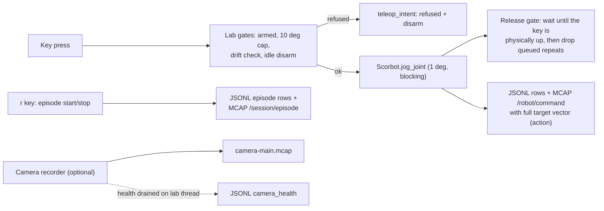

# Keyboard teleop and episode recording (M1 step 4)

> **Built** (gamepad deferred). Kept as the record of a decision; the code may have moved on since. The status line below is as written at the time.

Date: 2026-10-02. Status: draft, revised after Codex and Gemini adversarial reviews
(both found the quiet-gap rule could not prove key release; Codex found camera
liveness gaps). Draft for review. Parent:
[M1 roadmap](2026-10-01-m1-roadmap-design.md) section "4. Teleop" and
contracts C1-C7. Decided with the user on 2026-10-02: keyboard only for now
(gamepad later), "arm once, then each press moves" with no per-step
questions, episodes started and stopped by a key with a task text, and the
10 degree travel cap kept until calibration (G2).

## Big picture

Teleop is a mode of the existing guided session (`python -m scorbot.lab`),
not a new program. Everything that makes a jog safe today still applies:
arming with the MOTORS LED question and a typed `ARM`, base, shoulder and
elbow only, 1 degree steps, the 10 degree net travel cap per joint, the
counts drift check, idle disarm after 60 s, the fault latch, and the
physical stop as the only stop. What teleop removes is the per-step typed
confirmation and the three questions after each step.

## 1. Teleop mode

- `t` (while armed) enters teleop mode; `t` again leaves it. Entering shows
  one screen: the keys, the cap, "holding a key moves one step; release and
  press again for the next", "the physical stop is the stop". Leaving
  teleop keeps the arm armed (the normal jog loop resumes).
- In teleop mode a jog key (`1/q`, `2/w`, `3/e`) runs the existing
  `_prepare` (cap, drift, preview) and `_execute(observe=False)` at once:
  no typed confirmation, no observation questions.
- **One press, one step (release gate).** The console's `getwch`/`kbhit`
  only see queued characters, never a key-up, and a quiet gap does not prove
  release (both reviewers). So after each teleop step, and after `t`, `r`
  and `n`, the session calls a new operator method
  `wait_for_release(key)`: it polls the Windows key state
  (`user32.GetAsyncKeyState` through `ctypes`, standard library, no new
  dependency) every 20 ms until that key is physically up, then discards
  every queued character. A held key therefore gives exactly one step; the
  next step needs a release and a new press. While waiting nothing moves;
  after 3 s held the screen says "release the key". The discarded count is
  logged. The gate only ever delays motion: motion still comes only from a
  character read from this console window, so a key held in another window
  can delay but never cause a step.
- Without single-key input or without `GetAsyncKeyState` (not Windows),
  teleop is refused.
- Any other key in teleop mode except `t`, `r`, `?` and `x` leaves teleop
  and disarms, as an unknown key does today.
- Refusals (cap, drift, disarmed, failed jog) disarm and leave teleop, as
  today; the operator re-arms with the LED question and `ARM`.
- Idle disarm in teleop mode is 15 s (60 s elsewhere): with no per-step
  confirmation, an unattended armed console should not stay armed long.
- **Polled key wait.** In teleop mode the loop waits for a key with a new
  operator method `key_or_tick(prompt, tick_s=0.2)` that returns `None` on a
  tick with no key, so the session can check idle time and camera liveness
  while the operator is not typing.
- Step size stays the lab's current step (1 degree, or 0.5 with `s`).

## 2. Intent and action logging (contract C2)

- Every key read in teleop mode writes a JSONL `teleop_intent` row:
  `{key, action, accepted, reason?}` (jog keys add `joint`, `delta_deg`).
  Refused keys and keys that disarm are logged too.
- Every jog (teleop or not) now logs its full commanded target in the MCAP
  `/robot/command` params: `target_signed_counts` for base, shoulder,
  elbow, wrist motors 1 and 2 = the previewed targets for moving motors and
  the current counts for the rest. `Command.params` is free-form, so no
  `SCHEMA_VERSION` change. The SDK's own `motion_preview` (JSONL) remains
  the authority for what was sent.

## 3. Episodes

- `r` in teleop mode starts an episode; `r` again ends it as `completed`.
- The first `r` of a session asks for a task text once ("Task for these
  episodes, e.g. reach left block:"); later episodes reuse it. `n` in
  teleop mode (no episode open) asks for a new task text. Empty text
  refuses to start. (Capital letters cannot be used: the operator API
  lowercases keys.)
- An open episode ends as `aborted` with a reason when the session disarms,
  leaves teleop, faults, finishes (`x`), or the camera fails (section 4).
- Recorded in both places (contract C4): JSONL rows `episode_start`
  `{episode, task}` and `episode_end` `{episode, status, reason?, jogs}`;
  MCAP topic `/session/episode` with schema `scorbot.Episode`
  (`episode`, `event`, `task`, `status`). Adding a topic is backward
  compatible for the reader in this commit; an older reader reports it as
  "Unknown topic (kept)". `SCHEMA_VERSION` stays 1.
- Episode numbers count from 1 per session. Only `completed` episodes are
  meant for export (step 5 decides).

## 4. Camera (optional)

- `python -m scorbot.lab [--camera INDEX | --camera fake]`. Without the
  flag, sessions record robot data only, as today. `--camera fake` uses
  `FakeSource(pace=True)` and is allowed only with `--simulate`; a real
  index is allowed with both (useful for checking a webcam in rehearsal).
- With a camera, the session is created with `camera_ids=["main"]`; before
  the controller connects (so a hanging webcam driver can never stall the
  session with motors enabled; Codex code review) the camera opens (`OpenCVSource`), a `CameraStream` is created
  with its settings, and one `CameraRecorder` runs for the whole session.
  Episodes are time windows in that stream. The camera stops at finish
  (bounded `stop()`), before the session file closes.
- The lab thread drains `recorder.drain_health()` at every loop turn and
  tick and writes `camera_health` JSONL rows; no camera thread touches the
  JSONL.
- **Liveness, not just health rows** (Codex: a stalled reader can report
  `ok` with zero frames, and `_fail` does not guarantee a `failed` row).
  `CameraRecorder` gains `last_write_ns` (session clock of the last frame
  written, None before the first) and the lab reads `recorder.failure`
  directly. The camera is *live* when `failure is None` and the last write
  is under 1 s old.
- `r` refuses to start an episode unless the camera is live. On every loop
  turn and tick during an episode, a camera that is not live aborts the
  episode with reason `camera stalled` or `camera failed`, shows an alarm,
  and keeps the arm armed: the camera records training data, it is not the
  operator's view, and the operator stands at the arm with the physical
  stop (Gemini suggested disarming; rejected for that reason).
- `episode_end` records `frames` written during the episode; a `completed`
  episode with a camera always has frames, because liveness is checked
  right before completion too.
- Opening the camera fails: the session continues without video after an
  operator warning (and logs `camera_unavailable`); episodes are then robot
  only and say so in `episode_start` (`camera: false`).

## 5. What does not change

`Scorbot`, `SimulatedScorbot`, `openScorbot/`, packet bytes, sleeps, the
10 degree cap, the wrist block, the 5 degree SDK ceiling and the speed
range. Teleop adds no motion capability; it only removes questions between
steps the session already allows.

## 6. Tests (no hardware)

| Area | Test |
|---|---|
| mode | `t` while disarmed is refused; `t` armed enters; `t` again leaves and stays armed |
| one step per press | with an injected key state, a key held through and after the step gives exactly one jog until released; queued repeats discarded and counted; a long pre-repeat delay (no repeats yet, key still down) still gives one step; `r` held gives one episode start, not start+stop |
| no questions | a teleop jog asks no confirmation and no observation question |
| gates | a teleop press past the 10 degree cap is refused, disarms, leaves teleop, queues nothing; unknown key in teleop disarms |
| no single keys | teleop refused when the operator cannot read keys |
| intents | accepted and refused presses each write `teleop_intent` |
| action | every jog command in the MCAP carries a full `target_signed_counts` matching the JSONL `motion_preview` targets |
| episodes | `r` asks the task once, start and end rows in JSONL and MCAP; disarm, `x` and fault abort an open episode with the reason |
| camera | `--camera fake` in a simulated session writes `camera-main.mcap`, `camera_health` rows and episode rows with `camera: true` and a frame count; an injected failure or a stalled reader (no frames for 1 s, no `failed` row) aborts the episode on a tick with no key pressed, does not disarm; `r` refused while not live; real index without OpenCV warns and continues |
| idle | teleop disarms after 15 s with no key, checked on ticks |
| task key | `n` asks for a new task; `T` is not special |
| CLI | `--camera fake` without `--simulate` is refused |

`ScriptedOperator` gains `wait_for_release` and `key_or_tick` (scripted
ticks and key-down durations) so tests stay deterministic. The real
`GetAsyncKeyState` path gets a small test with an injected `user32` stub.

## 7. Docs

`docs/lab/LAB_SESSION.md` (teleop keys, episodes, camera flag),
`docs/design/OPERATOR_UX.md` (why held keys give one step), `docs/project/PROJECT_LOG.md`,
roadmap status.

## 8. Later

Gamepad (XInput via ctypes) as a second input source with a deadman button;
lifting the cap from a validated calibration (G2); hold-to-move once the
S2 streaming layer exists.
