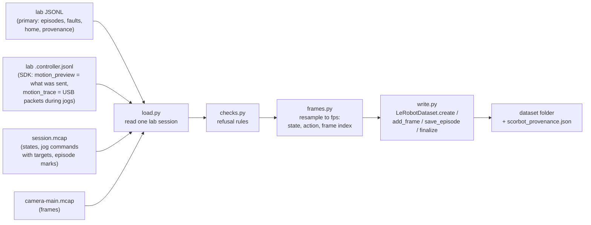

# Session-to-LeRobot dataset exporter (M1 step 5, S4)

> **Removed 2026-10-08:** the code this document describes was deleted from the repo (see git history before that date). Kept for reference only.

> **Built.** Kept as the record of a decision; the code may have moved on since. The status line below is as written at the time.

Date: 2026-10-02. Status: draft, revised after a Codex adversarial review
(2 high, 3 medium findings; Gemini unavailable: its prepaid credits ran out). Parent:
[M1 roadmap](2026-10-01-m1-roadmap-design.md) section "5. LeRobot exporter"
and contracts C1-C7. Decisions from 2026-09-29 (official LeRobot writer,
target-position action, raw counts labelled uncalibrated, never mix real and
simulated, record provenance) plus 2026-10-02 with the user: LeRobot in its
own CPU environment `.venv-lerobot`, default 10 fps, robot-only episodes need
`--no-video`, output to a local folder only (no upload).

## Big picture



Everything up to `frames.py` is pure Python on the core dependencies and
runs in the normal test suite. Only `write.py` imports `lerobot`, and only
inside `.venv-lerobot`.

## 1. Input

`python -m scorbot.lerobot_export LAB_JSONL [LAB_JSONL ...] --out DIR
--repo-id NAME [--fps 10] [--no-video] [--dry-run]`

- Input is the lab session JSONL (`logs/<robot>-<date>-NN.jsonl`). Its
  `recorder` row names the MCAP session folder under `sessions/`; the camera
  stream is `camera-main.mcap` in that folder; its `session` row names the
  SDK controller-event log (`<log>.controller.jsonl`), which holds the SDK's
  own `motion_preview` (start state and target actually sent) and
  `motion_trace` (every USB packet during the jog, timestamped).
- One dataset per command. Episodes come from every input session.
- `--dry-run` loads, checks and resamples, prints a table of episodes
  (kept or refused, with reason, frame count, duration) and writes nothing;
  it needs no `lerobot`, so it runs in the main environment.

## 2. Which episodes are exported

Only episodes the JSONL marks `completed`. Every refusal names the episode
and the reason and is printed; refused episodes are listed in the
provenance file. The export fails (exit 1, nothing written) when every
episode is refused.

| Rule | Level | Why |
|---|---|---|
| inputs mix `data_source` (real, simulated, synthetic) | refuse the whole export | CLAUDE.md: real and simulated data never share a dataset |
| inputs mix video and no-video episodes | refuse the whole export | LeRobot features must be identical across episodes |
| no camera and no `--no-video` | refuse the whole export | user decision: robot-only datasets only on purpose |
| session MCAP has error findings, or a lab row `session_failed` | refuse the session's episodes | evidence is damaged or incomplete |
| clock resolution above 1 ms | refuse the session | contract C1 |
| episode not `completed` in the JSONL | skip (listed) | aborted episodes are not demonstrations |
| the MCAP lacks the matching `/session/episode` start and end with the same number and status | refuse | contract C4: MCAP may have stopped while the JSONL continued |
| a `jog_failed`, `counts_drift` or `fault` row inside the episode window | refuse | the arm state after a fault is unverified |
| a jog in the window cannot be matched to an SDK `motion_preview` (by order and joint), or the SDK target for the moving motor differs from the lab command's `target_signed_counts` | refuse | the action must be what the SDK actually sent; the lab's preview and the SDK's are taken from different readings (Codex) |
| two jog commands fall inside one grid interval | refuse | one tick cannot carry two actions (Codex: the grid could erase a jog) |
| an episode with video has a jog spanning a grid tick without `motion_trace` input packets covering it at least once per grid interval, or the trace reports dropped packets | refuse | the image would show motion the state cannot describe (Codex) |
| camera stream has error findings | refuse the session's video episodes | |
| a gap between consecutive camera frames inside the window above `--max-frame-gap` (default 0.2 s) | refuse | a frozen video would teach a wrong policy |
| episode shorter than 2 dataset frames | refuse | nothing to learn |

## 3. Signals and resampling (contracts C1-C3)

Time base: the session monotonic clock. The episode window is the JSONL
`episode_start` / `episode_end` rows' `host_monotonic_ns`. Grid:
`t_k = t_start + k / fps` for every `t_k <= t_end`.

**Units.** Encoder counts from the session home, wrap-aware:
`signed_count_delta(encoder_counts[m], home_counts[m])` with the home counts
from the JSONL `home_complete` row. Motors (5, in this order): base,
shoulder, elbow, wrist_motor_1, wrist_motor_2. Labelled
"uncalibrated encoder counts from session home" everywhere. No degrees.

**observation.state(t_k)**: the latest robot reading with time `<= t_k`
(zero-order hold), taken from two sources merged in time order: the MCAP
`/robot/state` rows (before and after every jog, idle checks; exact at rest)
and, during a jog, the input packets of that jog's SDK `motion_trace`
decoded with `scorbot.state.decode_state` (the controller's own encoder
readings, about one every 13 ms on the real arm, unverified). The simulated
controller records no packets; its jogs take a few milliseconds but change the
counts all at once at the end, so holding the last reading is exact there and
the packet-coverage rule applies to real data only (found 2026-10-02 when a
tick landed inside a simulated jog). A video episode where a tick falls inside a
jog with no packet coverage is refused (section 2).

**action(t_k)**: contract C2, using the SDK's `motion_preview` (the target
actually sent), converted to counts from home as
`rel(sdk_start) + (sdk_target - signed(sdk_start))`.
- If a jog was in flight at `t_k` (command logged at or before `t_k`,
  result after), or a jog was commanded in `(t_{k-1}, t_k]` (so a jog
  shorter than one grid interval still labels exactly one tick): that jog's
  target.
- Otherwise: the current `observation.state` (the arm is told to stay
  where it is).
- Tests include a jog that starts and finishes between two ticks; the
  round trip compares against values computed independently from the raw
  records, not by calling `frames.py` again.

**observation.images.main(t_k)**: the latest camera frame with
`observed_monotonic_ns <= t_k` (read-return time, the same clock). Frames
older than `--max-frame-gap` at `t_k` refuse the episode (rule above).
Read-return time is not exposure time: the camera and driver may buffer
frames, so an image can be older than its stamp (Codex). That latency is
unmeasured until the lab measures it (docs: film a phone stopwatch with the
webcam during `python -m scorbot.camera check`); until then the provenance
records `image_latency: "unmeasured"` and the docs say so. Video export is
not refused for it, or no M1 dataset could exist before that measurement.
Images are decoded JPEG to RGB `uint8` (h, w, 3) only in `write.py`;
`frames.py` returns frame indices.

**task**: the episode's task text.

## 4. LeRobot features

```python
features = {
  "observation.state": {"dtype": "float32", "shape": (5,), "names": MOTORS},
  "action":            {"dtype": "float32", "shape": (5,), "names": MOTORS},
  "observation.images.main": {"dtype": "video", "shape": (h, w, 3),
                              "names": ["height", "width", "channels"]},
}
```

`robot_type="scorbot_er4u"`; image size from the camera stream's first
frame (all sessions must match, else refuse the export). Video encoding is
LeRobot's default.

## 5. Provenance

**Atomic publication** (Codex): the dataset is built in a temporary sibling
folder `DIR.partial-<random>`, provenance is written there, the result is
reopened with `LeRobotDataset(root=...)` and checked (episode and frame
counts), and only then renamed to `DIR`. An existing `DIR` is refused before
anything is built. Any failure deletes the partial folder and exits 1.

`scorbot_provenance.json` (inside the dataset):
`exporter_version`, `created_utc`, `fps`, `units`, `calibration:
"uncalibrated"`, `image_latency: "unmeasured"`, `data_source`, per input session: lab JSONL path and
sha256, MCAP session id, `motion_source_sha256` and `software_commit` from
the JSONL `session` row, camera stream frame count; per exported episode:
dataset episode index, source session, source episode number, task, frame
count; refused episodes with reasons. For simulated data the provenance
says `simulated: true` and the CLI prints SIMULATED on every line.

## 6. Code layout

| Module | Responsibility | Imports lerobot |
|---|---|---|
| `scorbot/lerobot_export/load.py` | Read one lab session: JSONL rows, SDK controller events (`motion_preview`, decoded `motion_trace` input packets), MCAP events (`load_session`), camera index (`scan_stream`), home counts, episodes | no |
| `scorbot/lerobot_export/checks.py` | Refusal rules (section 2), pure functions over loaded data | no |
| `scorbot/lerobot_export/frames.py` | Resampling (section 3): `EpisodeFrames(task, state[N,5], action[N,5], frame_index[N] or None)` | no |
| `scorbot/lerobot_export/write.py` | `LeRobotDataset.create/add_frame/save_episode/finalize`, JPEG decode, provenance | yes |
| `scorbot/lerobot_export/__main__.py` | CLI, `--dry-run` | only when writing |

New package added to the setuptools list (C7). No new dependency in
`pyproject.toml` for the main environment: a `lerobot` extra is declared
(`lerobot==0.6.1`) for documentation and for `.venv-lerobot`, but it is not
part of `dev`, so CI never installs it. `.venv-lerobot/` is gitignored.
The `uv.lock` is regenerated; the `lerobot` extra's resolution must not
change the locked versions the lab PC installs.

## 7. Tests

Fixtures are real simulated lab sessions produced by `LabSession` with
`SimulatedScorbot`, `ScriptedOperator` and `FakeSource` (as in
`tests/test_lab_teleop.py`), so the exporter is tested on exactly what the
lab writes.

| Area | Tests (main suite) |
|---|---|
| load | finds the MCAP folder and camera stream from the JSONL; home counts; completed and aborted episodes |
| checks | one test per rule in section 2, each producing its refusal |
| frames | grid length from window and fps; state holds at rest; state follows decoded trace packets during a jog; action equals the SDK target during a jog and the state after; a jog shorter than one interval labels exactly one tick; two jogs in one interval refuse; frame index is the latest frame at or before each tick; counts across the 0/65535 seam stay continuous (rest jitter fixture) |
| publication | an existing output folder is refused; a failure mid-build leaves no output folder and no partial folder |
| dry run | CLI table lists kept and refused episodes, writes nothing |
| real/sim | mixing a real and a simulated input refuses the export |

| Area | Tests (`.venv-lerobot` only, skipped elsewhere) |
|---|---|
| round trip | export a simulated teleop session, reopen with `LeRobotDataset(root=...)`, check episode count, frame count, feature names, `action` and `observation.state` values against values computed independently from the raw JSONL and MCAP records, task text, and that `scorbot_provenance.json` lists every episode |

Run the round trip with
`.venv-lerobot/Scripts/python.exe -m unittest tests.test_lerobot_export_write`.

## 8. Docs

`docs/design/LEROBOT_EXPORT.md` (how to install `.venv-lerobot`, export, what is
refused and why, units and limitations: step-and-stop motion, no states
during a jog only where packets exist, uncalibrated counts, unmeasured image
latency and how to measure it), `docs/project/PROJECT_LOG.md`, roadmap progress.

## 9. Not in this step

Upload to the Hugging Face Hub, the `lerobot_robot_scorbot` plugin and
replay on the arm, degrees from a calibration, states during motion (S2).
