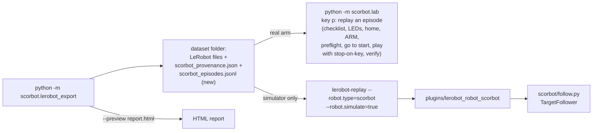

# Supervised replay, LeRobot robot plugin, and episode preview (M1 finish)

Date: 2026-10-02. Status: draft, revised after a Codex adversarial review
(1 critical, 4 high: `lerobot-replay` cannot verify which dataset drives the
arm, the connect order homed before the MOTORS check, connect failures could
leave motors on, there was no software pause, and the episode start pose was
never aligned). Parent: [M1 roadmap](2026-10-01-m1-roadmap-design.md): M1 is
done when "the sessions export as a LeRobot dataset that replays on the arm,
with logs". User decisions: same safety checks as the lab, arm-paced replay,
HTML preview, plugin in `plugins/`.

## Big picture

**Why real-arm replay lives in the lab tool:** the lab session already has
every gate replay needs in the right order (checklist, preflight, connect,
LED after connect, enable, LED lit after enable, home, post-home confirm,
landmark, LED before arming, typed `ARM`), cleanup on every failure path
(motors-off request, LED check, summary), multi-step plans that show the
moves, need a typed confirmation, stop on any key and are refused on the real
arm when keys cannot be read, the 10 degree travel cap, the drift check, the
fault latch and full logs. `lerobot-replay` calls `robot.connect()` outside
its cleanup block and loops with no stop key, so it is used only with the
simulator in this step. Real-arm use through LeRobot (M2 policy runs) gets
its own reviewed design.

## Part A: dataset sidecar for replay (exporter)

The exporter writes `scorbot_episodes.jsonl` into the dataset folder, one row
per dataset episode: `dataset_episode`, `session`, `source_episode`, `task`,
`fps`, `motors` (names in order), `units`, `step_counts` (counts per legacy
degree per arm joint, from `preview_jog`), `first_state`, `final_state` and
`actions` (the full action sequence, counts from home). The lab PC reads it
with the standard library, no LeRobot or pyarrow.

- Written from the same `EpisodeFrames` that fill the LeRobot dataset, in the
  partial folder, before verification.
- Verification (already reopening the dataset) also compares every episode's
  `action` column from LeRobot with the sidecar, value for value; a mismatch
  fails the export and nothing is published.
- `scorbot_provenance.json` gains `robot_id` per input session (from the lab
  JSONL `session` row).

## Part B: replay in the lab tool (real arm and rehearsal)

Key `p` (armed only, not inside teleop):

1. **Choose.** Type the dataset folder path, then the dataset episode number.
2. **Preflight, before any motion** (refuse with the reason, disarm):
   - `scorbot_provenance.json` and `scorbot_episodes.jsonl` exist and parse;
   - provenance `data_source` equals this session's (`real` on the real arm,
     `simulated` in a rehearsal), and every source session's `robot_id`
     equals this profile's `robot_id`;
   - `units` is exactly the exporter's units string, `motors` exactly the
     exporter's order;
   - the episode's `step_counts` match this SDK's `preview_jog` counts per
     joint (same legacy scale);
   - every action keeps base, shoulder and elbow within the 10 degree cap
     from home, and the wrist motors stay within half a wrist step of home
     (wrist motion stays disabled);
   - consecutive actions differ by at most one step on one joint (what
     teleop records); anything else is refused, not interpolated.
3. **Go to the start pose.** The episode's `first_state` is converted to
   travel per joint (counts from home divided by `step_counts`, rounded to
   the 0.5 degree grid; refused if not within a quarter step of it). If the
   arm is not there, the existing `_run_plan` shows the moves, asks for
   `START <n>`, runs them with stop-on-key, and checks arrival.
4. **Play.** The action sequence becomes a list of single steps (each change
   of target is one `Move(joint, ±step)`). `_run_plan` shows the step count
   and the joints, asks for `PLAY <n>`, runs it step by step with
   stop-on-key, and checks arrival against `final_state`.
5. **Log.** JSONL rows `replay_preflight` (checks and result),
   `replay_start` (dataset path, provenance sha256, episode, task, steps),
   then the usual plan rows; MCAP note with the same.

Replay runs at the arm's pace (user decision): each step finishes before the
next. No new motion capability: the same `jog_joint` steps, cap, joints,
drift check and fault latch as teleop and go-to-mark.

## Part C: LeRobot robot plugin (simulator only in this step)

`plugins/lerobot_robot_scorbot/` (own `pyproject.toml`, package
`lerobot_robot_scorbot`, depends on `scorbot-er4u` and `lerobot`), installed
into `.venv-lerobot` with `-e`; LeRobot discovers it by name.

- `ScorbotRobotConfig` registered as `"scorbot"`: `simulate: bool = False`,
  `speed: int = 10`, `step_deg: float = 1.0`, `log_dir`, `robot_id`.
- `simulate=False` raises at construction: "real-arm use through LeRobot is
  not supported yet; replay on the arm with python -m scorbot.lab (key p)".
- `connect()`: `SimulatedScorbot`, enable, home; any exception after the
  connection disables and disconnects before re-raising (connect is outside
  `lerobot-replay`'s cleanup).
- `observation_features` / `action_features`: `{name: float}` for the
  exporter's motor names; `get_observation()` and `send_action()` go
  through `scorbot/follow.py`.

`scorbot/follow.py` `TargetFollower` (core, main test suite):
`observe()` returns counts from home; `step_toward(target)` moves at most one
of base, shoulder, elbow by one step (the joint with the largest error beyond
half a step), refuses wrist targets more than half a wrist step away, refuses
a step past the 10 degree cap before queuing, refuses on drift, and returns
the target it commanded.

## Part D: episode preview

`python -m scorbot.lerobot_export ... --preview report.html` (with or without
`--dry-run`; no `lerobot`).

- One self-contained HTML file: no external scripts, fonts, images or URLs;
  light and dark styles; all log text HTML-escaped.
- Header: inputs, data source (SIMULATED banner), fps, units, image latency
  unmeasured, kept and refused counts.
- Per kept episode: task, duration, frames, jogs; up to 8 thumbnails evenly
  spaced, each re-encoded to at most 160 px wide JPEG (OpenCV when installed;
  without it, no thumbnails and a note); one inline SVG per moving joint with
  state and action over time.
- Per refused or skipped episode: the reasons.
- Bounds: at most 200 episodes shown (the rest summarised) and at most 8 MB
  of embedded images; beyond that thumbnails stop with a note.

## Tests

Main suite:
- sidecar written and matching the frames;
- lab replay on `SimulatedScorbot`: preflight refusals (each rule), start-pose
  plan, play to the final state, stop by key mid-play, refusal on the real
  data source when keys cannot be read (existing `_run_plan` rule), and
  JSONL rows;
- `TargetFollower` rules;
- preview content, escaping, bounds, no external URLs.

`.venv-lerobot`:
- the export verification compares sidecar and LeRobot actions;
- the plugin registers as `scorbot`;
- `lerobot-replay`'s `replay(cfg)` with `simulate=True` replays the
  round-trip episode to its final position;
- `simulate=False` is refused.

## Docs

`docs/design/LEROBOT_EXPORT.md` ("Replay on the arm", "Preview"),
`docs/lab/LAB_SESSION.md` (key `p`), `docs/project/PROJECT_LOG.md`, roadmap M1 status.
