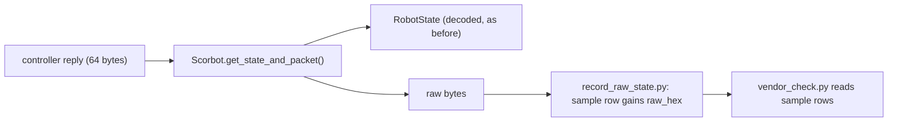
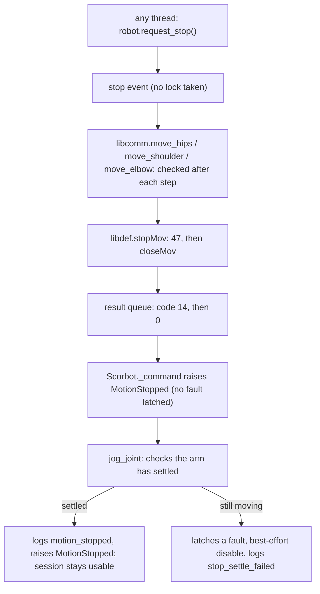

# Raw reply bytes and a software stop: design and plan

Date: 2026-10-04. Status: built in the simulator and against fake endpoints; **never run on the arm**. Written while the owner was away, on his instruction to plan and build it; it is here for his review.

Background: [VENDOR_DLL_PROTOCOL.md](../protocol/VENDOR_DLL_PROTOCOL.md) (what the vendor sends, from disassembly) and [VENDOR_PROTOCOL_LAB_PLAN.md](../lab/VENDOR_PROTOCOL_LAB_PLAN.md) (how each claim is confirmed; this work is its steps F2 and F3).

## 1. Problem

Two things block the fast path of the lab plan.

1. **We cannot see the bytes we have not decoded.** `RobotState` keeps only the fields the legacy code understood. The emergency bit (reply byte 2) and the ID and command echoes (bytes 0 and 1) are dropped, so an idle recording cannot confirm them.
2. **A jog cannot be stopped once started.** The legacy command worker runs one jog to the end. `disable()` is queued behind it. The only way to interrupt a move is the physical stop.

## 2. Part A: raw reply bytes in the idle recorder

- `Scorbot.get_state_and_packet()` returns the decoded state and a copy of the packet it came from. `get_state()` is that call without the packet, so every existing caller is unchanged.
- `RobotState` does **not** gain a field. It is serialised into every log and MCAP row; raw bytes belong only where someone asked for them.
- `examples/record_raw_state.py` adds `raw_hex` to each `sample` row. Nothing is sent to the controller that was not sent before.
- `scripts/vendor_check.py` accepts those rows as replies, so an idle recording across an e-stop press can be graded for claim V6.

## 3. Part B: the software stop

### What it is and is not

A request, from another thread, that the jog in progress end early. It works only while USB and the command worker are alive, and takes effect at the next packet. **It is not an emergency stop** and must never be documented or named as one. The physical stop stays authoritative.

### What goes on the wire

When a stop is requested during a jog, the legacy loop stops stepping and sends the vendor's arm-stop sequence:

| Message | Bytes from offset 4 | Already sent by the legacy code as |
|---|---|---|
| Clear communication buffer | `47` | `mov_comm(2)`, the first message of every jog |
| Mode S | `4F 3F 53` | `mov_comm(3)`, `closeMov` step 1 |
| Control Off, gripper | `73 20` | `mov_comm(4)`, `closeMov` step 2 |
| Motor off, gripper | `42 20` | `mov_comm(5)`, `closeMov` step 3 |

That is `47` followed by the three `closeMov` commands. No new command byte, no new template, no change to a sleep. This is what the amended packet rule allows on the strength of the disassembly. The one new thing is the `47` arriving mid-move.

In all four messages every joint's setpoint region carries the **smoothed measured position**, as the idle messages and `openMov` already do. `closeMov` differs: it keeps the jog target for the moving joint. The stop must not, or a stop on the last step would leave the full target commanded. The vendor does the same: its stop routine first copies the measured positions over its setpoints (`0x10021441`), then clears the buffer. The measured value is the legacy smoothed mean, which trails the arm by about one step, so the arm may be asked back a few counts.

The stop is checked after every step and in every pass of the settle loop (which otherwise keeps sending the full target until the arm arrives).

### How the request travels

Decisions:

- **Separate event.** `_cancel_event` already exists but means "the session is dying". The stop gets its own `_stop_event`, which is cleared after every jog.
- **Lock-free request.** `jog_joint` holds the motion lock for the whole jog, so `request_stop()` takes no lock; it only sets the event and writes a log row.
- **A stop requested while nothing moves refuses the next jog once.** Otherwise a request arriving a moment before a jog starts would be silently lost. Fail-stopped is the safe side of that race.
- **A clean stop is not a fault.** Motors stay on and the home reference stays valid: the encoders kept counting. The session continues.
- **An unconfirmed stop is a fault.** After the stop sequence, `jog_joint` compares successive readings 0.05 s apart until they no longer change, and gives up after 8 s. That is how the USNA ScorBot Toolbox for MATLAB decides the arm has stopped (`ScorWaitForMove`); "no longer change" is within 2 counts, the lab's idle band, and we ask for three such pairs in a row so one pause in a slow move is not taken for rest. If it gives up, the session latches a fault like any other and a best-effort disable is queued.
- **A request that comes too late is said to be too late.** If it arrives while the move is already being closed, nothing is cut short; the jog completes and a `stop_too_late` row is logged.
- **A stop does not promise less travel.** `MotionStopped` carries the measured state and whether the jog was started; the caller compares counts. The bench trial reports one of four outcomes: completed, not started (the request beat the jog; inconclusive), stopped early, or stopped at full travel.
- **Callers cannot mistake a stop for completion.** `jog_joint` raises `MotionStopped` (a `ScorbotError`) carrying the final state. `move_joint` therefore never reaches its "did it arrive" check.
- **Wrist jogs** are disabled in the SDK, so `move_wrist` is not touched.
- **Result code 14** is new on the legacy result queue ("stopped on request"). Codes 1-13 are taken by `libdef.error_msg`.
- **Session records** gain the command status `stopped`, so an interrupted jog is not stored as completed. It is an added value, not a schema version change.

### Simulator

`SimulatedController` applies a jog step by step and, on a stop, keeps the counts reached so far and answers code 14. This is a model of what we expect, not evidence: the real arm will coast, and whether the controller accepts `47` mid-move is exactly what the lab trial finds out.

### Lab trial

`examples/bench_joint.py --stop-after-ms N` requests a stop N milliseconds into the 1 degree jog. It is the F3 step of the lab plan: same prompts, same supervision, same 1 degree ceiling. Expected outcomes, best to worst: the arm stops short of 1 degree; the arm completes the 1 degree (the stop came too late or was ignored); the controller answers with an error and the session faults. None of these moves the arm further than the jog it was already cleared for.

## 4. What is not in this change

- No key binding in the guided lab session (`scorbot.lab`) or teleop. That comes after the arm has shown the stop works.
- No flow control from the echoed ID, no connect without motors on, no new decoder for the count format. Separate pieces of work.
- No stop for homing. `home()` already has its own cancel path and motors-off on failure.

## 5. Plan

| # | Step | Verified by |
|---|---|---|
| 1 | `get_state_and_packet` in `Scorbot`; simulator marks it simulated | `tests/test_simulated.py`, `tests/test_python_api.py` |
| 2 | `raw_hex` in idle sample rows; `vendor_check.py` reads them | `tests/test_calibration_capture.py`, `tests/test_vendor_check.py`, log-reader tests |
| 3 | Legacy: `libdef.stopMov`, stop check in the three jog loops, `execute` passes the event | New test with fake endpoints: exact command-byte sequence with and without a stop; existing golden codec tests unchanged |
| 4 | SDK: `request_stop`, `MotionStopped`, settle check, fault on failure | Simulator tests: stop mid-jog, stop while idle, stop that does not settle, session usable afterwards, nothing queued on refusal |
| 5 | Simulator: step-wise jog with stop | Same tests |
| 6 | `bench_joint.py --stop-after-ms` | `tests/test_bench_joint.py`, simulated run |
| 7 | Docs: module rules, safety case, protocol, lab plan, project log | Read-through |
| 8 | Full suite, `ruff`, `compileall`, Codex review and adversarial review | Output recorded in the project log |

## 6. Review

Codex `review` and `adversarial-review` ran on the first version (Gemini had no credits). All findings were checked against the code and accepted:

| Finding | Raised by | Fix |
|---|---|---|
| The bench trial could report success when the request beat the jog and nothing was sent | both | `MotionStopped.started`; the trial reports four outcomes and calls this one inconclusive |
| A stop on the last step reported an early stop with the full target still commanded | adversarial | The stop messages carry the measured position, as the vendor's stop does; the trial checks the counts |
| A request during the settle loop was lost | adversarial | The settle loop checks the event; a truly late request is logged as `stop_too_late` |
| One quiet pair of readings could pass a moving arm as settled | adversarial | Three quiet pairs in a row |
| An interrupted jog was stored as `completed` in the session record | review | New command status `stopped`; a refused jog is `rejected` |

## 7. Risks

- **`47` mid-move is untested on hardware.** It is the first message of every jog, so the controller accepts it; what it does to a move in progress is inferred from the vendor's own stop.
- **The stop retargets to a smoothed, slightly stale position.** A few counts of pull-back are expected; a large one would show in the trial's counts.
- **The arm coasts.** The stop removes future setpoints; it does not brake. The settle check measures the result, it does not shorten it.
- **A stop cannot outrun a dead link.** If USB or the worker has failed, the request does nothing. That is why it is not an emergency stop.
- **The fingerprint changes.** `libcomm.py`, `libdef.py` and `robot.py` are in `motion_source_sha256`, so logs from before and after this change will not be pooled. That is intended.
