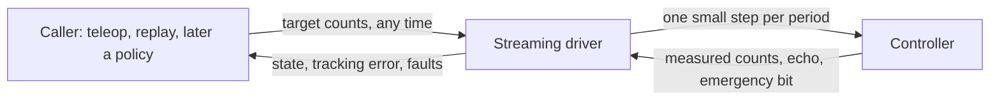
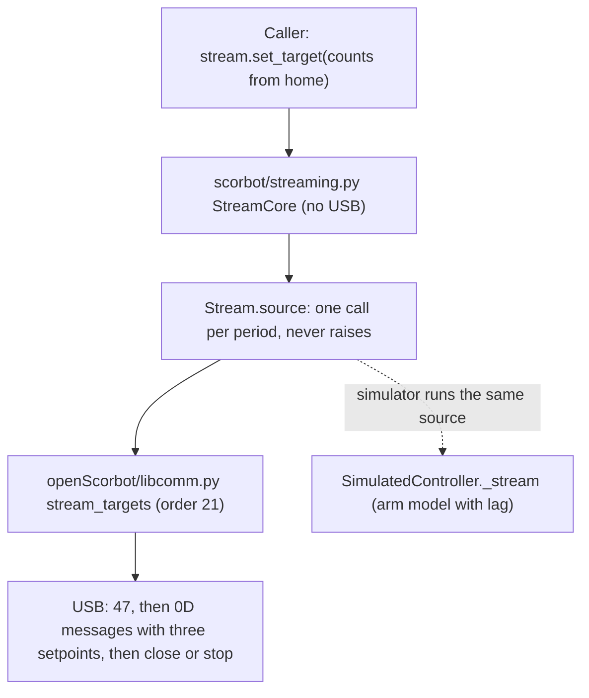

# Streaming driver: requirements

Date: 2026-10-04. Status: **built and tested in the simulator; never run on the arm.** Section 8 says what was built and what is deliberately switched off. This is step 2 of the agreed path: write down what the driver must do, get a yes, then build it against the simulator.

## 1. Why

The semester goal is an operator, and later a policy, driving the arm while it is recorded (`docs/design/LAB_PLATFORM_VISION.md`, M1 and M2). A policy sends a new joint target 10 to 50 times a second. Today the SDK can do one blocking jog of one joint, about a second each (`scorbot/follow.py:TargetFollower`). That gap is the project's main technical risk.

What the vendor analysis settled (`docs/protocol/VENDOR_DLL_PROTOCOL.md` sections 2, 5, 10, 11):

- The controller is driven by a stream of `0D` messages, each carrying a target for every axis. The legacy jog already does this for one joint.
- Intelitek's own software does **not** accept a new target mid-move. It refuses with "motion in progress". So there is no vendor behaviour to copy here; streaming with retargeting is our design.
- The vendor gives us priors to start from: a 24 ms planner period, 6500 counts/s per motor, a queue of 4 messages for jogging, and a stop sequence.

## 2. What it is

One loop. Every period it takes the newest target, moves the commanded position a small, limited step toward it, sends that, and reads the reply. The caller never waits for a move to finish; it just keeps updating the target.

## 3. Requirements

Each has the reason and how it will be tested in the simulator. "Prior" marks a starting value that the lab must measure.

| # | The driver must | Why | Test |
|---|---|---|---|
| R1 | Accept a new target at any time, including while moving, for base, shoulder and elbow together. The newest target wins | This is the whole point; a policy never waits | Send targets mid-move; the motion bends toward the new one without stopping first |
| R2 | Change the commanded position smoothly: per-motor limits on speed, acceleration and jerk, enforced every period | No jerks, no steps the motors cannot follow | For random target sequences, every commanded step stays inside the limits |
| R3 | Never command a position more than a set lead ahead of the measured position | If the arm stalls or hits something, the command must not run away from it | Hold the simulated arm still; the command stops at the lead limit and a fault follows (R6) |
| R4 | Refuse targets outside the allowed travel from home, before sending anything. The cap starts at 10 degrees and is raised in stages as lab sessions pass (section 5) | Same rule as today's follower; the widening is earned, not assumed | Out-of-range target: refused, nothing queued. The cap is a constructor value with a hard upper bound |
| R5 | Stop on request within one period, using the stop sequence, and hold where the arm is | An operator key and a policy both need it | Request a stop mid-stream; no further target steps are sent, the stop sequence is, and the session stays usable |
| R6 | Latch a fault and stop streaming on: lead limit reached, stale or missing reply, controller error word over its threshold, emergency bit, worker crash | Same rule as the rest of the SDK: any fault ends motion | One simulator test per cause; each shows the session latched and nothing sent afterwards |
| R7 | Hold position if no new target arrives within a time limit | A crashed or hung caller must not leave the arm chasing an old target | Stop sending targets; the driver decelerates and holds, and says so in the log |
| R8 | Not send faster than the controller takes messages, using the echoed message ID | The vendor paces this way; overflowing the controller loses commands | Simulated controller with a small queue: sent minus echoed never exceeds the limit |
| R9 | Leave the wrist and gripper alone | Wrist jogs are disabled until the two-motor mapping is bench-tested | Wrist and gripper regions always carry the measured position |
| R10 | Log, every period: target, commanded, measured, and the raw packets | Tracking error is the number that says whether streaming works | Replay a log and recompute the tracking error offline |
| R11 | Run the same in the simulator, with a simulated arm that lags | Tests must be able to fail for the right reasons | A lag model in `SimulatedController`; tracking error is non-zero and bounded |
| R12 | Be opt-in and gated: enabled, homed, no fault, and a deliberate call to start streaming. `jog_joint` keeps working as it does now | Existing lab procedures must not change | Existing suite unchanged; streaming refuses to start when a gate is not met |

## 4. Starting values (all priors)

| Value | Starting point | Source | The lab measures |
|---|---|---|---|
| Period | 24 ms | Vendor planner (`PCPeriod` x `USBCPeriod`). The legacy loop runs near 20 ms; `planning.py` assumed 16 | The period the controller actually keeps up with |
| Speed limit per motor | A quarter of 6500 counts/s to begin with | Vendor `MaxSpeed`; the datasheet joint speeds are about half that | Tracking error against speed |
| Acceleration and jerk | From the vendor profile's jog setting (acceleration fraction 0.3, jerk fraction 0.05) | Vendor `MoveManual` | Whether the arm follows without overshoot |
| Lead limit | A few steps' worth of counts | Ours | Normal lag, then set the limit above it |
| Queue limit | 4 | Vendor `ManualBuffers` | Whether the echo works as read (lab plan V4) |
| No-target time limit | 0.5 s | Ours | Operator feel in teleop |

## 5. Decisions (answered by the owner, 2026-10-04)

1. **Several motors together: allowed.** "No coordinated motion" was a project rule, not something from the manual; the vendor's own software moves all joints on one curve. The rule in `CLAUDE.md` now permits base, shoulder and elbow together as motor-count targets inside the travel cap. Each motor is still tried alone on the bench first, because a wrong direction is harder to see when three move.
2. **Limits grow with evidence.** The 5 degree ceiling stays for `jog_joint`. For streaming the limits are the lead limit (R3) and the travel cap from home (R4), starting at 10 degrees. After a lab session with no faults and tracking inside the limit, the cap is raised one stage, and the reason is written in the project log. Suggested stages: 10, 20, 45 degrees, then the vendor's encoder limits once home and signs are measured. This is the usual envelope-expansion practice: widen only what the last test covered. *2026-10-06: the owner lifted the cap to 180 degrees in one step; the source model's joint limits now bound travel, and `StreamCore` takes a whole-pose `pose_check` (see the project log).*
3. **Method: a pure core with thin adapters.** The streaming logic (targets in, limited steps out, faults, stop, watchdog) is written as a plain module with no USB in it, fully tested on its own. A small adapter connects it to the arm. The first adapter runs inside the existing legacy worker, so every byte sent is one the arm has already accepted and the load-bearing sleeps are untouched. A second adapter for the planned single-thread driver (`scorbot/transport/codec.py`) can replace it later without touching the core. This gets the long-term structure without betting the first trial on new transport code.
4. **Targets are motor counts, with angles as a layer on top.** Counts are what the controller reports and what the recorder and exporter already store, and they keep unverified maths out of the safety path. Joint angles are what kinematics, policies and other arms use, so the API gains an angle view once a calibration exists (`scorbot/calibration.py`, and `scorbot/vendor_model.py` as the prior for the wrist and the shoulder coupling). Datasets keep raw counts and add angles when calibrated.

## 6. Not in this work

Cartesian targets, wrist and gripper motion, calibration, the policy itself, and the server-to-lab-PC link. Each has its own place in the roadmap.

## 7. What "done" looks like

- In the simulator: every requirement has a passing test, and a recorded teleop episode replays through the streaming driver with a stated tracking error.
- Reviewed by Codex before it goes near the arm.
- At the lab: one motor, 1 degree, someone at the physical stop, then the starting values replaced by measured ones.

## 8. What was built (2026-10-04)

| Requirement | State | Where tested |
|---|---|---|
| R1 new target any time, three motors | Built | `test_streaming_core`, `test_streaming` |
| R2 speed, acceleration, jerk limits | Built (Ruckig online) | `test_streaming_core` |
| R3 lead limit | Built; default 2 degrees, at most the jog ceiling. Checked on the setpoint about to be sent, so nothing past the limit goes out | both |
| R4 travel cap | Built; 10 degrees, and the code refuses more | both |
| R5 stop | Built; ends with the stop sequence on the measured position | both, plus the exact messages |
| R6 faults | Built for lead, error word, bad reply, worker crash. The worker latches the session itself, so a caller that never ends the stream still leaves it faulted; a stream that does not end in time is told to stop. **Emergency bit: built, off by default** until the lab confirms reply byte 2 (lab plan V6) | both |
| R7 hold when targets stop | Built; 0.5 s default | both |
| R8 pacing on the echoed ID | **Not built.** A first version let the core wait when told the queue was full, but nothing could feed it the echo and, as written, a wait would never have cleared. It was removed on 2026-10-05. To be designed once the lab confirms reply byte 0 (lab plan V4). The legacy loop sends one message and reads one reply per step, as jogs do | none |
| R9 wrist and gripper untouched | Built | exact messages in `test_streaming` |
| R10 log | Built: one `stream_trace` row with every step's target, command, measurement and lead, plus the raw packets | `test_streaming` |
| R11 simulator with lag | Built: `SimulatedController.stream_follow`, `stream_stuck` | both |
| R12 opt-in, gated, jogs unchanged | Built; other commands are refused while a stream is active, before they log or queue anything | `test_streaming`; the existing suite is unchanged |

Things to know before the first trial on the arm:

- **Steps are paced to the planned period.** The core plans in 24 ms steps; the legacy loop's own delays give about 20 ms plus USB time, which alone would drive the arm about a fifth faster than the limits say. `Stream.source` therefore waits out the rest of each period before it answers. That makes the gap between messages a few milliseconds longer than in a jog, which has not been tried on the arm. A loop slower than the period is not caught up, so the arm then moves slower than planned. The log records real timestamps.
- **The counter range.** Setpoints are home plus the command in the legacy signed count, continuous through zero. If home sits within the travel cap of plus or minus 65535 counts the stream faults there instead of wrapping (the legacy arithmetic would wrap; the vendor's counter is wider and does not). Where home sits on the counter is not known until the homing analysis or a lab log says.
- **Three setpoints in one message has not been sent to this arm before.** Each field is what a jog sends for that joint; the layout is the one `moveXYZ` uses, which the SDK never ran.
- **First trial:** `examples/bench_stream.py`: one motor, a target one degree away and back, travel cap 2 degrees, someone at the physical stop. It prints whether the arm arrived and returned, the largest lead and the real time between steps; the `stream_trace` row has every step.
