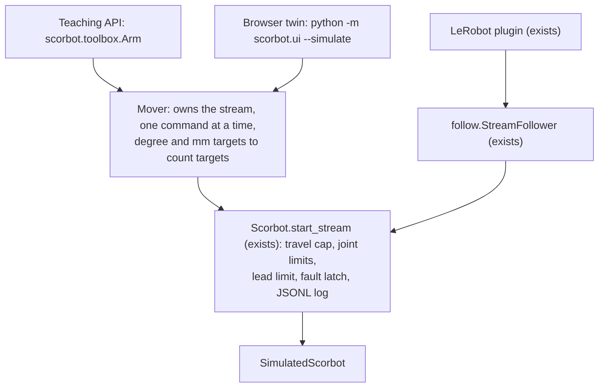

# Three front doors: teaching API, browser twin, AI interface

Date: 2026-10-05. Status: draft for owner review, revised after a Codex
adversarial review (six findings, all taken; see the end). The shape was agreed
with the owner on 2026-10-05 ("teaching tool and research tool for VLA"; "no
complex or over engineering").

**Everything in this document runs on the simulator only.** Putting any of it
on the real arm is a separate, later design, written after the lab acceptance
run. Nothing here is verified on the arm.

## Goal

One arm, three kinds of user:

- a **student** writing a short script in degrees and millimetres;
- a **person at a screen** moving the arm by hand and recording demonstrations;
- a **policy** (ACT first, a VLA later) reading observations and sending actions.

All three pass the same gates and leave the same kind of recording, so a
demonstration made in the browser can train a policy, and a policy's run can be
replayed and reviewed like any lab session.

## Big picture

Nothing new talks to `openScorbot/`. No packet bytes change.

## What is deliberately left out

- **The real arm.** Each door refuses a robot that is not simulated, as the
  plugin already does. A file on disk saying "the acceptance run passed" is not
  enough to unlock it: a real session needs a fresh supervised check of the
  pose, the motor LED and homing every time. That belongs to the later design.
- **The wrist.** Wrist motion stays disabled (project rule). Pitch and roll are
  read-only. The simulator works in counts and `source_model` already does the
  joint coupling, so the simulator needs no change.
- **A URDF.** `arm_chain.link_poses` and the meshes already place every link.
- **A web framework, a server API, user accounts.** Viser is the whole UI.
- **Leader-follower teleop.** There is no second arm. "Two-way" means the twin
  shows the arm, and dragging the twin moves the arm.
- **ROS 2, MoveIt.**

## Decisions for the owner

1. **Viser** as a new optional dependency (`ui` extra). Never needed on the lab
   PC.
2. **Millimetre targets in the simulator.** `CLAUDE.md` says "No Cartesian
   motion" and `scorbot/CLAUDE.md` wants measurements before adding it. Here a
   millimetre target is turned into joint angles by
   `source_model.angles_from_xyzpr` and sent as count targets inside the travel
   cap, **to the simulator only**; the `Mover` refuses one for a robot that is
   not simulated. The rule for the real arm does not change. `CLAUDE.md` gets
   one sentence saying so.

## The Mover (`scorbot/mover.py`)

The one new piece of control logic. Both the teaching API and the browser use
it, so there is a single owner of the stream.

- `set_target_angles(base=, shoulder=, elbow=)`, `set_target_xyz(x, y, z)`:
  convert with `source_model`, check `source_model.outside_window`, pass counts
  to `stream.set_target`. A bad target raises `ValueError` naming the allowed
  range; nothing is sent and the session is not faulted.
- `tick()`: called about ten times a second by whoever is driving. Re-sends the
  current target, because the stream slows to rest if it hears nothing for
  0.5 s (`StreamCore` hold timeout).
- **A stream lives only while something is driving it.** The first target opens
  one. When no fresh target or `tick` has come for about a second, the `Mover`
  closes it, **whether or not the arm arrived**. So a script that crashes, or
  a browser tab that closes, ends with the arm slowed to rest and the stream
  closed. This also keeps each stream short: `Scorbot` refuses every other
  command while one is open, and a stream's packet trace covers only about
  48 s (`docs/project/BACKLOG.md`). A drag longer than 30 s is ended cleanly
  and the next target opens a new stream.
- `home()`, `gripper(direction)`: close the stream first, wait for rest, then
  call `Scorbot.home` / `move_gripper`.
- `stop()`: `stream.stop()`, the software stop. Not an emergency stop.
- All of the above run one at a time under one lock. `arrived()` and `state()`
  only read.

`follow.StreamFollower` stays as it is for the plugin (it works in counts and
the policy keeps it alive). If the two end up near-identical they are merged
later; not now.

## Door 1: teaching API (`scorbot/toolbox.py`)

A plain class in degrees and millimetres, named so that someone who has used the
USNA ScorBot Toolbox for MATLAB recognises it.

| Python | USNA toolbox | Does |
|---|---|---|
| `Arm()` and `with` | `ScorInit` | Simulated robot: connect, enable |
| `go_home()` | `ScorHome` / `ScorGoHome` | Home once; afterwards return to the home pose |
| `get_angles()` | `ScorGetBSEPR` | Five joint angles, degrees |
| `get_xyz()` | `ScorGetXYZPR` | Tool point in mm, tool pitch and roll in degrees |
| `move_to_angles(base=, shoulder=, elbow=)` | `ScorSetBSEPR` | Move the three arm joints |
| `move_by_angles(...)` | `ScorSetDeltaBSEPR` | Same, relative |
| `move_to_xyz(x, y, z)` | `ScorSetXYZPR` | Move the tool point; the tool keeps its angle to the floor because the wrist motors do not move |
| `set_gripper("open" / "close")` | `ScorSetGripper` | `Scorbot.move_gripper` |
| `wait_for_move()`, `is_moving()` | `ScorWaitForMove`, `ScorIsMoving` | |
| `set_speed(percent)` | `ScorSetSpeed` | Scales the stream's speed, never above its default |

- Moves **block by default** (`wait=True`): the call ticks the `Mover` until
  the arm is within a small count tolerance and settled, or a timeout raises.
  A student script reads top to bottom. `wait=False` returns at once.
- A fault during a move raises the SDK's own error and the session stays
  latched, as today.
- Docstrings and `Arm.status` say "source model, not measured".

## Door 2: browser twin (`scorbot/ui/`)

One page, served on `127.0.0.1` only:

- **3D view.** The arm where it is now (solid) and where it has been told to go
  (ghost). Built from `arm_chain.link_poses`, with meshes if present and a stick
  figure if not, as `arm_view` does.
- **Three sliders** for base, shoulder, elbow, limited to the allowed window.
- **A drag handle** on the tool point. A drag to a place the arm may not go
  leaves the target where it was and shows why.
- **Buttons:** Home, Open gripper, Close gripper, **Software stop**, Record /
  Stop recording with a task text box.
- **Status line:** SIMULATED, fault text, "source model, not measured".

The stop button is labelled "Software stop"; the page says it is not an
emergency stop.

Two files, so the logic is tested without a browser:

- `scorbot/ui/panel.py`: plain Python, no Viser. Takes "slider moved", "handle
  dragged", "button pressed"; hands slow work (home, gripper, closing a stream)
  to one worker thread so the page and the stop button stay responsive; calls
  the `Mover`; returns what to draw. It ticks the `Mover` only while a browser
  is connected and a control is being held or was moved in the last second.
- `scorbot/ui/app.py`: the only file that imports Viser. Wires widgets to the
  panel and redraws on a timer.

**Recording.** Built last, and done only when one browser-recorded episode
passes the existing exporter (`python -m scorbot.lerobot_export --dry-run`) in a
test. While recording, each stream step writes what the exporter already reads
from a keyboard-teleop session: the commanded count target (the action), the
observed counts (the observation) and their time, plus episode start and stop
rows with the task text. Camera frames come from the existing camera recorder
and are optional. The exact rows are fixed in the implementation plan after
reading the exporter; the exporter should need no change, and if it does, that
change is named there.

Viser facts this relies on (from its documentation, read 2026-10-05; confirm on
install): plain `pip install`, Windows and Python 3.13 supported; no URDF
needed, a mesh or frame is posed by setting `.position` and `.wxyz`;
`gui.add_slider`, `gui.add_button`, `scene.add_transform_controls` (the drag
handle), `scene.add_mesh_trimesh`. Prior art for the same pattern on a hobby
arm: SO-101 teleoperation kits that drive LeRobot from a Viser drag handle.

## Door 3: AI interface

The plugin stays as it is: `streaming=true`, simulator only. Added:

- `docs/design/POLICY_LOOP.md`: the commands, end to end, to record
  demonstrations in the browser, export, train ACT, and run it back through the
  plugin. Written against the LeRobot version installed in `.venv-lerobot`.
- One smoke test in `.venv-lerobot` that runs the loop with a stand-in policy.

The simulator has no camera, so this proves the plumbing, not a useful policy.

## Build order

1. `Mover`, joint targets only, with tests.
2. `toolbox.Arm` on top of it; then millimetre targets in both.
3. Browser twin, view only.
4. Browser twin, sliders, buttons and drag handle.
5. Recording from the browser, proven through the exporter.
6. Policy loop document and smoke test.

The one-script lab acceptance run is its own piece of work and is not blocked
by any of this.

## Testing

- `Mover`: on `SimulatedScorbot`: reach a target; each kind of bad target is
  refused without a fault; the stream closes when ticks stop mid-move; home and
  gripper work straight after a move; stop; a fault during a move; the
  shoulder's upper limit; xyz there and back; xyz refused for a non-simulated
  robot (a stub, never the real class).
- `Arm`: blocking and non-blocking moves, the timeout, the name table above.
- `panel.py`: unit tests with a fake `Mover`, including "browser gone".
- `app.py`: one import-and-start smoke test, skipped without Viser.
- No test opens USB.

## Known limits

- The travel cap is 10 degrees from home (under 4 upward for the shoulder), so
  the reachable box is small: enough to teach and to prove the chain.
- Simulated timing on the development PC means nothing.

## Outside review (Codex, 2026-10-05)

| Finding | What changed |
|---|---|
| A file on disk is not enough to unlock the real arm | The real arm is out of this document entirely |
| A closed browser tab leaves the stream open | The `Mover` closes any stream that is not being driven, arrived or not |
| Millimetre moves conflict with the "no Cartesian motion" rule | Simulator only, refused otherwise; listed as an owner decision |
| "Reuse the episode writer" does not say what gets recorded | Recording is its own step with a pass condition: the exporter accepts a browser episode |
| Home and gripper are refused while a stream is open; stop could block | The `Mover` is the single owner and closes the stream first; slow work runs on a worker thread |
| The plugin cannot use a real-arm unlock | The plugin stays simulator only, said outright |
