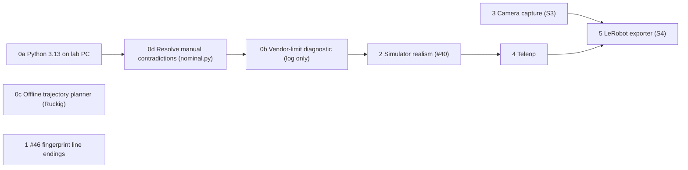

# M1 roadmap: foundations, simulator, camera, teleop, dataset export

Date: 2026-10-01. Progress: steps 0a-0d, 1, 2 and 3 done (step 3: see
2026-10-01-camera-capture-design.md). Status: draft, revised after a Codex review (4 blocking issues fixed: teleop
gates, action record, camera file contract, elbow span).

M1 (see [LAB_PLATFORM_VISION.md](../../LAB_PLATFORM_VISION.md), "Semester goal"):
an operator drives the arm by keyboard or gamepad while a webcam records,
and the sessions export as a LeRobot dataset. This roadmap covers the desk work
that needs no arm. The streaming motion layer (S2) waits on the USB
captures (S1) and is out of scope, apart from the offline planner in step 0c.

Each step below gets its own design approval, plan and commit, normally in
its own chat. This document fixes the order, the interfaces between steps
and the shared contracts, so those chats do not each invent their own.

## 1. Order and dependencies

| Step | Deliverable | Depends on | Touches the motion path? | Size |
|---|---|---|---|---|
| 0a | Lab PC on Python 3.13 | none | no | 30 min |
| 0d | Manual contradictions resolved in `nominal.py` | none | no | 0.5 day |
| 0b | Vendor-limit diagnostic, log only | 0d | logging only in `scorbot/robot.py` (no packet or gate change) | 0.5 day |
| 0c | Offline trajectory planner | none | no (wired into nothing) | 1-2 days |
| 1 | BACKLOG #46 fix | none | no (`provenance.py`) | hours |
| 2 | Simulator realism | 0b (so the sim exercises the guard) | no (`simulated.py` only) | 1-2 days |
| 3 | Camera capture | 0a (clock) | no | 2-3 days |
| 4 | Teleop | 2 (realistic rehearsal) | no SDK change; uses `jog_joint` | 2-3 days |
| 5 | LeRobot exporter | 3, 4 (input format fixed) | no | 3-4 days |

Steps 0c, 1 and 3 can run in parallel with anything else. Steps 1 and 0b both
change the value `motion_source_sha256` records; that is expected and lab logs
record the value per run.

## 2. Shared contracts (all steps)

**C1 Clock.** Every timestamp in a session is `time.monotonic_ns()` on the
host, anchored by the session's `clock` block (`record.py:_clock_info`). On
Windows, Python before 3.13 backs `monotonic` with `GetTickCount64` (about
15.6 ms per tick); 3.13 uses `QueryPerformanceCounter` (verified on the desk
machine: resolution 1e-07). Step 0a removes the problem. Rules:
- Every camera frame carries the capture time taken right after `read()`
  returns. `log_frame` today falls back to a second `monotonic_ns()` call when
  none is given (`record.py:162`); step 3 makes the observation time
  mandatory for frames so the image timestamp and `_rec` agree.
- A camera file reuses the parent session's clock anchor
  (`started_monotonic_ns`, `started_epoch_ns`) byte for byte; the loader
  refuses a camera file whose anchor differs.
- The exporter refuses sessions whose recorded clock resolution is coarser
  than 1 ms. Resolution is a precondition only; capture jitter is measured
  separately (`camera_health` max gap).

**C2 Action.** The action for a frame is the commanded joint target in signed
encoder counts, as a full vector (every arm motor, not only the moving one).
Today the MCAP `/robot/command` for a jog carries only joint, delta and speed
(`scorbot/lab/session.py:370`), and `target_signed_counts` exists only in the
JSONL `motion_preview` row and only for the motors that move
(`scorbot/robot.py:396`). So:
- The lab session computes the preview (offline, no USB) from the latest
  state before each jog and adds `target_signed_counts` for all arm motors
  (unmoved motors keep their current count) to the jog command's `params`.
  `params` is free-form in `scorbot.Command`, so no `SCHEMA_VERSION` bump.
- The command's MCAP time is the action timestamp; its `command_id` links
  it to `command_result`. Between a completed jog and the next command the
  action is the last observed position, derived by the exporter.
- The SDK's own `motion_preview` (JSONL) stays authoritative for what was
  sent; the exporter checks the two targets agree and refuses the episode
  if they do not.
- Teleop adds one `teleop_intent` row per operator intent, including rejected
  ones, so the input is in the record even when a gate refused it.

**C3 Units.** Raw signed encoder counts, labelled `uncalibrated`, until a
physical calibration exists (CLAUDE.md: nominal values are priors, never
calibration). Unsigned counts are converted with
`scorbot.calibration.signed_count_delta` relative to the session home count,
never by subtraction.

**C4 Evidence order.** JSONL first, MCAP second (CLAUDE.md conventions).
Strict JSON (`allow_nan=False`). Real and simulated data never share a
session, dataset or comparison. MCAP recording is best effort and can stop
while motion and the JSONL continue (`BestEffortRecorder`), so any consumer
that claims an episode is complete (the exporter) reads both and refuses on
disagreement: faults, episode boundaries and `motion_source_sha256` come from
the JSONL; state samples and frames come from the MCAP files.

**C7 New packages.** `pyproject.toml` lists packages explicitly; every new
package (`scorbot.camera`, `scorbot.teleop`, `scorbot.lerobot_export`) is
added there in the commit that creates it.

**C5 Optional dependencies.** Every new third-party dependency is an optional
extra; the core install stays `mcap`, `numpy`, `pyusb`. Tests for an extra
skip when it is not installed. Each extra is added to `uv.lock` (`uv lock`; CI
checks it).

| Extra | Package | Step |
|---|---|---|
| `planning` | `ruckig` | 0c |
| `camera` | `opencv-python-headless` | 3 |
| `lerobot` | `lerobot` (separate venv, never on the arm-control venv) | 5 |

**C6 No hardware in tests.** Camera tests use a fake frame source; teleop
tests use a scripted input source; nothing in CI opens USB or a webcam.

## 3. Step designs

### 0a. Python 3.13 on the lab PC

- `.python-version` 3.12 to 3.13, `uv lock`, update the docs that say 3.12
  (`DEPLOYMENT_OPTIONS.md`, `START_HERE_WINDOWS.md`, `docs/LAB_SESSION.md` if
  present). `requires-python` stays `>=3.10`; CI keeps 3.10 and 3.13.
- Check before merging: every locked dependency has a cp313 Windows wheel
  (numpy, pyusb, mcap, libusb-package, hypothesis).
- Acceptance: `uv sync --locked --extra windows --extra test` succeeds on 3.13;
  the full test suite passes; on the lab PC
  `python -c "import time; print(time.get_clock_info('monotonic'))"` shows
  `QueryPerformanceCounter`.

### 0d. Resolve manual contradictions

Source: the contradictions table in
[MANUAL_AND_PRIOR_ART_FINDINGS.md](../../MANUAL_AND_PRIOR_ART_FINDINGS.md).

- Scope: only the numeric rows (shoulder height and link length, elbow
  span, shoulder range, path velocity, pitch counts per degree). LED colour
  and homing back-off are documentation and capture questions; they get a
  verdict in the findings doc, not a constant.
- For each numeric row, `nominal.py` records both values with their sources
  and one of three verdicts: `adopted` (one source is clearly right, say
  why), `both kept` (sources disagree, a measurement decides) or `measure`.
  Nothing is labelled measured.
- Safety bounds never get looser here. The 260 degree elbow span in
  `AXIS_RANGES` (`nominal.py:91`) stays the calibration gate
  (`check_soft_limit_span`, CLAUDE.md "Calibration refuses ... soft-limit
  spans beyond the manual's travel"); the vendor 275 is stored as a
  `VendorPrior` next to it, not used by any check.
- Adds `VENDOR_ENCODER_SOFT_LIMITS` (base -25000..20000, shoulder
  -18000..1500, elbow -25000..20000, pitch +/-15000) as `VendorPrior`
  values for step 0b.
- Acceptance: the contradictions table has a verdict per row;
  `tests/` covers every new constant's `status` string; existing
  calibration-span tests unchanged.

### 0b. Vendor-limit diagnostic (log only, not a guard)

Purpose: record, for every jog, where the target sits relative to the
vendor's encoder limits, so the first lab sessions collect evidence on
whether our zero and signs match the vendor's. It is not a safety guard: with
our zero and sign mapping unverified, absolute counts cannot establish the
distance to asymmetric limits, and a log-only check does not constrain
motion. The real limits stay the lab session's 10 degree travel cap and the
SDK jog ceiling. It is never named or documented as a guard.

- Pure function `scorbot.nominal.vendor_limit_report(target_signed_counts)`
  returning, per motor, the target, both vendor bounds, and which bound it
  would cross under each sign hypothesis. Logged as a `vendor_limit_report`
  field inside the existing `motion_preview` row, not as a new event, so no
  alarm parsing changes and no new noise (the shoulder's 1500-count bound,
  about 13 degrees, would otherwise fire during normal motion).
- No enforce mode in this roadmap. An enforcing guard is a later decision
  after calibration (G2) shows the zero and sign mapping.
- Does not change packet construction, sequence bytes or sleeps.
- Tests: report contents at, inside and beyond each bound under both sign
  hypotheses; a jog still succeeds and the row carries the report.

### 0c. Offline trajectory planner

Purpose: have a tested planner ready when S2 starts, built on a proven
library, not hand-written. Kept deliberately small: the streaming interface
it will feed is unknown until S1, so this step only proves the library,
limits and units, and has the lowest priority in step 0. If time is short it
moves to the start of S2.

- `scorbot/planning.py`, wired into nothing (same status as
  `scorbot/kinematics.py`). Input: start and goal joint positions in signed
  counts per motor, per-axis limits, controller period. Output: a list of
  per-period targets plus the trajectory duration.
- Library: Ruckig (MIT community edition), time-optimal and jerk-limited,
  with synchronised multi-axis arrival.
- Limits: velocity priors from the datasheet (base 20, shoulder and elbow
  26.3, pitch 83, roll 106 deg/s) converted with the vendor counts per
  degree; acceleration and jerk are parameters with no default, because no
  source gives them. Period defaults to the vendor `PCPeriod` 16 ms, as a
  parameter.
- Every output carries `status = "offline plan, priors only, not sent"`.
- Tests: the trajectory starts and ends at the requested points, never
  exceeds the given limits, and all axes arrive together; skipped without
  `ruckig`.
- Check first: Ruckig wheels exist for Windows on 3.10 and 3.13.

### 1. BACKLOG #46: fingerprint line endings

- `motion_source_sha256` hashes each file with `\r\n` replaced by `\n`.
  Hashing in code, not only `.gitattributes`, because a bench-kit ZIP or an
  editor save on Windows can reintroduce CRLF.
- Old logs keep their recorded value; `docs/BACKLOG.md` and the log docs say
  fingerprints before this commit are not comparable across line endings.
- Test: a temporary tree with CRLF and LF copies of the same files gives the
  same digest (the function takes the root as an optional parameter for this).

### 2. Simulator realism (BACKLOG #40)

Goal: rehearsals exercise operator procedures and teleop against something
closer to the arm than today's instant homing (`simulated.py:144` sets all
counts at once). `SimulatedScorbot` still replaces only
`connect`/`disconnect`; all changes live in `SimulatedController`.

Every value below is a modeled hypothesis, not a description of our arm.
Each lives in one `SimulatorProfile` dataclass whose fields name their
source and say "modeled", so a later measurement replaces a value in one
place.

| Behaviour | Source | Simulated as |
|---|---|---|
| Homing order | whatever the legacy code commands | the simulator responds to the legacy homing commands in the order they arrive (legacy `setHome.py` homes pitch before roll; the vendor INI order differs and is not imposed) |
| Switch width | steveturbek/scorbot_controller (a replacement controller, so a weak prior) | switch stays pressed for about 200 counts |
| Offset after the switch | vendor INI | shoulder -190, elbow +45, pitch +850, roll -690 counts |
| Counts after homing | SCORBASE p. 23, 39 | 0 or close to 0 |
| Homing failure | vendor INI time limits | configurable: switch never found |
| Joint speed | datasheet | counts advance at the effective speed scaled by the legacy speed |
| Packet period | our ~13 ms idle estimate (the vendor 16 ms is a host period, not the packet rate) | configurable |
| Rest jitter | none (our choice) | +/- N counts at rest, including starts near the 0/65535 seam |
| LEDs | `docs/HARDWARE_REFERENCE.md` | MOTORS and POWER state exposed for the lab tool's questions |

Tests check the legacy homing path completing against the modeled sequence
separately from tests of the modeled values themselves.

- Time: simulated time runs faster than real time by a configurable factor
  (default fast in tests, 1x in `--simulate` rehearsals), so the 90 s suite
  does not grow.
- Existing tests stay green; new tests cover the homing sequence as seen
  through switch bits and the seam.

### 3. Camera capture (S3)

**Design reference:** LeRobot's `OpenCVCamera` (Apache-2.0): its config
names (`index_or_path`, `fps`, `width`, `height`, `color_mode`), its
background reader thread and its warm-up handling. We copy names and
structure so the later LeRobot plugin maps one-to-one; we do not depend on
`lerobot` here.

Components:

| Unit | Responsibility | Depends on |
|---|---|---|
| `scorbot/camera/source.py` | `FrameSource` protocol; `OpenCVSource` (DirectShow, fixed exposure and focus, set and read back) and `FakeSource` (deterministic frames, injectable drops and stalls) | OpenCV (optional) |
| `scorbot/camera/capture.py` | Reader thread: `read()`, stamp `monotonic_ns()` right after it returns, JPEG encode, put in a bounded queue (drop-oldest, count drops) | `FrameSource` |
| `scorbot/camera/writer.py` | Drains the queue into the camera recording; writes one health row per second to the JSONL log | `SessionWriter` |

**Decision to review: where frames are stored.** Today `log_frame` writes
base64 JPEG into the same MCAP, under the same lock, as `/robot/state`, and a
write failure sets `_broken` and stops all recording (`record.py:_emit`).
A camera fault could then take down the robot evidence. Options:

1. Same MCAP file (simplest; reader unchanged). Risk above; file grows about
   1.5 MB/s at 640x480, 30 fps.
2. **Separate MCAP per camera (recommended):** isolates writer failures
   (a camera write error cannot set the robot writer's `_broken`). It is not
   total isolation: both share the disk. It needs a new file contract,
   because `SessionWriter.create` always makes a new directory, session id,
   clock anchor and `session.mcap` (`record.py:61`), and `load_session`
   treats the `.mcap` next to `metadata.json` as the session and checks its
   event count (`replay.py:48`). The step 3 spec must define, before code:
   - `SessionWriter.create_stream(parent, name="camera-<id>")`: writes
     `camera-<id>.mcap` inside the parent session directory, with its own
     embedded metadata (`parent_session_id`, stream name, the parent's clock
     anchor copied exactly, its own event count at close).
   - A `streams` manifest in the parent `metadata.json`, written when the
     stream opens and updated when it closes.
   - `load_session` unchanged for the robot file; a new
     `load_stream(session_dir, name)` with its own integrity checks
     (anchor match, event count, damaged-tail classification as today).
   - Whether this needs a `SCHEMA_VERSION` bump (only with a reader
     migration).
3. MP4 files plus a timestamp table: smallest, but adds a codec dependency
   and a second container format before any need is shown.

**Health and failure:**
- JSONL gets one `camera_health` row per second (frames, drops, max gap,
  queue depth), not one row per frame: per-frame data stays in the camera
  MCAP `_rec` block (`frame_number`, `observed_monotonic_ns`).
- Camera failure never latches the robot fault and never stops motion; it is
  logged and shown to the operator. A teleop recording session can require
  the camera to be healthy before recording starts (step 4).
- Memory: queue capped (default 2 s of frames); no unbounded buffers.

**Settings recorded:** backend, requested and read-back resolution, fps,
exposure, focus, and whether each setting was accepted (DirectShow often
ignores them). Mount and camera ids use the existing `camera_config_id` and
`mount_id` fields.

**Acceptance:** a `FakeSource` run at 30 fps for 60 s records all frames with
monotonic, increasing timestamps; injected stalls show as drops in
`camera_health`; killing the source mid-run leaves the robot MCAP intact and
readable; laptop webcam smoke test documented (manual, not CI).

### 4. Teleop

Keyboard jogging already exists (`scorbot/lab/session.py:JOG_KEYS`). Teleop
adds a gamepad, a deadman, intent logging and a recording mode on top of it.

Teleop is an input source plugged into the existing lab session engine, not
a separate loop calling `jog_joint`. The lab session's gates are stricter
than the SDK's and all apply unchanged: the armed state and everything that
clears it, the MOTORS LED question on every arming, idle disarm, 1 degree
steps, base, shoulder and elbow only, and the 10 degree net travel cap per
joint from home (`scorbot/lab/session.py:1-8`, `TRAVEL_CAP_DEG`). The SDK
gates (5 degree ceiling, wrist rejection, speed 1-20, fault latch) sit
underneath.

**Design reference:** LeRobot's keyboard and gamepad teleoperators: one
`get_action()` per tick returning a dict; we copy that interface so the
later `lerobot_teleoperator_scorbot` plugin wraps it directly. SCORBASE manual
movement: speed 1-10 with default 5, and a pendant on Teach blocks PC motion
(added to the pre-motion check list).

| Unit | Responsibility |
|---|---|
| `scorbot/teleop/input.py` | `InputSource` protocol returning `Intent(joint, direction, deadman)` or none. `KeyboardSource` (existing operator keys), `XInputSource` (stdlib `ctypes`, Windows only), `ScriptedSource` (tests) |
| `scorbot/lab/session.py` (extended) | Takes intents from the active `InputSource` into its existing jog path, so arming, travel cap and logging are shared with keyboard jogs; discards input that arrived during a jog |

Rules:
- Deadman: gamepad motion requires holding a shoulder button; releasing it
  means no new jog. It cannot stop a jog in progress (`disable()` is not an
  emergency stop); the bound is the 1 degree step.
- Step size stays the lab session's 1 degree; travel stays inside the 10
  degree cap (so M1 demos are small reaches until calibration lifts the
  cap through its own reviewed change). Wrist intents are rejected and
  logged.
- Held keys and auto-repeat never queue: input that arrives during a jog is
  discarded (`discard_pending_keys`) and counted.
- Gamepad disconnect or a read error means no new jog and a logged event.
- Logging: one `teleop_intent` row per intent with `accepted` or the
  rejection reason; accepted intents then produce the existing
  `motion_preview` / `motion_complete` rows (the action source, contract C2).
- Recording mode: `python -m scorbot.lab` gains "record an episode" that
  starts the camera (step 3), requires `camera_health` to be OK, and marks
  episode start and end with an operator note (the exporter's episode
  boundaries).
- Tests: scripted intents through the lab session on `SimulatedScorbot`;
  auto-repeat flood produces one jog; deadman released produces none; wrist
  rejected without queuing motion; gamepad intents beyond the travel cap or
  while disarmed are refused exactly like keys; XInput tests skip off Windows.

### 5. LeRobot exporter (S4)

Decisions already made (2026-09-29): the official `lerobot` writer
(`LeRobotDataset.create`, `add_frame`, `save_episode`, `finalize`) in a
separate venv; action is the target position; raw counts labelled
uncalibrated; one episode per recorded episode; refuse faulted or damaged
sessions; never mix real and simulated; record source provenance.

Split so most of it is tested in the main CI without `lerobot`:

| Unit | Responsibility | Needs `lerobot` |
|---|---|---|
| `scorbot/lerobot_export/frames.py` | Pure: load the robot MCAP (`load_session`), camera streams (`load_stream`) and the lab JSONL; cut episodes; resample to a fixed fps grid; pick the nearest state and frame per tick; derive the action (C2) | no |
| `scorbot/lerobot_export/checks.py` | Pure: refusal rules (faults in either record, JSONL and MCAP disagreeing on episode boundaries or targets, MCAP stopped early, damaged MCAP, mixed sources, coarse clock, frame gap above a tolerance) | no |
| `scorbot/lerobot_export/write.py` | Thin adapter onto `LeRobotDataset` | yes |
| `python -m scorbot.lerobot_export` | CLI | yes, for write |

- Feature names follow LeRobot conventions so ACT trains with no changes:
  `observation.state` (motor counts, with names), `action` (same names),
  `observation.images.<camera_id>`.
- fps is a required argument (S1 has not measured the achievable rate).
- Dataset metadata: source session ids and file hashes,
  `motion_source_sha256`, `simulated: true/false`, units `uncalibrated counts`.
- Tests: synthetic sessions with fake camera frames (extend
  `examples/make_synthetic_session.py`); pure units tested in CI; the
  writer test skips without `lerobot`; a round trip (export, reload with
  `LeRobotDataset`, compare) runs in the lerobot venv only.
- Check first: which Python versions the current `lerobot` release supports.

## 4. Risks

| Risk | Effect | Mitigation |
|---|---|---|
| Vendor limit signs or zero differ from ours | Diagnostic misleads | Log-only report under both sign hypotheses; never called a guard |
| Teleop path skips a lab gate | Unbounded travel | Teleop goes through the lab session's jog path; tests refuse gamepad intents exactly like keys |
| Camera write load or failure disturbs robot recording | Lost evidence | Separate camera file (option 2); bounded queue |
| DirectShow ignores exposure or focus settings | Unusable training video | Read back and record every setting; acceptance needs a manual check |
| Step-and-stop teleop is too slow to demonstrate tasks | Weak M1 demos | Expected until S2; the exporter's fps is a parameter |
| Simulator numbers taken as truth | Rehearsal hides real behaviour | `SimulatorProfile` fields cite sources; outputs still say SIMULATED |
| Exporter written before real episodes exist | Format mismatch later | Exporter last; contracts C1-C3 fixed now |
| New extras break the lock or CI | Lab PC install fails | `uv lock` per extra; CI lock check; tests skip without extras |

## 5. Out of scope

S2 streaming follower and wiring the planner in, gripper, wrist motion,
Cartesian motion, the LeRobot robot plugin, the web UI, policy training.
