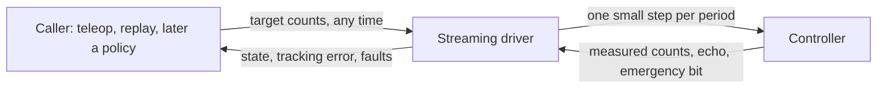

# Streaming driver: requirements

Date: 2026-10-04. Status: **draft for the owner's review. Nothing is built.** This is step 2 of the agreed path: write down what the driver must do, get a yes, then build it against the simulator.

## 1. Why

The semester goal is an operator, and later a policy, driving the arm while it is recorded (`docs/LAB_PLATFORM_VISION.md`, M1 and M2). A policy sends a new joint target 10 to 50 times a second. Today the SDK can do one blocking jog of one joint, about a second each (`scorbot/follow.py:TargetFollower`). That gap is the project's main technical risk.

What the vendor analysis settled (`docs/VENDOR_DLL_PROTOCOL.md` sections 2, 5, 10, 11):

- The controller is driven by a stream of `0D` messages, each carrying a target for every axis. The legacy jog already does this for one joint.
- Intelitek's own software does **not** accept a new target mid-move. It refuses with "motion in progress". So there is no vendor behaviour to copy here; streaming with retargeting is our design.
- The vendor gives us priors to start from: a 24 ms planner period, 6500 counts/s per motor, a queue of 4 messages for jogging, and a stop sequence.

## 2. What it is

One loop. Every period it takes the newest target, moves the commanded position a small, limited step toward it, sends that, and reads the reply. The caller never waits for a move to finish; it just keeps updating the target.

## 3. Requirements

Each has the reason and how it will be tested in the simulator. "Prior" marks a starting value that the lab must measure.

| # | The driver must | Why | Test |
|---|---|---|---|
| R1 | Accept a new target at any time, including while moving. The newest target wins | This is the whole point; a policy never waits | Send targets mid-move; the motion bends toward the new one without stopping first |
| R2 | Change the commanded position smoothly: per-motor limits on speed, acceleration and jerk, enforced every period | No jerks, no steps the motors cannot follow | For random target sequences, every commanded step stays inside the limits |
| R3 | Never command a position more than a set lead ahead of the measured position | If the arm stalls or hits something, the command must not run away from it | Hold the simulated arm still; the command stops at the lead limit and a fault follows (R6) |
| R4 | Refuse targets outside the allowed travel from home, before sending anything | Same rule as today's follower (10 degrees from home until calibration exists) | Out-of-range target: refused, nothing queued |
| R5 | Stop on request within one period, using the stop sequence, and hold where the arm is | An operator key and a policy both need it | Request a stop mid-stream; no further target steps are sent, the stop sequence is, and the session stays usable |
| R6 | Latch a fault and stop streaming on: lead limit reached, stale or missing reply, controller error word over its threshold, emergency bit, worker crash | Same rule as the rest of the SDK: any fault ends motion | One simulator test per cause; each shows the session latched and nothing sent afterwards |
| R7 | Hold position if no new target arrives within a time limit | A crashed or hung caller must not leave the arm chasing an old target | Stop sending targets; the driver decelerates and holds, and says so in the log |
| R8 | Not send faster than the controller takes messages, using the echoed message ID | The vendor paces this way; overflowing the controller loses commands | Simulated controller with a small queue: sent minus echoed never exceeds the limit |
| R9 | Leave the wrist and gripper alone | Wrist jogs are disabled until the two-motor mapping is bench-tested | Wrist and gripper regions always carry the measured position |
| R10 | Log, every period: target, commanded, measured, and the raw packets | Tracking error is the number that says whether streaming works | Replay a log and recompute the tracking error offline |
| R11 | Run the same in the simulator, with a simulated arm that lags | Tests must be able to fail for the right reasons | A lag model in `SimulatedController`; tracking error is non-zero and bounded |
| R12 | Be opt-in and gated: enabled, homed, no fault, and a deliberate call to start streaming. `jog_joint` keeps working as it does now | Existing lab procedures must not change | Existing suite unchanged; streaming refuses to start when a gate is not met |

## 4. Starting values (all priors)

| Value | Starting point | Source | The lab measures |
|---|---|---|---|
| Period | 24 ms | Vendor planner (`PCPeriod` x `USBCPeriod`). The legacy loop runs near 20 ms; `planning.py` assumed 16 | The period the controller actually keeps up with |
| Speed limit per motor | A quarter of 6500 counts/s to begin with | Vendor `MaxSpeed`; the datasheet joint speeds are about half that | Tracking error against speed |
| Acceleration and jerk | From the vendor profile's jog setting (acceleration fraction 0.3, jerk fraction 0.05) | Vendor `MoveManual` | Whether the arm follows without overshoot |
| Lead limit | A few steps' worth of counts | Ours | Normal lag, then set the limit above it |
| Queue limit | 4 | Vendor `ManualBuffers` | Whether the echo works as read (lab plan V4) |
| No-target time limit | 0.5 s | Ours | Operator feel in teleop |

## 5. Decisions needed from the owner

1. **One joint at a time, or several together?** A standing safety rule says "no coordinated motion". Streaming several joints at once is coordinated motion. Options: (a) first version moves one motor at a time, which stays inside the rule but is slower and less natural for a policy; (b) change the rule to allow base, shoulder and elbow together at small steps, tried first on the bench. **Recommendation: (a) for the first build, (b) once the lab has shown single-joint streaming tracks.**
2. **The 5 degree jog ceiling.** It was written for one jog. For streaming I propose the same number as the lead limit's outer bound and keeping the 10 degree travel cap from home. **Recommendation: keep both numbers; no rule change.**
3. **Where the loop lives.** (a) Inside the legacy two-thread code, as a new command, reusing its packet builders: quicker, but it inherits that code's limits. (b) The planned single-thread driver on `scorbot/transport/codec.py` (USB upgrade phase C): cleaner and what the roadmap intends, but the codec has not yet been compared with real traffic. **Recommendation: (a) now, because every byte it sends is one the arm has already accepted; (b) later.**
4. **Units of the target.** Motor counts from home, as the recorder and exporter already use. Joint angles would need the unverified mapping in `scorbot/vendor_model.py`. **Recommendation: counts.**

## 6. Not in this work

Cartesian targets, wrist and gripper motion, calibration, the policy itself, and the server-to-lab-PC link. Each has its own place in the roadmap.

## 7. What "done" looks like

- In the simulator: every requirement has a passing test, and a recorded teleop episode replays through the streaming driver with a stated tracking error.
- Reviewed by Codex before it goes near the arm.
- At the lab: one motor, 1 degree, someone at the physical stop, then the starting values replaced by measured ones.
