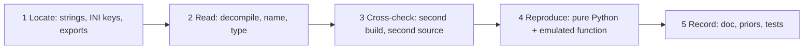

# Desk analysis of the vendor DLL: action plan

Date: 2026-10-04. Status: plan, revised after an outside review (section 8), awaiting the owner's go-ahead. No arm, no lab, nothing is sent anywhere. Everything this produces is a **prior from disassembly, unverified** until the arm confirms it.

## 1. Why these four

An AI policy outputs joint targets many times a second. Two links between "Python can connect" and "a policy can drive the arm" are missing (see `docs/LAB_PLATFORM_VISION.md`, "The main technical risk"): knowing what the counts mean, and following targets smoothly. Intelitek's `USBC.dll` already does both. Reading how is cheaper than rediscovering it at the lab.

| # | Question | What it unblocks | Backlog |
|---|---|---|---|
| A | How does the vendor turn a move into a stream of setpoints (timing, speed, acceleration)? | The streaming driver (USB upgrade phase C), smooth teleop, the policy action rate | LAB_PLATFORM_VISION main risk; PROTOCOL unknowns 12, 15 |
| B | How do the two wrist motors combine into pitch and roll? | Wrist jogs, disabled today because the mapping is unmeasured | Safety invariant "Wrist jogs stay disabled"; BACKLOG 3, 4 |
| C | How does the vendor convert counts to joint angles, and which INI values feed it? | A strong starting point for calibration, so the lab only has to confirm | BACKLOG 8 |
| D | How does the vendor home (order, search, back-off, speeds, limits)? | Homing that does not overshoot or sweep | BACKLOG 1, 2, 3, 4 |

Order: C, then B, then A, then D. C and B are small, closed-form and feed each other (the wrist mapping is a count-to-angle conversion for two coupled motors). A is the largest. D depends on A (homing uses the planner).

## 2. Method

The same five steps for each question. They are the usual reverse-engineering discipline of locate, read, cross-check, reproduce, record.

1. **Locate.** Start from anchors that survive compilation: INI key strings (`Gearing`, `HomingSeq`, `NoEnc90`, `AccelA`, all confirmed present), log strings, and the exported entry points (`MoveJoint`, `MoveLinear`, `MoveManual`, `Home`, `SetJoints`, `GetCurrentPosition`, `Speed`, `Time`). Follow cross-references from there.
2. **Read.** Decompile with Ghidra, rename functions and globals as their role becomes clear, and give the big state object a struct so offsets read as fields. Save names and types in the Ghidra project so the work is cumulative.
3. **Cross-check.** Two independent checks before anything is written as a finding:
   - **Second build.** Find the same function in the 2008 build and diff it. Agreement across ten years of builds is evidence the logic is stable.
   - **Second source.** Compare with something that is not the DLL: Intelitek's INI parameter files, the USNA ScorBot Toolbox for MATLAB (its DH table, `ScorBSEPR2XYZPR`, `ScorDeg2Cnts`), the ER-4u manual, the ROS URDF in `baijuch/sboter4u`, and our own legacy code.
4. **Reproduce.** Two different kinds of logic need two different checks:
   - **Arithmetic** (a conversion, a mixing matrix, one profile sample): write it as a pure Python function and compare it numerically with the vendor *function* run in an emulator on chosen inputs (section 4). This catches a formula misread that still looks plausible.
   - **State machines** (the planner's move lifecycle, homing): these depend on stored state, replies from the controller, callbacks and timing, so they cannot be emulated as a leaf function. They are written as an explicit state and transition table, and modelled in Python driven by scripted reply fixtures. Any branch that cannot be read with confidence is listed as **unresolved**, not guessed.
5. **Record.** One section per question in `docs/VENDOR_DLL_PROTOCOL.md`, values in `scorbot/nominal.py` as `VendorPrior`, and tests. Every statement labelled V (read from the code), E (arithmetic reproduced by emulation), or I (inference). E means the Python version and the emulated vendor code agree; it is internal consistency, not proof about the arm.

## 3. Per question

### C. Counts to angles

- **Find:** the reader of `NoEnc90` and `Gearing` (`0x100043b2`, `0x10003655`), then who uses those fields; `GetCurrentPosition` (returns encoder, joint and XYZ arrays, so it contains both conversions); `SetJoints`/`SetEncoders`.
- **Answer:** the formula from raw count to joint angle per axis; the sign convention (`Gearing = 1, -1, -1, 1, 0`); where zero is; units (the API uses 1/1000 degree).
- **Cross-check:** counts per degree against the INI-derived priors already in `nominal.py` (base 141.89, shoulder and elbow 113.51, wrist 27.90) and against Kutzer's `ScorDeg2Cnts`.
- **Done when:** a Python function gives the same integer result (in the API's 1/1000 degree units) as the emulated DLL function for every axis at: zero, plus and minus one count, both ends of the legal range, the `0x7FFFFF` seam, and 1,000 random counts. The rounding step is read and stated separately (the DLL converts with `__ftol`, which truncates toward zero; a round-versus-truncate mistake only shows at half-count boundaries, so those are test points).
- **Independent check, because an emulator and a misreading can agree with each other:** the result must also match a source that never went through our emulator: counts per degree from the INI files and from Kutzer's `ScorDeg2Cnts`. If it does not, the finding is recorded as disputed.

### B. Wrist mixing

- **Find:** inside the conversions from C, the two axes that read two encoders each. In a differential wrist, pitch and roll are the half-sum and half-difference of the two motor angles, scaled by the gear ratios; the question is which sign and which scale.
- **Answer:** the 2x2 matrix from (motor 4, motor 5) to (pitch, roll) and its inverse, with units; whether joint pitch is relative to the forearm (MTIS says so).
- **Cross-check:** our legacy `libcomm.move_wrist` (which motors it steps for orders 10-13) and `motion_profile.MOTOR_DIRECTIONS`; Kutzer's toolbox; the legacy pitch scale of 33.8, which already disagrees with the INI 27.90.
- **Done when:** the matrix is reproduced in emulation both ways, and every disagreement with the legacy code is listed with which side each source supports. The safety rule stays: this does not enable wrist jogs. It tells the bench test what to expect.

### A. Motion planner

- **Find:** from `MoveJoint` and `MoveManual` down to the function that writes the setpoint table (`0x10025c6c`, about 1,800 lines, called once per reply by the communication thread); the readers of `AccelA`, `MaxJointSpeed`, `TotalTimeA`, `PCPeriod`.
- **Answer:** the profile shape (trapezoid, sine, polynomial); how `Speed` percent and `Time` map to it; whether joints are synchronised to finish together; the sample period; how many setpoints it keeps queued; how a velocity jog differs from a point move; how it ends a move.
- **Cross-check:** generate the same move with Ruckig (already a project dependency, used by `scorbot/planning.py`) under the vendor's limits and compare duration and peak velocity; compare the per-step increments with our legacy `motion_profile.plan_jog`.
- **Done when,** in two parts:
  - *Arithmetic (E):* the function that produces one profile sample (position at step k for a given distance, speed and acceleration) is reproduced exactly, integer count for integer count, for a short, a long and a multi-joint move. "Exactly" is the pass mark; a difference is a failure to explain or an unresolved item, never waved through.
  - *Lifecycle (V, state table):* what the planner does on each of: a new target while moving, a stop, the queue reaching its limit (`Buffers`, `ManualBuffers`), a reply that is late or missing, an emergency bit, the end of a move. Each row says what is sent and what state follows, or says unresolved.
- Output: the vendor's velocity and acceleration limits per joint as `VendorPrior` values, the lifecycle table, and a written comparison with our planner. Whether the controller *tracks* such a stream stays unverified until the lab.

### D. Homing

- **Find:** `Home` (`0x10018e19`) and its per-group routines; the switch wait (`0x10007f34`) already read; the `HomingSeq` reader; error 561 and 563 paths.
- **Answer:** the order; the search direction and speed per axis; what happens when the switch is found (stop, back off until release, slow re-approach); the travel and time limits; what is written to the controller's counters at home (`48` Set position); how the gripper is homed.
- **Cross-check:** the manual's homing description (`docs/HARDWARE_REFERENCE.md`); the vendor INI `[HomingSeq]` and per-axis home offsets already in the simulator profile; our `setHome.py`.
- **Done when:** a per-axis state table exists that covers the normal path and these branches: the switch already active at the start; the switch never found (error 563) and the time limit (error 561); the switch found but never released; the emergency bit during the search; a communication failure; what happens to queued motion; and whether the controller's counter is set (`48`) after a failure or only after success. Each row gives the message sent and the next state, or says unresolved. A second table sets the result against the legacy routine's four known problems (BACKLOG 1-4).

## 4. Tools and standards

| Need | Tool or standard | Status |
|---|---|---|
| Decompile, name, type | Ghidra 12.1.4, headless, scripted (NSA, open source; the standard free reverse-engineering suite) | installed |
| Scripting the analysis | PyGhidra (bundled with Ghidra) or Java GhidraScript, checked in under `tools/usbc_analysis/` | bundled |
| Match functions between the 2008 and 2018 builds | Ghidra Version Tracking and BSim (bundled). `ghidriff` (open source, one-command diff) is an alternative that needs a `pip install` | bundled; `ghidriff` needs approval |
| Run one vendor function on test inputs without Windows, USB or the DLL being loaded | Ghidra's p-code emulator (`PcodeEmulator`; the older `EmulatorHelper` is deprecated in 12.1). Unicorn is the common alternative and needs a `pip install` | bundled |
| Second opinion on a disputed instruction sequence | A second disassembler (Capstone, or radare2/rizin) | not installed; only if a reading is disputed |
| Kinematic conventions | Denavit-Hartenberg parameters; Robotics Toolbox for Python (Corke) as the reference implementation, already the optional `kinematics` extra | extra not installed in this venv |
| Trajectory generation reference | Ruckig (jerk-limited, time-optimal; Berscheid and Kroeger) | installed |
| Vocabulary for homing | CiA 402 homing methods (the CANopen drive profile's catalogue of switch-based homing) as the naming reference | reference only |
| Vocabulary for performance and safety | ISO 9283 (accuracy, repeatability, path) and ISO 10218-1 (robot safety terms such as protective stop) | reference only |
| Testing the re-implemented formulas | `unittest`; Hypothesis property tests (round trip counts -> angle -> counts; matrix times inverse is identity), already in the project | installed |
| Evidence handling | SHA-256 of each binary, function addresses per build, V/E/I labels, scripts in the repo, binaries and dumps outside it | in place |

No new dependency is required. Anything marked "needs approval" is asked for before use.

About emulation and the "do not run the DLL" decision: emulation interprets the bytes of one function inside Ghidra, with memory we set up by hand. The DLL is not loaded by Windows, its start-up code does not run, nothing touches a driver or USB. It is static analysis with arithmetic. Functions that call Windows or touch the device are not emulated.

Limits of emulation, stated up front. Ghidra's p-code semantics were written first for decompilation, and its own documentation warns they can be wrong for some instructions; x87 floating point (which this DLL uses throughout) is the usual trouble spot. So: emulate only leaf arithmetic; test at boundaries, not only at typical values; read the rounding instruction by hand; and when a result matters and involves x87, confirm it in a second emulator (Unicorn, which needs approval) before labelling it E.

## 5. Where results go

| Result | Place | Rule |
|---|---|---|
| Findings, with V/E/I labels and addresses | `docs/VENDOR_DLL_PROTOCOL.md`, one section per question | Docs branch conventions |
| Numbers (counts per degree, limits, wrist matrix, homing offsets) | `scorbot/nominal.py` as `VendorPrior` | Priors, never calibration; `fit_calibration.py` still refuses vendor-display data |
| Re-implemented formulas | A new offline module `scorbot/vendor_model.py` (pure, standard library only, wired into nothing), with tests | Same standing as `scorbot/kinematics.py` |
| Analysis scripts | `tools/usbc_analysis/` | No vendor code in the repo |
| Ghidra project with names and structs, dumps | `C:\Users\sebas\tools\usbc_analysis`, outside the repo | Never committed |
| What the lab must confirm | New rows in `docs/VENDOR_PROTOCOL_LAB_PLAN.md` | One row per claim |

Nothing in `openScorbot/` or `scorbot/robot.py` changes in this plan. No motion behaviour changes.

## 6. Working rules

- A finding is written down only after step 3 (two cross-checks) or it is labelled I.
- A formula is labelled E only after step 4 (emulation agrees with the Python version at the boundary points) and only "confirmed against a second source" when something outside the emulator agrees too.
- A state-machine branch that was not read with confidence is written as unresolved. An honest gap is worth more than a tidy table.
- If the two builds disagree, both are recorded and the newer one is not assumed right.
- Time box: C and B one session each, A two, D one. If a question overruns by half, stop and write down what is known and what blocks it.
- Each question ends with a Codex review of its findings against the dump, as was done for the protocol document.

## 7. Risks

| Risk | Handling |
|---|---|
| The planner is large and uses x87 floating point; the decompiler output is hard to read | Emulate before understanding fully: observe inputs and outputs, then explain |
| The p-code emulator mishandles some x87 or MFC code | Emulate only leaf arithmetic functions; fall back to Unicorn (needs approval) |
| A prior is mistaken for a measurement later | `VendorPrior` type, status strings, and the calibration loader's existing refusal |
| The lab's build differs | The lab plan already asks for the lab DLL's hash; the scripts rerun on any build |
| The vendor's own numbers are wrong for this arm (wear, replaced motors) | That is what calibration is for; this plan only shortens it |

## 8. Review

Reviewed by Codex (adversarial review of this plan against the protocol document, backlog and `nominal.py`). Gemini had no credits. Four findings; all were accepted and the plan was changed:

| Finding | Change |
|---|---|
| Emulating leaf functions cannot prove the planner's or homing's behaviour, which depend on state, replies and timing | Step 4 now separates arithmetic (emulated) from state machines (transition tables with scripted replies and explicit "unresolved" rows) |
| Three fixed moves do not test streaming: no retarget, stop, queue limit or lost reply; "differences explained" had no pass mark | The planner criterion is exact equality for the arithmetic, plus a lifecycle table for those transitions; controller tracking stays unverified |
| A nominal homing walk-through omits the failure paths that make homing dangerous | Homing now requires a per-axis state table with switch-already-active, not-found, not-released, time-out, emergency and communication-failure branches |
| Agreement with the emulator at 1/1000 degree could certify an emulator artifact, especially with x87 rounding | Boundary and half-count test points, the rounding step read by hand, a second emulator for x87 results that matter, and an independent source required before a finding is called confirmed |
